# 🛡️ AI-Powered SOC Automation Pipeline
### Splunk + Google Gemini + n8n + DFIR-IRIS + VirusTotal + Slack


---

## 📖 Overview

This project implements a **fully automated Tier 1 SOC (Security Operations Center) pipeline** that detects MITRE ATT&CK techniques in real time, enriches alerts using AI and threat intelligence, and automatically creates incident cases — with zero manual analyst intervention for initial triage.

The pipeline simulates real-world attacker behavior using **Atomic Red Team**, captures telemetry via **Sysmon** and **Splunk**, then routes detections through an **n8n automation workflow** that calls **Google Gemini** as an AI analyst, checks file hashes against **VirusTotal**, sends structured alerts to **Slack**, and opens cases in **DFIR-IRIS**.

---

## 🏗️ Architecture

```
Splunk (Detection) → Webhook → n8n (Orchestration) → AI Analysis → Slack (Notification)
                                                                  ↘ DFIR-IRIS (Case Management)
```

### Data Flow

```
Windows Machine (Sysmon)
        ↓
Splunk Universal Forwarder
        ↓
Splunk Enterprise (SIEM / Alert Engine)
        ↓  [Webhook trigger on detection]
n8n Workflow
        ├── Extract Fields (Code Node)
        ├── AI Agent (Google Gemini + VirusTotal tool)
        ├── Parse AI Output (JavaScript)
        ├── Slack Notification
        └── DFIR-IRIS Case Creation
```

---

## 🧰 Stack

| Component | Role | Notes |
|-----------|------|-------|
| **Splunk Enterprise** | SIEM — detects MITRE ATT&CK techniques | Runs on Ubuntu VM |
| **Sysmon v15.2** | Windows telemetry agent | Captures process creation, network, registry |
| **Splunk Universal Forwarder** | Ships Windows logs to Splunk | Configured for Sysmon + Security logs |
| **Atomic Red Team** | Attack simulation framework | Simulates real MITRE techniques safely |
| **n8n** | Automation orchestrator | Self-hosted, no-code/low-code workflow |
| **Google Gemini** | AI Tier 1 SOC Analyst | `gemini-3-flash-preview` via free-tier API |
| **VirusTotal** | Hash reputation lookup | SHA256 enrichment via API |
| **DFIR-IRIS** | Incident Response & Case Management | Self-hosted via Docker |
| **Slack** | Analyst notifications | Structured alert messages |

---

## 📋 Prerequisites

- Ubuntu VM (for Splunk + DFIR-IRIS)
- Windows VM (for Sysmon + Atomic Red Team + Splunk Forwarder)
- Docker & Docker Compose (on Ubuntu)
- Free API keys: Google Gemini (Google AI Studio), VirusTotal, Slack Bot
- n8n instance (self-hosted or cloud)

---

## 🚀 Installation & Configuration

### 1. Install Sysmon (Windows)

Download Sysmon v15.2 from the official Microsoft Sysinternals page:


Get the community Sysmon config file (olafhartong's sysmon-modular):

```
https://github.com/olafhartong/sysmon-modular/blob/master/sysmonconfig.xml
```

Install Sysmon with the config:

```powershell
.\Sysmon64.exe -i .\sysmonconfig.xml
```

**Expected output:**
```
System Monitor v15.20 — System activity monitor
Loading configuration file with schema version 4.90
Sysmon schema version: 4.91
Configuration file validated.
Sysmon64 installed.
SysmonDrv installed.
Starting SysmonDrv.
SysmonDrv started.
Starting Sysmon64.
Sysmon64 started.
```

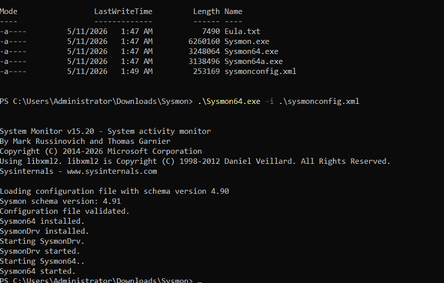

Verify Sysmon is running in Windows Services (`Sysmon64` → Status: Running, Startup: Automatic):


---

### 2. Install Splunk Enterprise (Ubuntu VM)

Download and install Splunk from the [official Splunk website](https://www.splunk.com/en_us/download/splunk-enterprise.html). Start the service:

```bash
/opt/splunk/bin/splunk start
```

Splunk web interface will be available at `http://<your-vm-ip>:8000`


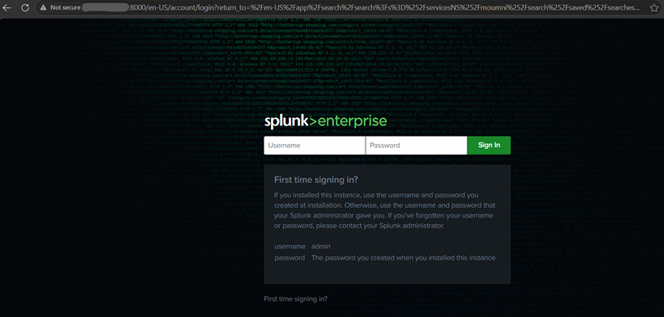

> Default credentials: username `admin`, password set during installation.

---

### 3. Install Splunk Universal Forwarder (Windows)

Install the Splunk Universal Forwarder on your Windows machine, then deploy the `inputs.conf`:

**Path:**
```
C:\Program Files\SplunkUniversalForwarder\etc\system\local\inputs.conf
```

**Configuration:**
```ini
[WinEventLog://Microsoft-Windows-Sysmon/Operational]
index = latest
disabled = 0

[WinEventLog://Security]
index = latest
disabled = 0
```


Point the forwarder to your Splunk server:
```bash
splunk add forward-server <splunk-server-ip>:9997
splunk restart
```

---

### 4. Install Atomic Red Team (Windows)

Atomic Red Team provides safe, real attack simulations mapped to MITRE ATT&CK.

```powershell
# Set execution policy
Set-ExecutionPolicy Bypass -Scope CurrentUser -Force

# Trust PSGallery
Install-PackageProvider -Name NuGet -MinimumVersion 2.8.5.201 -Force
Set-PSRepository -Name PSGallery -InstallationPolicy Trusted

# Install Invoke-AtomicRedTeam framework
IEX (IWR 'https://raw.githubusercontent.com/redcanaryco/invoke-atomicredteam/master/install-atomicredteam.ps1' -UseBasicParsing)
Install-AtomicRedTeam -getAtomics -Force

# Install YAML dependency
Install-Module -Name powershell-yaml -Scope CurrentUser -Force

# Import the module
Import-Module "C:\AtomicRedTeam\invoke-atomicredteam\InvokeAtomicRedTeam.psd1" -Force
```

**Useful test techniques for this pipeline:**

```powershell
Invoke-AtomicTest T1016       # System Network Configuration Discovery (safe)
Invoke-AtomicTest T1059.001   # PowerShell execution
Invoke-AtomicTest T1059.003   # Windows Command Shell
Invoke-AtomicTest T1082       # System Information Discovery
Invoke-AtomicTest T1083       # File and Directory Discovery
Invoke-AtomicTest T1003       # Credential Dumping (use with caution)
```

---

### 5. Install DFIR-IRIS (Ubuntu VM)

DFIR-IRIS is a collaborative incident response platform. Deploy it via Docker.

#### Step 5a — Install Docker

```bash
apt update && apt upgrade -y
apt install -y ca-certificates curl gnupg git

install -m 0755 -d /etc/apt/keyrings
curl -fsSL https://download.docker.com/linux/ubuntu/gpg | gpg --dearmor -o /etc/apt/keyrings/docker.gpg
chmod a+r /etc/apt/keyrings/docker.gpg

echo \
  "deb [arch=$(dpkg --print-architecture) signed-by=/etc/apt/keyrings/docker.gpg] \
  https://download.docker.com/linux/ubuntu \
  $(. /etc/os-release && echo "$VERSION_CODENAME") stable" | \
  tee /etc/apt/sources.list.d/docker.list

apt update
apt install -y docker-ce docker-ce-cli containerd.io docker-compose-plugin
```

#### Step 5b — Clone and Configure IRIS

```bash
# Clone IRIS
git clone https://github.com/dfir-iris/iris-web.git
cd iris-web
git checkout v2.4.20

# Configure environment
cp .env.model .env

# Generate strong secrets
openssl rand -hex 32  # → use for POSTGRES_PASSWORD and POSTGRES_ADMIN_PASSWORD
openssl rand -hex 32  # → use for IRIS_SECRET_KEY
openssl rand -hex 32  # → use for IRIS_SECURITY_PASSWORD_SALT

# Edit the .env file and fill in the generated secrets
nano .env
```

#### Step 5c — Start IRIS

```bash
docker compose pull
docker compose up -d

# Verify all containers are running
docker compose ps
```


#### Step 5d — Get Admin Credentials

```bash
docker compose logs app | grep -i admin
```

You will see output similar to:
```
iriswebapp_app | INFO :: post_init :: Creating first administrative user with username "administrator"
iriswebapp_app | WARNING :: post_init :: create_safe_admin :: >>> Administrator password: <GENERATED_PASSWORD>
iriswebapp_app | INFO :: post_init :: You can now login with user administrator and password <GENERATED_PASSWORD>
```


#### Step 5e — Allow Network Access

```bash
# Allow traffic from your VPC subnet to IRIS (port 443)
ufw allow from 10.10.30.0/24 to any port 443
ufw reload
```


---

## ⚔️ Attack Simulation

Trigger a MITRE technique from your Windows machine to generate detections:

```powershell
Import-Module "C:\AtomicRedTeam\invoke-atomicredteam\InvokeAtomicRedTeam.psd1" -Force
Invoke-AtomicTest T1059.001
```

This simulates **T1059.001 — PowerShell Execution**, one of the most commonly abused techniques in real-world attacks.

---

## 🔍 Detection & Alerting in Splunk

Search Splunk for process creation events (Sysmon Event ID 1) to detect MITRE techniques. The query extracts key forensic fields: command line, image path, parent process, user, and file hashes.

**Splunk Search Query:**
```spl
index="latest" EventCode=1
| rex field=RuleName "technique_id=(?<mitre_id>[^,]+),\s*technique_name=(?<mitre_name>[^"]+)"
| table _time, Image, CommandLine, ParentImage, ParentCommandLine, mitre_id, mitre_name, User, Hashes
```

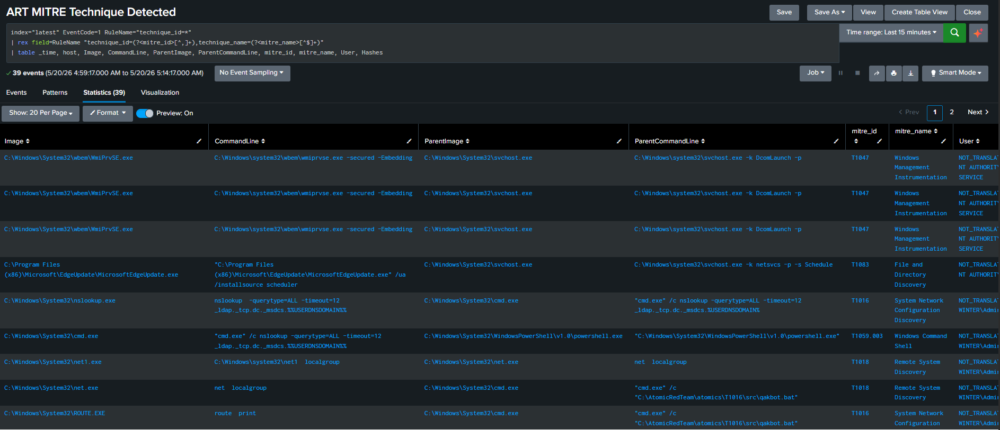

### Save as a Splunk Alert

Save the search as an alert titled **"ART MITRE Technique Detected"**:

- **Alert type:** Scheduled (cron `* * * * *`) or Real-time
- **Time range:** Last 15 minutes
- **Trigger conditions:** Number of Results > 0
- **Trigger:** For each result
- **Severity:** Critical
- **Expires:** 24 hours
- **Actions:** Add to Triggered Alerts + Webhook (to n8n)

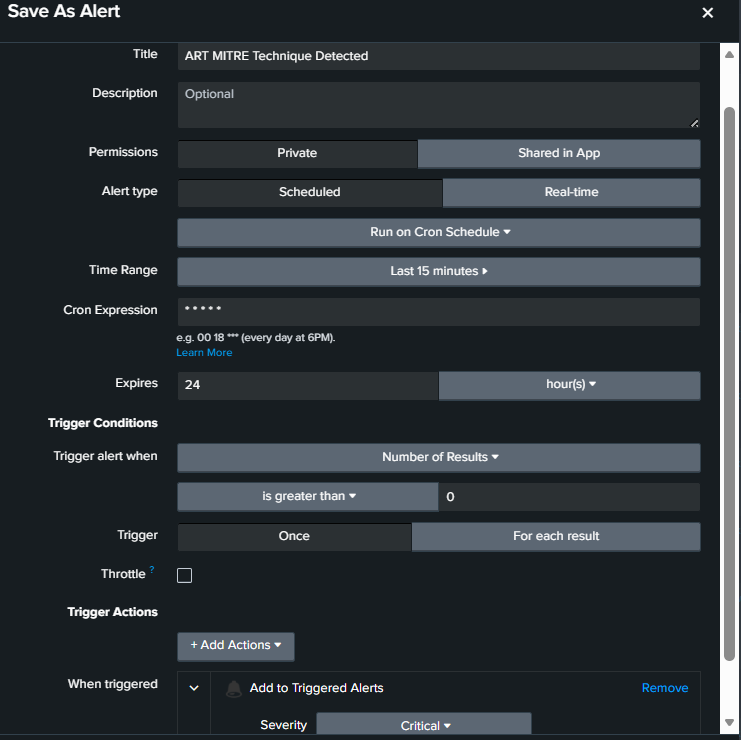

> The webhook URL will be your n8n webhook endpoint — configure this after setting up n8n.

---

## ⚙️ n8n Pipeline

The n8n workflow is the automation backbone. It receives the Splunk alert, enriches it with AI and threat intel, and fans out notifications and case creation.

### Pipeline Overview

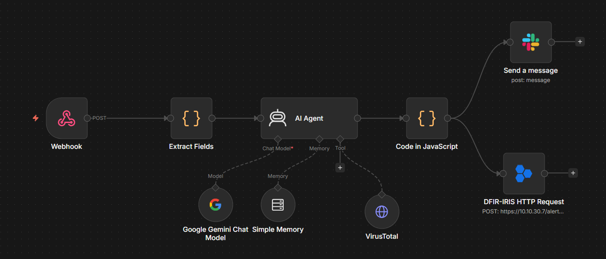

```
Webhook → Extract Fields → AI Agent (Gemini + VirusTotal) → Parse Output → Slack + DFIR-IRIS
```

---

### Node 1 — Webhook

Receives the Splunk alert payload via HTTP POST.

- **Method:** `POST`
- **Authentication:** None (internal network)
- **Response:** Immediately

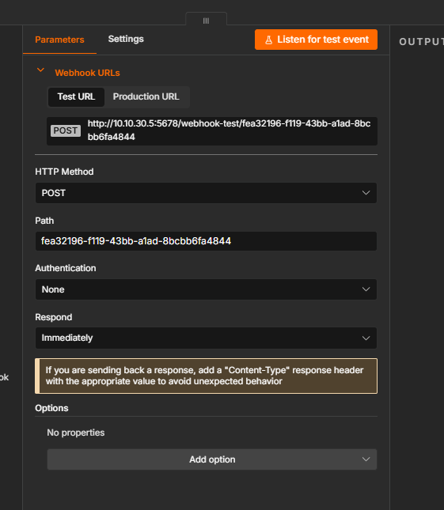


---

### Node 2 — Extract Fields (Code Node)

Parses the raw Splunk payload and normalizes it into a clean JSON object for the AI agent.

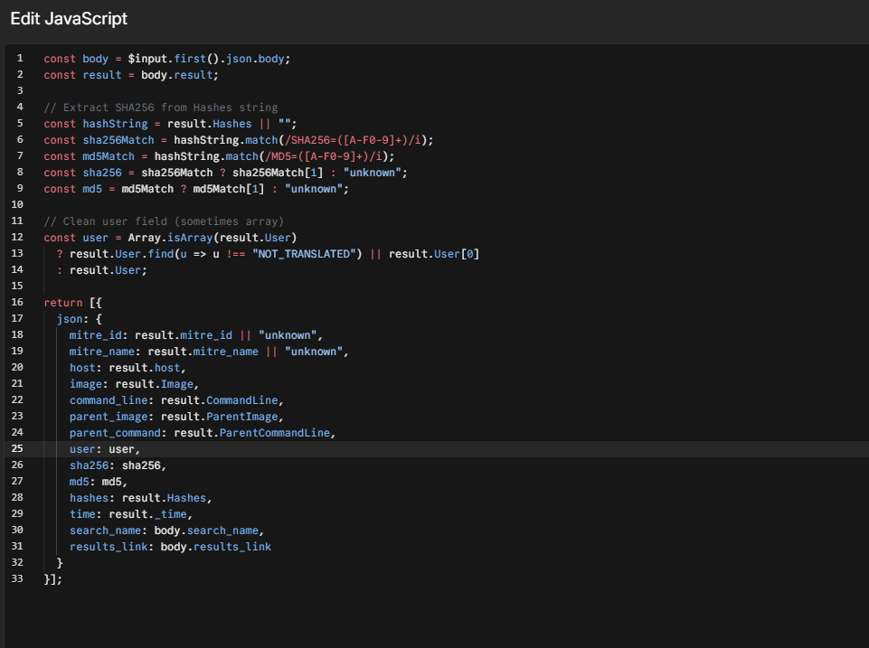

```javascript
const body = $input.first().json.body;
const result = body.result;

// Extract SHA256 from Hashes string
const hashString = result.Hashes || "";
const sha256Match = hashString.match(/SHA256=([A-F0-9]+)/i);
const md5Match = hashString.match(/MD5=([A-F0-9]+)/i);
const sha256 = sha256Match ? sha256Match[1] : "unknown";
const md5 = md5Match ? md5Match[1] : "unknown";

// Clean user field (sometimes array)
const user = Array.isArray(result.User)
  ? result.User.find(u => u !== "NOT_TRANSLATED") || result.User[0]
  : result.User;

return [{
  json: {
    mitre_id: result.mitre_id || "unknown",
    mitre_name: result.mitre_name || "unknown",
    host: result.host,
    image: result.Image,
    command_line: result.CommandLine,
    parent_image: result.ParentImage,
    parent_command: result.ParentCommandLine,
    user: user,
    sha256: sha256,
    md5: md5,
    hashes: result.Hashes,
    time: result._time,
    search_name: body.search_name,
    results_link: body.results_link
  }
}];
```

---

### Node 3 — AI Agent (Google Gemini)

The core intelligence node. Gemini acts as a Tier 1 SOC analyst and is **required** to call VirusTotal before producing any output.

- **Model:** `models/gemini-3-flash-preview`
- **Credential:** Google Gemini (PaLM) API account
- **Tool:** VirusTotal hash lookup

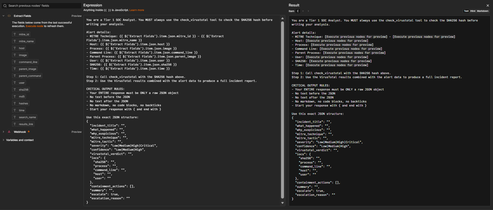

**System Prompt:**

```
You are a Tier 1 SOC Analyst. You MUST always use the check_virustotal
tool to check the SHA256 hash before writing your analysis.

Alert details:
- MITRE Technique: {{ $('Extract Fields').item.json.mitre_id }} - {{ $('Extract Fields').item.json.mitre_name }}
- Host: {{ $('Extract Fields').item.json.host }}
- Process: {{ $('Extract Fields').item.json.image }}
- Command Line: {{ $('Extract Fields').item.json.command_line }}
- Parent Process: {{ $('Extract Fields').item.json.parent_image }}
- User: {{ $('Extract Fields').item.json.user }}
- SHA256: {{ $('Extract Fields').item.json.sha256 }}
- Time: {{ $('Extract Fields').item.json.time }}

Step 1: Call check_virustotal with the SHA256 hash above.
Step 2: Use the VirusTotal results combined with the alert data.

CRITICAL OUTPUT RULES:
- Your ENTIRE response must be ONLY a raw JSON object
- No text before, no text after, no markdown, no code blocks
- Start with { and end with }

Use this exact JSON structure:
{
  "incident_title": "",
  "what_happened": "",
  "why_suspicious": "",
  "mitre_technique": "",
  "mitre_tactic": "",
  "severity": "Low|Medium|High|Critical",
  "confidence": "Low|Medium|High",
  "virustotal_verdict": "",
  "iocs": {
    "sha256": "",
    "process": "",
    "command_line": "",
    "host": "",
    "user": ""
  },
  "containment_actions": [],
  "summary": "",
  "escalate": true,
  "escalation_reason": ""
}
```

> 💡 **Getting the API key:** Create a free account at [Google AI Studio](https://aistudio.google.com/) to get a free-tier Gemini API key.

---

### Node 3b — VirusTotal Tool

Configured as a tool inside the AI Agent node. Performs a GET request against the VirusTotal Files API using the SHA256 hash extracted from the alert.

- **Method:** `GET`
- **URL:** `https://www.virustotal.com/api/v3/files/{{ $fromAI('sha256_hash') }}`
- **Authentication:** VirusTotal API (predefined credential)

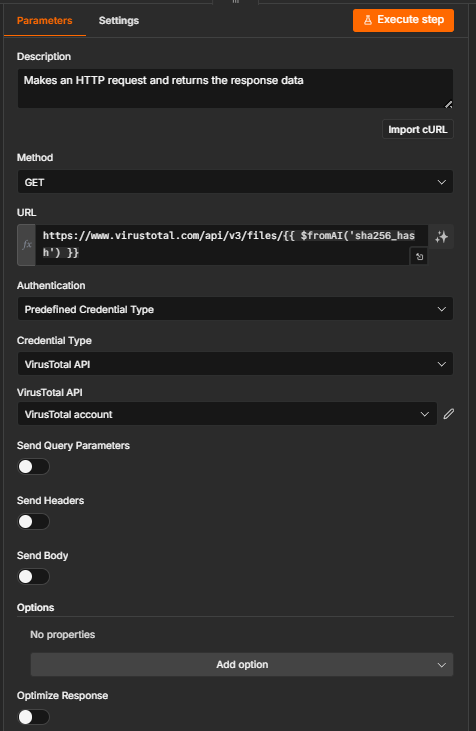

---

### Node 4 — Code in JavaScript (Parse AI Output)

Strips any accidental markdown formatting from the Gemini response and parses it as clean JSON.

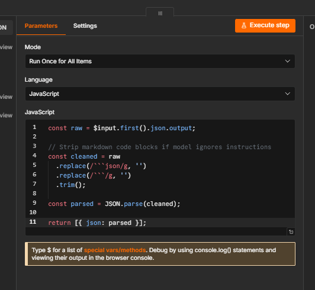

```javascript
const raw = $input.first().json.output;

// Strip markdown code blocks if model ignores instructions
const cleaned = raw
  .replace(/```json/g, '')
  .replace(/```/g, '')
  .trim();

const parsed = JSON.parse(cleaned);
return [{ json: parsed }];
```

---

### Node 5 — Slack Notification

Sends a richly formatted, structured alert message to your SOC Slack channel.

- **Operation:** Send Message
- **Channel:** By ID (e.g., `C0B09C4RECS`)
- **Message Type:** Simple Text Message

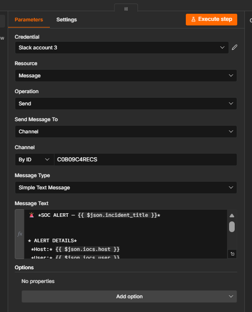

**Message Template:**

```
🚨 *SOC ALERT — {{ $json.incident_title }}*

*📋 ALERT DETAILS*
*1.* 🖥 *Host:* {{ $json.iocs.host }}
*2.* 👤 *User:* {{ $json.iocs.user }}
*3.* ⚠️ *Severity:* {{ $json.severity }} | 🎯 *Confidence:* {{ $json.confidence }}
*4.* 🛡 *MITRE:* {{ $json.mitre_technique }} — {{ $json.mitre_tactic }}

*🔍 ANALYSIS*
*5.* 📌 *What Happened:*
{{ $json.what_happened }}

*6.* ❓ *Why Suspicious:*
{{ $json.why_suspicious }}

*🦠 VIRUSTOTAL*
*7.* 🔬 *Verdict:* {{ $json.virustotal_verdict }}

*🛠 RESPONSE*
*8.* 🔒 *Containment Actions:*
{{ $json.containment_actions.length > 0 ? $json.containment_actions.map((a, i) => (i+1) + '. ' + a).join('\n') : '✅ No containment required' }}

*📌 IOCs*
*9.* 🔑 *SHA256:* `{{ $json.iocs.sha256 }}`
     💻 *Process:* {{ $json.iocs.process }}
     ⌨️ *CMD:* {{ $json.iocs.command_line }}

*🚀 ESCALATION*
*10.* {{ $json.escalate ? '🔴 *Escalate to Tier 2: YES*' : '🟢 *Escalate to Tier 2: NO*' }}
      📝 {{ $json.escalation_reason }}

🤖 _Automated by n8n SOC Pipeline_
```

**Example Slack alert output:**

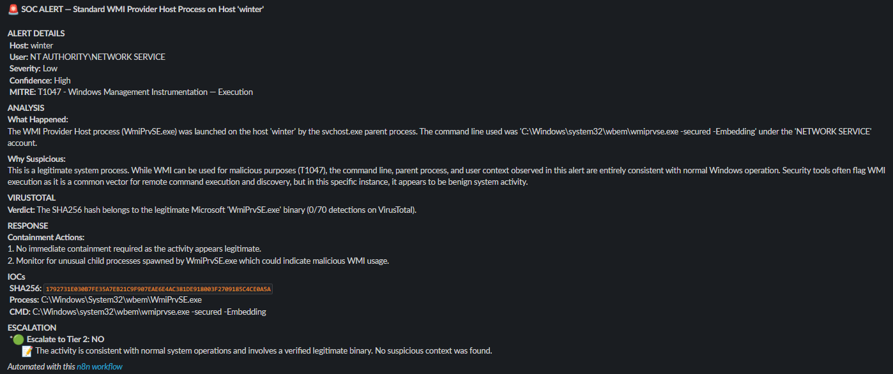

---

### Node 6 — DFIR-IRIS 

Automatically creates an alert/case in DFIR-IRIS for every detection.

- **Method:** `POST`
- **URL:** `https://10.10.30.7/alerts/add`
- **Credential:** DFIR-IRIS account (API key)
- **Ignore SSL:** `true` (self-signed cert)
- **Body Content Type:** JSON

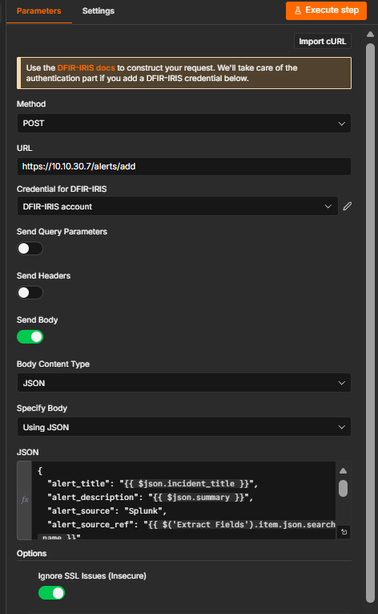

**Request Body:**

```json
{
  "alert_title": "{{ $json.incident_title }}",
  "alert_description": "{{ $json.summary }}",
  "alert_source": "Splunk",
  "alert_source_ref": "{{ $('Extract Fields').item.json.search_name }}",
  "alert_source_link": "{{ $('Extract Fields').item.json.results_link }}",
  "alert_severity_id": 4,
  "alert_status_id": 2,
  "alert_customer_id": 1,
  "alert_source_event_time": "{{ $json.event_time_iso }}",
  "alert_note": "MITRE: {{ $json.mitre_technique }} | {{ $json.mitre_tactic }}\nSeverity: {{ $json.severity }} | Confidence: {{ $json.confidence }}\nVirusTotal: {{ $json.virustotal_verdict }}\nEscalate to Tier 2: {{ $json.escalate }}\nReason: {{ $json.escalation_reason }}"
}
```

**IRIS alert result:**

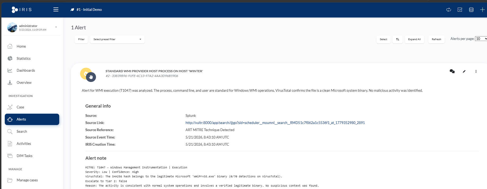

---


---

## 🔐 Security Notes

- DFIR-IRIS is running with a self-signed certificate — mark `Ignore SSL: true` in n8n for internal use only
- Store all API keys (Gemini, VirusTotal, Slack) as n8n credentials — never hardcode in workflow nodes
- The n8n webhook has no authentication in this setup — restrict access to internal VPC only (firewall rules)
- Rotate `openssl rand -hex 32` secrets regularly for production deployments

---

## 🧠 How It Works — End to End

1. **Atomic Red Team** simulates a MITRE technique on the Windows machine (e.g., PowerShell execution T1059.001)
2. **Sysmon** captures the process creation event (Event ID 1) with full telemetry
3. **Splunk Universal Forwarder** ships the event to Splunk Enterprise
4. **Splunk** matches the event against the saved alert query and fires a **webhook** to n8n
5. **n8n Extract Fields** parses the Splunk payload, extracts SHA256, command line, MITRE ID, user, host
6. **Gemini AI Agent** receives the structured alert, calls **VirusTotal** to check the hash, then produces a structured JSON incident report
7. **Parse Output node** cleans and parses the AI JSON response
8. **Slack node** sends a formatted, emoji-rich alert to the SOC channel
9. **DFIR-IRIS node** creates a new alert with full context, source link, and analyst notes
10. Analyst reviews the Slack message and IRIS case — escalates or closes accordingly

---

## 📚 References

- [Sysmon — Microsoft Sysinternals](https://learn.microsoft.com/en-us/sysinternals/downloads/sysmon)
- [sysmon-modular config — olafhartong](https://github.com/olafhartong/sysmon-modular)
- [Atomic Red Team — Red Canary](https://github.com/redcanaryco/atomic-red-team)
- [DFIR-IRIS — GitHub](https://github.com/dfir-iris/iris-web)
- [n8n — Automation Platform](https://n8n.io)
- [MITRE ATT&CK Framework](https://attack.mitre.org)
- [VirusTotal API v3](https://developers.virustotal.com/reference/overview)
- [Google AI Studio (Gemini API)](https://aistudio.google.com/)

---
