# 🔐 Splunk + Shuffle SOAR — Automated Active Directory Response

> Automated detection and response pipeline: when an unauthorized RDP login is detected by Splunk, the SOC analyst is notified via Slack, prompted to approve an action, and the compromised account is automatically disabled in Active Directory — all without manual intervention.

---

## 📋 Table of Contents

- [Overview](#overview)
- [Architecture](#architecture)
- [Prerequisites](#prerequisites)
- [Infrastructure Setup](#infrastructure-setup)
  - [Virtual Machines](#virtual-machines)
  - [Network & Security Configuration](#network--security-configuration)
  - [Active Directory Setup](#active-directory-setup)
  - [Splunk Setup](#splunk-setup)
  - [Attack Simulation](#attack-simulation)
- [Splunk Detection](#splunk-detection)
- [SOAR Workflow (Shuffle)](#soar-workflow-shuffle)
  - [Node 1 — Splunk ALERT Webhook](#node-1--splunk-alert-webhook)
  - [Node 2 — Slack Notification](#node-2--slack-notification)
  - [Node 3 — User Actions (Analyst Approval)](#node-3--user-actions-analyst-approval)
  - [Node 4 — Disable User via Flask API](#node-4--disable-user-via-flask-api)
  - [Node 5 — Slack Confirmation](#node-5--slack-confirmation)
- [Flask LDAP API](#flask-ldap-api)

---

## Overview

This project implements a **Security Orchestration, Automation, and Response (SOAR)** pipeline that:

1. **Detects** unauthorized successful RDP logins via Splunk (Windows Event ID 4624, Logon Type 10)
2. **Notifies** the SOC analyst in Slack with full alert details
3. **Prompts** the analyst via email with Yes/No buttons (human-in-the-loop approval)
4. **Automatically disables** the user account in Active Directory via a Flask/LDAP API
5. **Confirms** the action back to the Slack channel

```
Splunk ALERT → Slack Notification → Analyst Approval (Yes/No) → Disable User in AD → Slack Confirmation
```

---

## Architecture

| Component | Role | Address |
|-----------|------|---------|
| **Splunk** | SIEM — detects unauthorized RDP logins | `http://Moumni-Splunk:8000` |
| **Shuffle** | SOAR — orchestrates the full response workflow | `https://shuffler.io` |
| **Flask API** | Bridge between Shuffle and Active Directory | `http://136.244.84.188:8000` |
| **Active Directory** | User account management via LDAP | `136.244.84.188:389` |
| **Slack** | SOC analyst notifications and approval flow | Slack API |

---

## Prerequisites

- [ ] Splunk Enterprise instance (running and accessible)
- [ ] Shuffle Cloud account at [shuffler.io](https://shuffler.io)
- [ ] Slack workspace with a bot token and a dedicated alert channel
- [ ] Windows Server with Active Directory Domain Services installed
- [ ] Python 3.x installed on the AD server
- [ ] Vultr (or equivalent) VMs in the same region for VPC connectivity

---

## Infrastructure Setup

### Virtual Machines

Four VMs were deployed on Vultr:

| VM | Role |
|----|------|
| `Moumni-Splunk` | Linux — Splunk Enterprise SIEM |
| `Moumni-ADDC01` | Windows Server — Active Directory Domain Controller |
| `vultr-guest` | Windows — test machine joined to the domain |
| Kali Linux | Attacker simulation machine |

---

### Network & Security Configuration

- **Firewall Group**: Only SSH (port 22) and RDP (port 3389) allowed from your public IP
- **VPC**: Enabled on all VMs so they communicate over a private network — machines must be in the same region for VPC compatibility
- **Windows network adapter**: IP address changed to use the VPC address so internal traffic routes correctly

---

### Active Directory Setup

Install the **Active Directory Domain Services (AD DS)** role on the Windows Server VM via Server Manager.

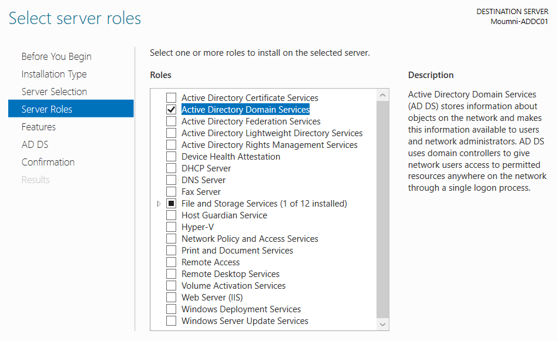

After installation, promote the server to a Domain Controller and create the domain (e.g. `Moumni.local`).

Then join the test Windows machine to the domain so it generates realistic Windows Security Event logs.

---

### Splunk Setup

**Install Splunk Enterprise** on the Linux VM and start it:

```bash
/opt/splunk/bin/splunk start
# Web UI available at http://<SPLUNK_IP>:8000
```


#### Splunk Universal Forwarder

Install the Splunk Universal Forwarder on the **Windows domain machine** so that Windows Security Event logs are forwarded to Splunk in real time.

Configure `inputs.conf` to monitor the Security event log:

```
C:\Program Files\SplunkUniversalForwarder\etc\system\local\inputs.conf
```

```ini
[WinEventlog://Security]
index = moumni-ad
disabled = false
```

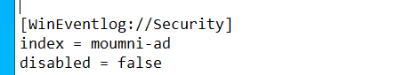

Restart the forwarder service to apply:

```powershell
Restart-Service SplunkForwarder
```

---

### Attack Simulation

Since the Kali Linux VM is headless (no GUI), `xfreerdp` requires a virtual display. The workaround is to use **Xvfb (Virtual Framebuffer)**:

```bash
# Install packages
apt update && apt install -y xvfb freerdp2-x11

# Start virtual display
Xvfb :99 -screen 0 1024x768x16 &
export DISPLAY=:99

# RDP into the Windows test VM
xfreerdp /u:Administrator /p:YOUR_PASSWORD /v:209.250.237.162 /cert-ignore
```

This simulates an unauthorized RDP login that Splunk will detect.

---

## Splunk Detection

Create a new search in Splunk to detect successful RDP logins (Event Code 4624, Logon Type 10):

```spl
index="MOUMNI-AD81" EventCode=4624 Logon_Type=10
| stats count by _time, ComputerName, Source_Network_Address, user
```

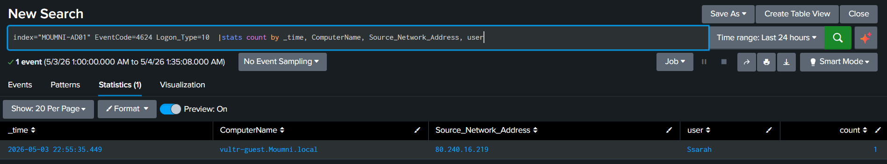

Save the search as an **Alert** with:
- **Severity**: Medium
- **Schedule**: Cron-based (e.g. every minute)
- **Trigger Action**: Webhook → points to your Shuffle workflow webhook URL

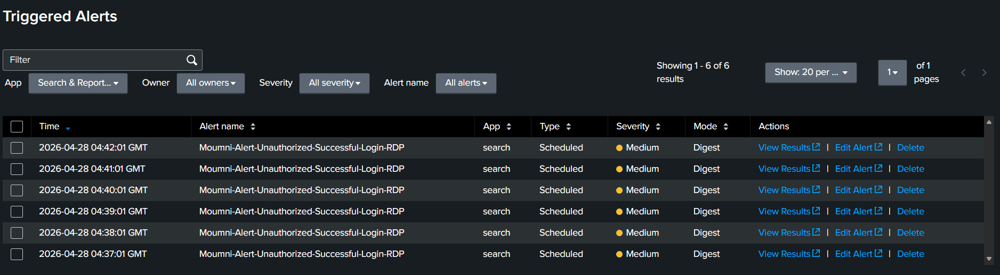

---

## SOAR Workflow (Shuffle)

The full Shuffle workflow consists of 5 connected nodes:

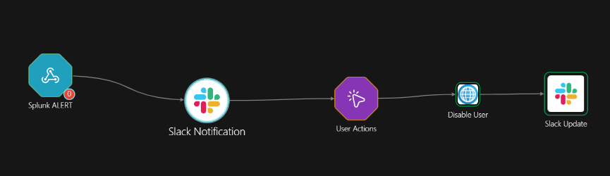

---

### Node 1 — Splunk ALERT Webhook

- **Type**: Webhook trigger
- **Purpose**: Receives the JSON payload from Splunk when the alert fires

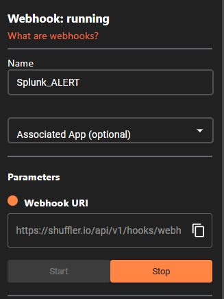

The webhook URI (e.g. `https://shuffler.io/api/v1/hooks/webhook_...`) is pasted into Splunk as the alert's trigger action URL.

---

### Node 2 — Slack Notification

- **App**: Slack
- **Action**: `chat_postmessage`
- **Purpose**: Sends an immediate alert to the SOC Slack channel with the affected user, source IP, computer name, and a direct link to the Splunk search results

**Slack message body:**

```json
{
  "channel": "YOUR_CHANNEL_ID",
  "text": "🚨 Unauthorized RDP Login Detected!\nUser: $exec.result.user\nComputer: $exec.result.ComputerName\nSource IP: $exec.result.Source_Network_Address\nAlert: $exec.search_name\nResults: $exec.results_link",
  "mrkdwn": true
}
```

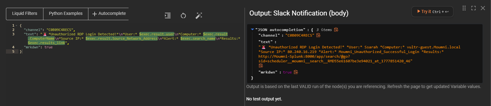

The SOC analyst receives this notification immediately in Slack:

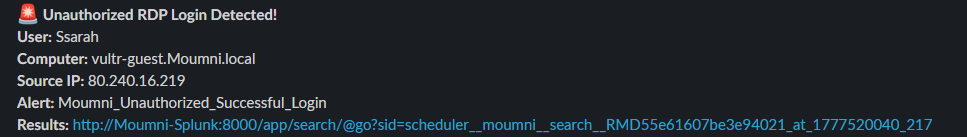

---

### Node 3 — User Actions (Analyst Approval)

- **App**: User Input
- **Action**: Sends an email to the SOC analyst containing the full alert details and two action buttons
- **Behavior**: The workflow **pauses** until the analyst responds

**Email prompt options:**
- ✅ **YES** — Disable the user account
- ❌ **NO** — Keep the user active and dismiss the alert

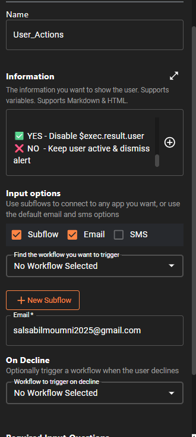

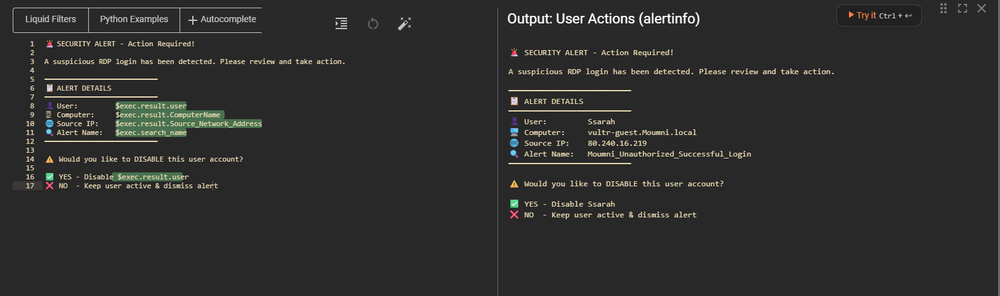

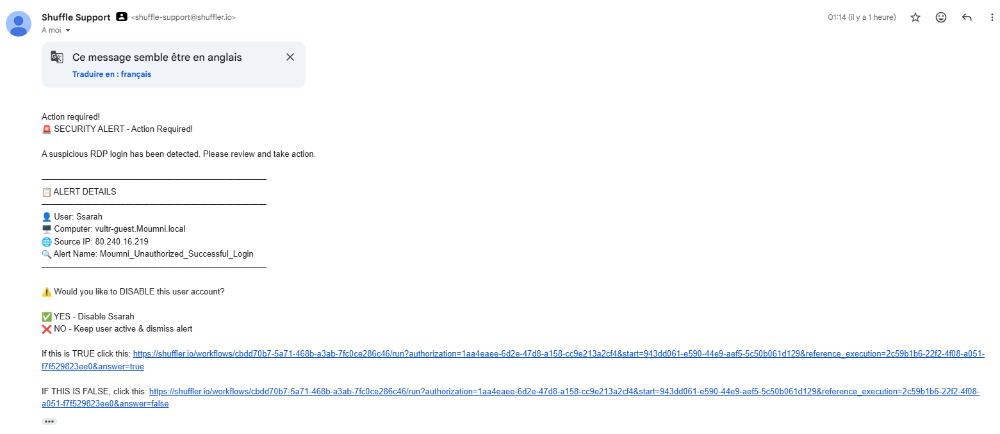

---

### Node 4 — Disable User via Flask API

- **App**: HTTP
- **Method**: `POST`
- **URL**: `http://136.244.84.188:8000/disable_user`
- **Body**: `{"username": "$exec.result.user"}`
- **Headers**: `{"Content-Type": "application/json"}`
- **Condition**: Only triggered from the **Yes** branch of Node 3

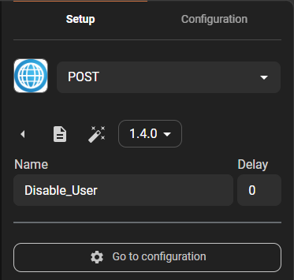

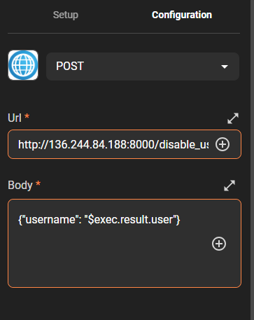

The Flask API receives the request, binds to Active Directory via LDAP, and sets `userAccountControl` to `514` (disabled).

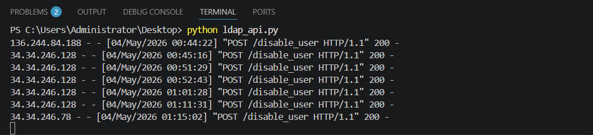

The user account is confirmed as disabled in **Active Directory Users and Computers**:

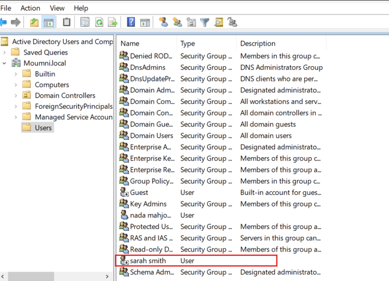

---

### Node 5 — Slack Confirmation

- **App**: Slack
- **Action**: `chat_postmessage`
- **Purpose**: Sends a final confirmation message to the SOC channel once the account has been disabled

**Slack message body:**

```json
{
  "channel": "YOUR_CHANNEL_ID",
  "text": "✅ $exec.result.user has been DISABLED in Active Directory.",
  "mrkdwn": true
}
```

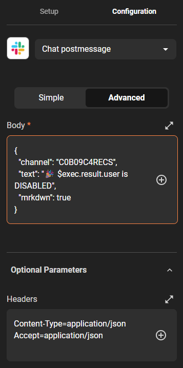


---

## Flask LDAP API

The Flask API runs on the AD server and exposes two endpoints used by the Shuffle workflow.

### Setup

```powershell
# On the AD server (136.244.84.188)
pip install flask ldap3

# Or from requirements file
pip install -r ldap_api/requirements.txt

# Run the API
python ldap_api/ldap_api.py
```

### `ldap_api.py`

```python
from flask import Flask, request, jsonify
from ldap3 import Server, Connection, ALL, SUBTREE

app = Flask(__name__)

# ── Configuration ─────────────────────────────────────────────
AD_SERVER   = '136.244.84.188'
AD_PORT     = 389
AD_DOMAIN   = 'Moumni'
AD_USER     = 'Administrator@Moumni.local'
AD_PASSWORD = 'YOUR_PASSWORD_HERE'
BASE_DN     = 'DC=Moumni,DC=local'
# ──────────────────────────────────────────────────────────────

def get_connection():
    """Establish and return an authenticated LDAP connection to Active Directory."""
    server = Server(AD_SERVER, port=AD_PORT, get_info=ALL)
    conn = Connection(
        server,
        user=AD_USER,
        password=AD_PASSWORD,
        authentication='SIMPLE'   # Compatible with OpenSSL 3.x (no NTLM/MD4 required)
    )
    bind_result = conn.bind()
    print(f"[LDAP] Bind result: {bind_result} | Response: {conn.result}")
    return conn


@app.route('/user', methods=['GET'])
def get_user():
    """Look up a user in Active Directory by sAMAccountName."""
    username = request.args.get('username')
    print(f"[/user] Searching for: {username}")

    conn = get_connection()
    conn.search(
        BASE_DN,
        f'(sAMAccountName={username})',
        search_scope=SUBTREE,
        attributes=['sAMAccountName', 'userAccountControl', 'mail', 'displayName', 'memberOf']
    )

    print(f"[/user] Entries found: {conn.entries}")
    if conn.entries:
        return jsonify({"success": True, "user": str(conn.entries[0])})
    return jsonify({"success": False, "reason": "User not found"})


@app.route('/disable_user', methods=['POST'])
def disable_user():
    """
    Disable an Active Directory user account.
    Sets userAccountControl to 514 (512 = normal account + 2 = disabled flag).
    """
    data = request.json
    username = data.get('username')
    print(f"[/disable_user] Disabling: {username}")

    conn = get_connection()
    conn.search(
        BASE_DN,
        f'(sAMAccountName={username})',
        search_scope=SUBTREE,
        attributes=['userAccountControl']
    )

    if not conn.entries:
        print(f"[/disable_user] User not found: {username}")
        return jsonify({"success": False, "reason": "User not found"})

    user_dn = conn.entries[0].entry_dn
    conn.modify(user_dn, {'userAccountControl': [('MODIFY_REPLACE', 514)]})
    print(f"[/disable_user] Modify result: {conn.result}")

    return jsonify({"success": True, "disabled": username})


if __name__ == '__main__':
    app.run(host='0.0.0.0', port=8000)
```

### API Endpoints

| Method | Endpoint | Description |
|--------|----------|-------------|
| `GET` | `/user?username=<name>` | Retrieve AD user details by `sAMAccountName` |
| `POST` | `/disable_user` | Disable a user account (`userAccountControl = 514`) |


