# 🛡️ Phishing Email Triage Pipeline

> A fully automated SOC triage pipeline built with **Splunk + n8n + AI** that detects phishing emails, enriches IOCs, and creates tickets in **DFIR-IRIS** and **Jira**.

---

## 📋 Table of Contents

- [Overview](#overview)
- [Architecture](#architecture)
- [Prerequisites](#prerequisites)
- [Installation](#installation)
  - [1. Install Sysmon (Windows Victim Machine)](#1-install-sysmon-windows-victim-machine)
  - [2. Install Splunk](#2-install-splunk)
  - [3. Install DFIR-IRIS](#3-install-dfir-iris)
- [Phishing Email Simulator](#phishing-email-simulator)
- [Detection & Alerting in Splunk](#detection--alerting-in-splunk)
- [n8n Workflow](#n8n-workflow)
  - [Node Structure](#node-structure)
- [AI Agent](#ai-agent)
- [Ticket Creation](#ticket-creation)
- [Results](#results)
- [Project Structure](#project-structure)

---

## Overview

This project implements a **fully automated phishing email triage pipeline** for a Security Operations Center (SOC). When a phishing email is detected in Splunk, a webhook fires into n8n, which automatically:

1. **Extracts IOCs** — sender IP, phishing domain, malicious URL, and file attachment hash
2. **Enriches each IOC** — via AbuseIPDB, VirusTotal, and URLscan.io
3. **Analyzes with AI** — a GPT-4.1-mini agent acts as a Tier 1 SOC analyst
4. **Creates response tickets** — automatically in both DFIR-IRIS (case management) and Jira

A Windows VM configured as a victim machine runs simulated phishing scripts and sends telemetry to Splunk via **Sysmon**.

---

## Architecture

### Infrastructure

| Component   | Host                    | Port |
|-------------|-------------------------|------|
| Splunk      | Windows VM              | 8000 |
| n8n         | Ubuntu VPS (Vultr)      | 5678 |
| DFIR-IRIS   | Ubuntu VM               | 443  |
| Jira        | Atlassian Cloud         | —    |

### Pipeline Flow

```
Splunk Alert (Phishing Email Detected)
        │
        ▼
   Webhook → n8n
        │
        ├─── Extract IP    ──► AbuseIPDB
        ├─── Extract Domain ──► VirusTotal (domains)
        ├─── Extract URL   ──► URLscan.io
        └─── Extract Attachment ──► IF (hash exists)
                                        └──► VirusTotal (files)
        │
        ▼
     Merge → Normalize → Bundle
        │
        ▼
     AI Agent (GPT-4.1-mini)
        │
        ├──► DFIR-IRIS Alert
        └──► Jira Ticket
```

---

## Prerequisites

### Server Requirements

| Server         | OS              | Purpose                          |
|----------------|-----------------|----------------------------------|
| Ubuntu VM      | Ubuntu 22.04 LTS | Splunk server                   |
| Windows VM     | Windows 10/11   | Victim machine + Splunk forwarder |
| Ubuntu VPS     | Ubuntu 22.04 LTS | n8n automation server           |
| Ubuntu VM      | Ubuntu 22.04 LTS | DFIR-IRIS case management        |


**Required software:**
- Python 3.x
- Docker + Docker Compose
- n8n (self-hosted via Docker)

### API Keys Required

| Service     | Purpose                   | URL                          |
|-------------|---------------------------|------------------------------|
| VirusTotal  | Hash / Domain / IP lookup | https://virustotal.com       |
| AbuseIPDB   | IP reputation             | https://abuseipdb.com        |
| URLscan.io  | URL scanning              | https://urlscan.io           |
| Jira        | Ticket creation           | https://atlassian.com       |
| DFIR-IRIS   | Case management           | Self-hosted                  |
| OpenAI      | AI triage agent           | https://platform.openai.com  |

---

## Installation

### 1. Install Sysmon (Windows Victim Machine)

Sysmon provides detailed system activity logging and forwards telemetry to Splunk.

**Step 1:** Download Sysmon v15.2 from the official Microsoft Sysinternals page.


**Step 2:** Get the community config file from GitHub:

```
https://github.com/olafhartong/sysmon-modular/blob/master/sysmonconfig.xml
```

**Step 3:** Install Sysmon with the config:

```powershell
.\Sysmon64.exe -i .\sysmonconfig.xml
```

Expected output confirms successful installation:


Verify Sysmon is running as a service (`Automatic` startup, `Local System` account) in Windows Services:

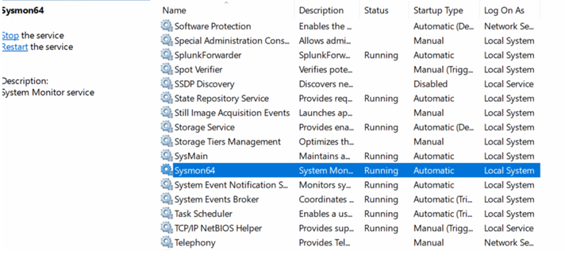

---

### 2. Install Splunk

Install the Splunk server on an Ubuntu VM from the [official Splunk website](https://www.splunk.com).

Start the Splunk daemon:

```bash
/opt/splunk/bin/splunk start
```


Access the Splunk web interface at `http://<your-ip>:8000`:


> Default credentials: `admin` / (password set during installation)

---

### 3. Install DFIR-IRIS

DFIR-IRIS is deployed on a dedicated Ubuntu VM using Docker Compose.

```bash
# Install Docker
apt update && apt upgrade -y
apt install -y ca-certificates curl gnupg git
install -m 0755 -d /etc/apt/keyrings
curl -fsSL https://download.docker.com/linux/ubuntu/gpg | gpg --dearmor -o \
  /etc/apt/keyrings/docker.gpg
chmod a+r /etc/apt/keyrings/docker.gpg
echo \
  "deb [arch=$(dpkg --print-architecture) signed-by=/etc/apt/keyrings/docker.gpg] \
  https://download.docker.com/linux/ubuntu \
  $(. /etc/os-release && echo "$VERSION_CODENAME") stable" | \
  tee /etc/apt/sources.list.d/docker.list
apt update
apt install -y docker-ce docker-ce-cli containerd.io docker-compose-plugin

# Clone IRIS
git clone https://github.com/dfir-iris/iris-web.git
cd iris-web
git checkout v2.4.20

# Configure environment
cp .env.model .env

# Generate secrets (run each separately and paste into .env)
openssl rand -hex 32   # POSTGRES_PASSWORD and POSTGRES_ADMIN_PASSWORD
openssl rand -hex 32   # IRIS_SECRET_KEY
openssl rand -hex 32   # IRIS_SECURITY_PASSWORD_SALT

# Edit the .env file
nano .env

# Start IRIS
docker compose pull
docker compose up -d

# Allow VPC traffic
ufw allow from 10.10.30.0/24 to any port 443
ufw reload

# Verify containers are running
docker compose ps
```

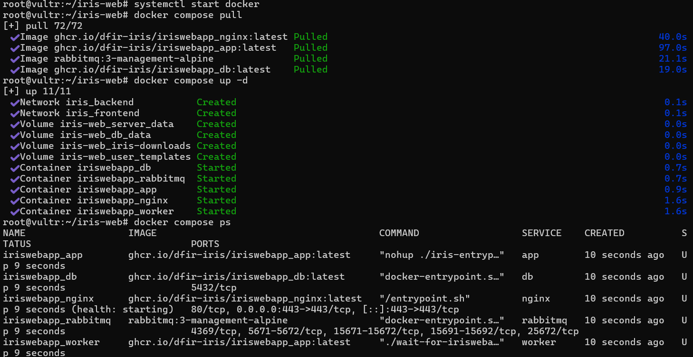

**Retrieve the admin password from logs:**

```bash
docker compose logs app | grep -i admin
```

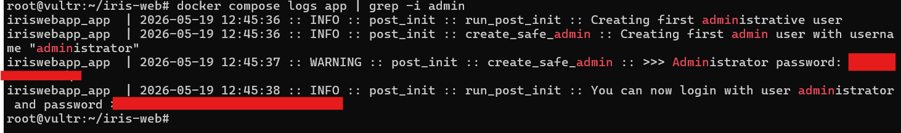

Access the IRIS web interface:


---

## Phishing Email Simulator

The file `phishing_simulator.py` generates realistic phishing email logs for Splunk ingestion. It simulates four attack scenarios with real-world IOCs.

### Scenarios

| Scenario             | Description                           | Has Attachment |
|----------------------|---------------------------------------|----------------|
| `credential_harvest` | Fake Microsoft/IT login pages         | Always         |
| `invoice_fraud`      | Fake invoice with malicious attachment | Always        |
| `ceo_fraud`          | BEC / wire transfer requests          | Always         |
| `malware_delivery`   | Fake DHL/FedEx with malware           | Always         |

### Real Malicious Hashes Used

| Hash (SHA256)                                                       | Family   | Type      |
|---------------------------------------------------------------------|----------|-----------|
| `275a021bbfb6489e54d471899f7db9d1663fc695ec2fe2a2c4538aabf651fd0f` | EICAR    | Test File |
| `b80b4afd8745f9e06a9358cf8fc9769771fc05cbf8ec5399ba32cca85240d68e` | FormBook | Malware   |

### Usage

```bash
# Generate 1 event (all scenarios)
python phishing_simulator.py --count 1 --scenario all

# Generate 5 malware delivery events
python phishing_simulator.py --count 5 --scenario malware_delivery

# Print to stdout only (no file write)
python phishing_simulator.py --print-only

# Continuous generation with interval (seconds)
python phishing_simulator.py --count 10 --interval 30
```

**Running the credential harvest scenario:**

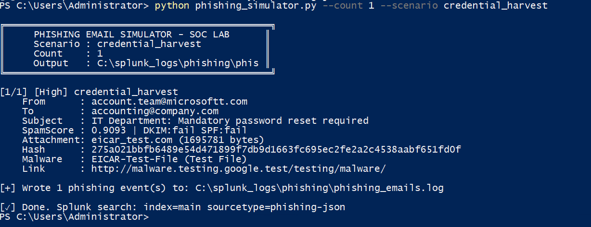

---

## Detection & Alerting in Splunk

### Splunk Search Query

```spl
index=main sourcetype="phishing-json" is_phishing="true" threat_level="High"
| table timestamp, from, to, subject, sender_ip, sender_domain, spam_score,
  link_url, attachment_name, attachment_hash_sha256, scenario, mitre_technique
```

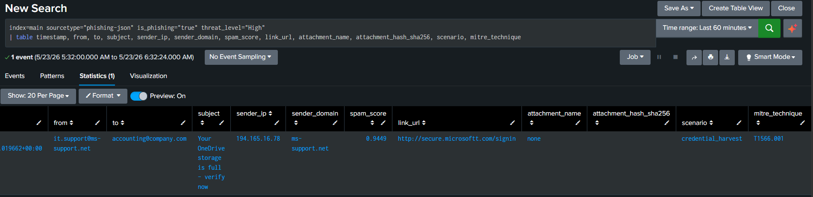

### Alert Configuration

Create a **Scheduled Alert** named `Phishing Email Detected`:

- **Alert type:** Scheduled
- **Cron expression:** `* * * * *` (every minute)
- **Time range:** Last 60 minutes
- **Trigger when:** Number of Results > 0
- **Trigger:** For each result
- **Action:** Webhook → n8n webhook URL

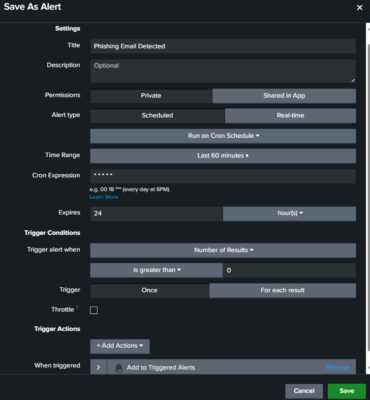

---

## n8n Workflow

The n8n workflow receives the Splunk webhook payload and orchestrates the entire enrichment and triage pipeline.

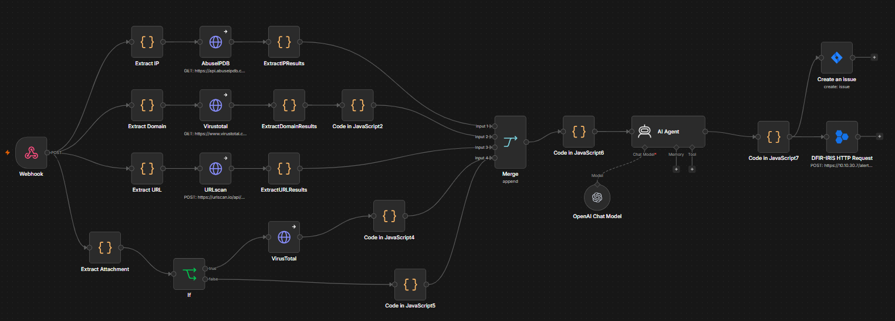

---

### Node Structure

#### 1. Webhook (Trigger)

- **Method:** POST
- **Action:** Receives the Splunk alert payload

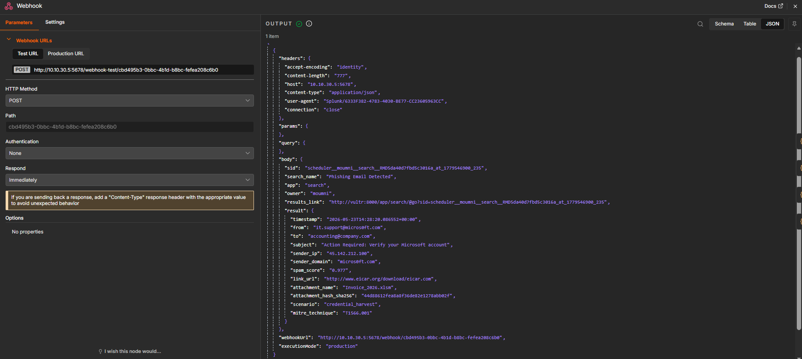

#### 2. Extract IP (Code)

Extracts sender IP and mail server from the Splunk alert payload.

```javascript
const result = $input.first().json.body.result;
return [{ json: {
    sender_ip: result.sender_ip,
    mail_server: result.mail_server
}}];
```

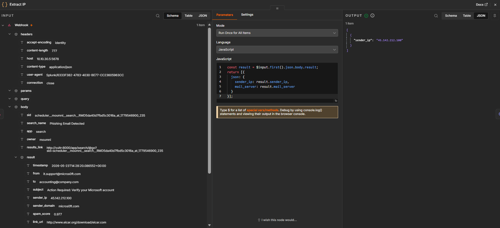

#### 3. Extract Domain (Code)

Extracts the phishing domain from the malicious link URL.

```javascript
const result = $input.first().json.body.result;
const linkUrl = result.link_url.replace(/^https?:\/\//, '').split('/')[0];
return [{ json: {
    sender_domain: result.sender_domain,
    phishing_domain: linkUrl,
    from_email: result.from,
    to_email: result.to
}}];
```

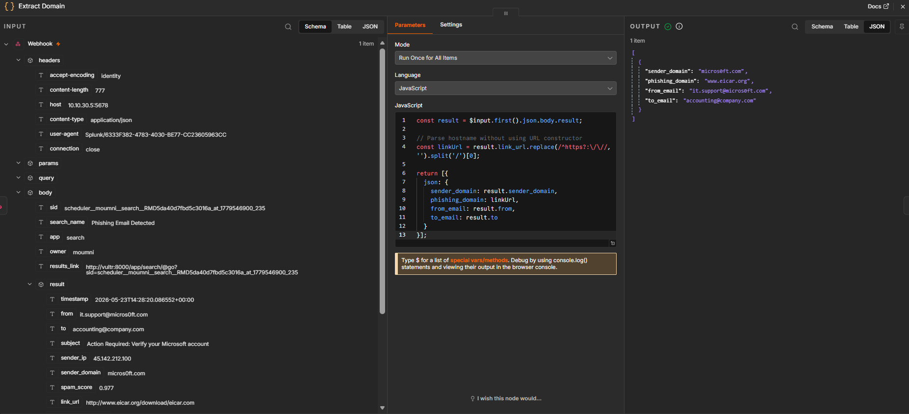

#### 4. Extract URL (Code)

Extracts the full phishing URL for scanning.

```javascript
const result = $input.first().json.body.result;
return [{ json: {
    link_url: result.link_url,
    has_link: result.has_link
}}];
```

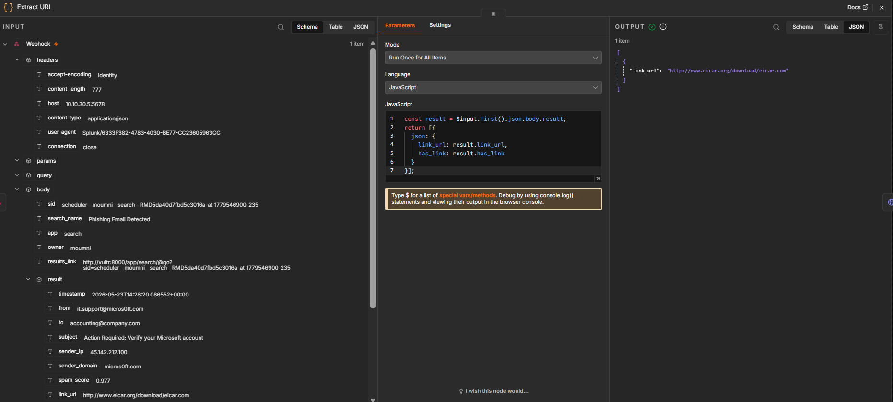

#### 5. Extract Attachment (Code)

Extracts attachment metadata including the SHA256 hash for VirusTotal lookup.

```javascript
const result = $input.first().json.body.result;
return [{ json: {
    attachment_name: result.attachment_name,
    attachment_hash_sha256: result.attachment_hash_sha256,
    attachment_size_bytes: result.attachment_size_bytes,
    has_attachment: result.has_attachment
}}];
```

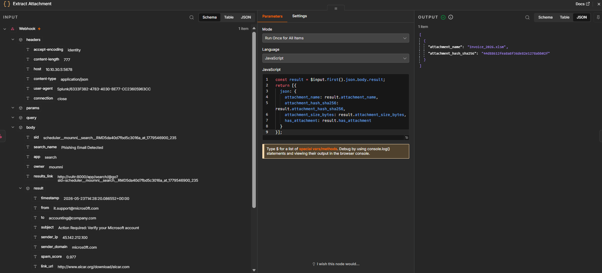

#### 6. AbuseIPDB (HTTP Request)

- **Method:** GET
- **URL:** `https://api.abuseipdb.com/api/v2/check?ipAddress={{ $json.sender_ip }}`
- **Auth:** Header Auth (API key)

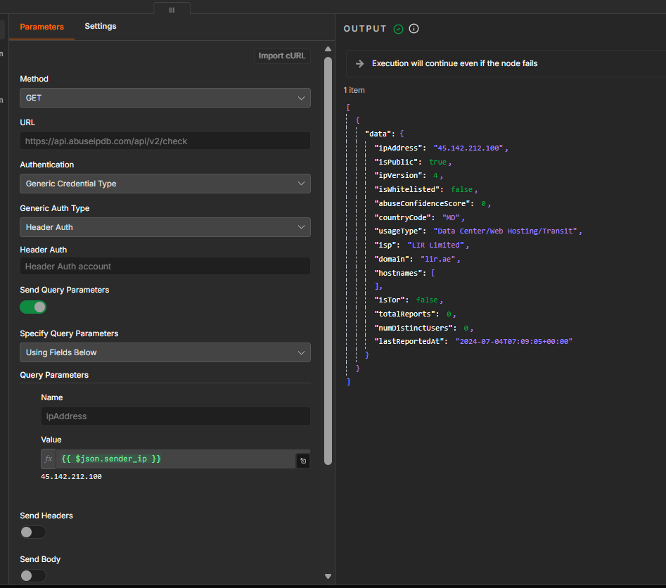

#### 7. VirusTotal Domain (HTTP Request)

- **Method:** GET
- **URL:** `https://www.virustotal.com/api/v3/domains/{{ $json.phishing_domain }}`
- **Auth:** VirusTotal API credential

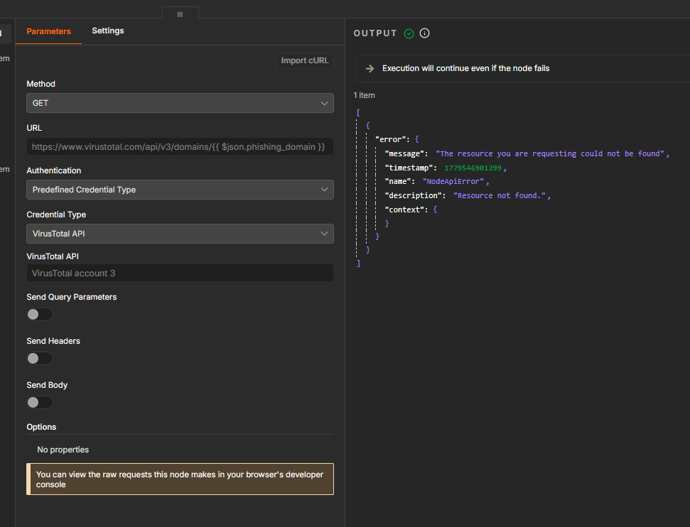

#### 8. URLscan.io (HTTP Request)

- **Method:** POST
- **URL:** `https://urlscan.io/api/v1/scan/`
- **Body:**
```json
{
  "url": "{{ $json.link_url }}",
  "visibility": "private"
}
```

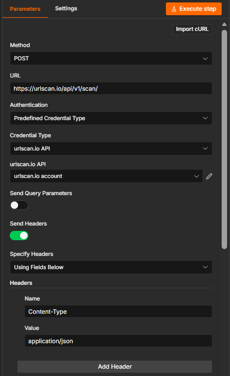
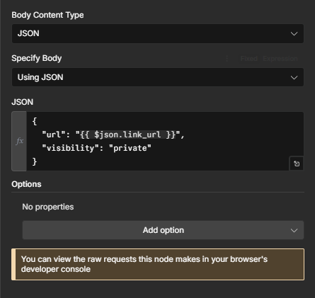

#### 9. IF Node (Attachment Guard)

Routes execution based on whether an attachment hash exists.

- **Condition:** `{{ $json.attachment_hash_sha256.length }}` greater than `0`
- **True →** VirusTotal Files lookup
- **False →** Default "no attachment" object

#### 10. VirusTotal Files (HTTP Request)

- **Method:** GET
- **URL:** `https://www.virustotal.com/api/v3/files/{{ $json.attachment_hash_sha256 }}`
- **Auth:** VirusTotal API credential

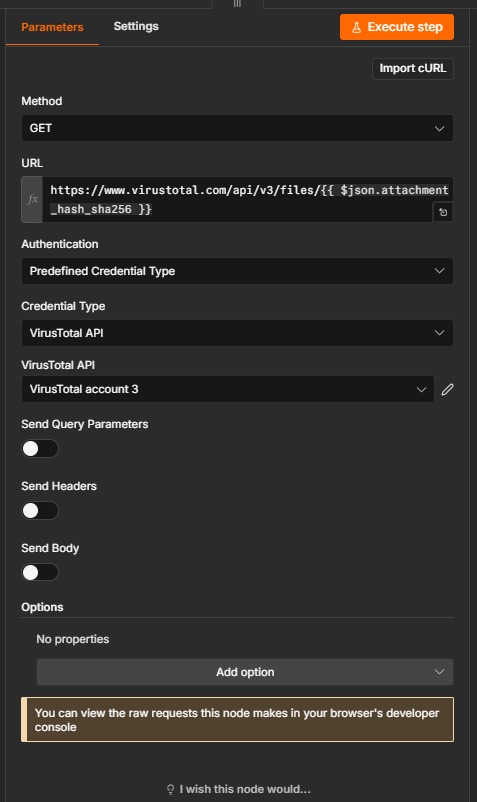

#### 11. Normalize Nodes (Code — one per branch)

Each IOC branch normalizes the raw API response into a consistent format.

**IP Normalize:**

```javascript
const data = $input.first().json;
if (data.error) return [{ json: { ioc_type: "ip", ioc_value: "", ip_verdict: "unknown", ip_found: false }}];
const report = data.data;
return [{ json: {
    ioc_type: "ip",
    ioc_value: report.ipAddress,
    ip_abuse_score: report.abuseConfidenceScore,
    ip_country: report.countryCode,
    ip_isp: report.isp,
    ip_total_reports: report.totalReports,
    ip_verdict: report.abuseConfidenceScore > 50 ? "malicious" : "suspicious"
}}];
```

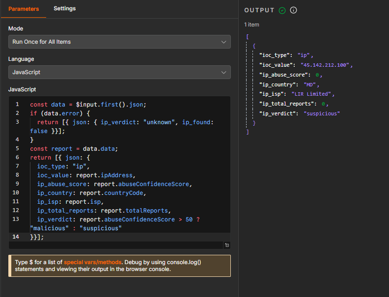

**Domain Normalize:**

```javascript
const data = $input.first().json;
if (data.error || !data.data || !data.data.attributes) {
    return [{ json: {
        ioc_type: "domain",
        ioc_value: $('Extract Domain').first().json.phishing_domain,
        domain_verdict: "unknown",
        domain_vt_found: false
    }}];
}
const stats = data.data.attributes.last_analysis_stats;
return [{ json: {
    ioc_type: "domain",
    ioc_value: data.data.id,
    domain_malicious_count: stats.malicious,
    domain_harmless_count: stats.harmless,
    domain_verdict: stats.malicious > 0 ? "malicious" : "clean"
}}];
```

**URL Normalize:**

```javascript
const data = $input.first().json;
if (data.error) {
    return [{ json: {
        ioc_type: "url",
        ioc_value: $('Extract URL').first().json.link_url,
        url_verdict: "unknown",
        url_scan_found: false,
        url_note: data.error.description
    }}];
}
return [{ json: {
    ioc_type: "url",
    ioc_value: data.result,
    url_verdict: data.verdicts?.overall?.malicious ? "malicious" : "clean",
    url_malicious: data.verdicts?.overall?.malicious,
    url_score: data.verdicts?.overall?.score
}}];
```

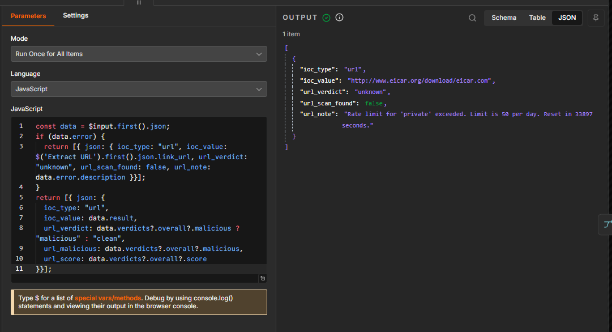

**File Normalize:**

```javascript
const data = $input.first().json;
if (data.error) {
    return [{ json: {
        ioc_type: "file",
        ioc_value: $('Extract Attachment').first().json.attachment_hash_sha256,
        file_verdict: "unknown",
        file_vt_found: false
    }}];
}
const stats = data.data.attributes.last_analysis_stats;
return [{ json: {
    ioc_type: "file",
    ioc_value: data.data.id,
    file_malicious_count: stats.malicious,
    file_harmless_count: stats.harmless,
    file_verdict: stats.malicious > 0 ? "malicious" : "clean"
}}];
```

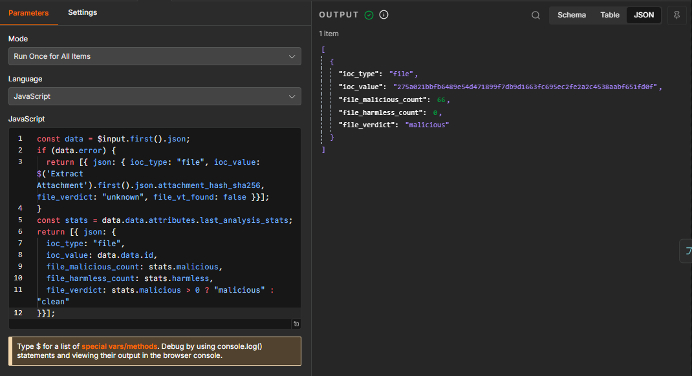

#### 14. Merge Node

- **Mode:** Append
- **Number of Inputs:** 4 (IP, Domain, URL, File branches)

#### 15. Bundle Code Node

Assembles all enriched IOCs alongside the original email context from the webhook.

```javascript
const items = $input.all().map(i => i.json);
const email = $('Webhook').first().json.body.result;
return [{ json: {
    email_context: {
        timestamp: email.timestamp,
        from: email.from,
        to: email.to,
        subject: email.subject,
        spam_score: email.spam_score,
        mitre_technique: email.mitre_technique,
        scenario: email.scenario
    },
    iocs: items
}}];
```

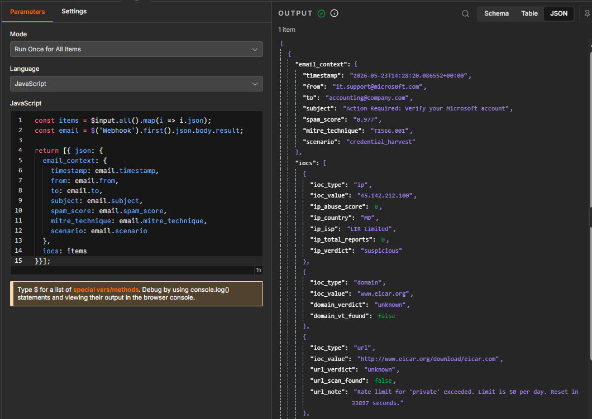

---

## AI Agent

The AI Agent node uses **OpenAI GPT-4.1-mini** — lightweight and cost-effective for Tier 1 SOC triage tasks.

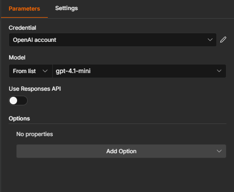

### System Prompt

```
You are a Tier 1 SOC analyst assistant. Analyze the following phishing email
alert and IOC enrichment data.

Input data:
{{ JSON.stringify($json) }}

Perform these steps:
1. Summarize the alert
2. Enrich with threat intelligence from the provided IOC data
3. Assess severity based on MITRE ATT&CK mapping
4. Recommend next actions

IMPORTANT: Respond ONLY with a valid JSON object, no markdown, no backticks:

{
  "summary": "string",
  "ioc_enrichment": [
    {
      "ioc_type": "ip|domain|url|file",
      "ioc_value": "string",
      "verdict": "malicious|suspicious|unknown|clean|none",
      "details": "string"
    }
  ],
  "severity": {
    "rating": "Low|Medium|High|Critical",
    "mitre_technique": "string",
    "mitre_tactic": "string",
    "justification": "string"
  },
  "recommended_actions": ["string"],
  "risk_score": 0,
  "verdict": "MALICIOUS|SUSPICIOUS|BENIGN"
}
```

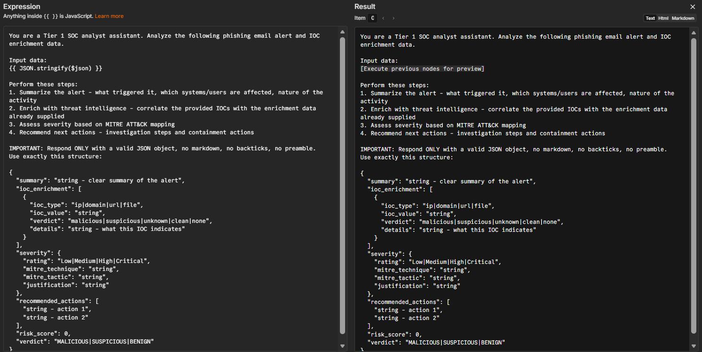

### Parse JSON Code Node

Strips any markdown fences from the AI response and parses it into structured JSON.

```javascript
const raw = $input.first().json.output;
const clean = raw.replace(/```json|```/g, '').trim();
const parsed = JSON.parse(clean);
return [{ json: parsed }];
```

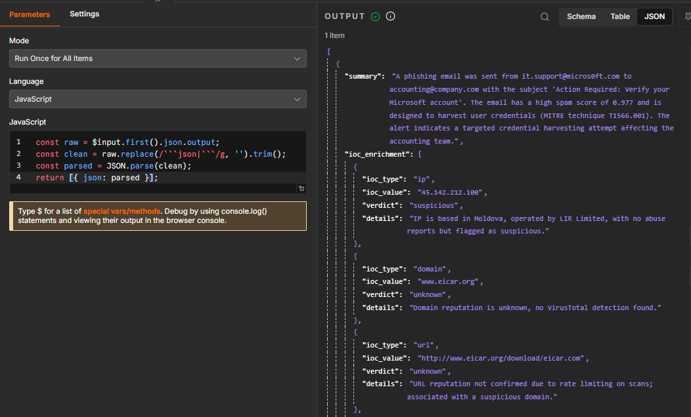

---

## Ticket Creation

### DFIR-IRIS Alert Node

**Configuration:**

| Field         | Value                               |
|---------------|-------------------------------------|
| Host          | `https://10.10.30.7`               |
| Auth          | Bearer API Token                    |
| SSL           | Ignore (self-signed cert)           |
| Alert severity | Critical=4, High=3, Medium=2, Low=1 |

- **Method:** POST
- **URL:** `https://10.10.30.7/alerts/add`

**Request Body:**

```json
{
  "alert_title": "{{ $json.verdict }} - {{ $('Webhook').first().json.body.result.subject }}",
  "alert_description": "{{ $json.summary }}",
  "alert_note": "## AI Investigation Report\n\n**Verdict:** {{ $json.verdict }}\n**Risk Score:** {{ $json.risk_score }}/100\n**Severity:** {{ $json.severity.rating }}\n**MITRE:** {{ $json.severity.mitre_technique }} - {{ $json.severity.mitre_tactic }}\n\n**Justification:** {{ $json.severity.justification }}\n\n---\n\n## IOC Enrichment\n{{ $json.ioc_enrichment.map(i => `- **${i.ioc_type}** | ${i.ioc_value} | ${i.verdict}\n  ${i.details}`).join('\n') }}\n\n---\n\n## Recommended Actions\n{{ $json.recommended_actions.map((a,i) => `${i+1}. ${a}`).join('\n') }}",
  "alert_severity_id": "{{ {'Critical':4,'High':3,'Medium':2,'Low':1}[$json.severity.rating] ?? 2 }}",
  "alert_status_id": 2,
  "alert_tlp_id": 2,
  "alert_source": "Splunk",
  "alert_source_ref": "{{ $('Webhook').first().json.body.sid }}",
  "alert_customer_id": 1
}
```

### Jira Issue Node

**Configuration:**

| Field          | Value                          |
|----------------|--------------------------------|
| Project Key    | KAN                            |
| Project ID     | 10000                          |
| Issue Type ID  | 10003 (Task)                   |
| Auth           | Basic Auth (email + API token) |

Get your API token at: `https://id.atlassian.com/manage-profile/security/api-tokens`

- **Method:** POST
- **URL:** `https://YOUR_DOMAIN.atlassian.net/rest/api/2/issue`

**Request Body:**

```json
{
  "fields": {
    "project": { "key": "KAN" },
    "issuetype": { "id": "10003" },
    "summary": "{{ '[' + $json.severity.rating + '] ' + $json.verdict + ' - ' + $('Webhook').first().json.body.result.subject }}",
    "description": "Verdict: {{ $json.verdict }}\nRisk Score: {{ $json.risk_score }}/100\nMITRE: {{ $json.severity.mitre_technique }} - {{ $json.severity.mitre_tactic }}\n\nSummary:\n{{ $json.summary }}\n\nRecommended Actions:\n{{ $json.recommended_actions.join('\n') }}"
  }
}
```

---

## Results

### DFIR-IRIS Alert Created

The AI agent generates a full investigation report automatically attached to the IRIS alert, including IOC enrichment, MITRE ATT&CK mapping, and recommended actions.

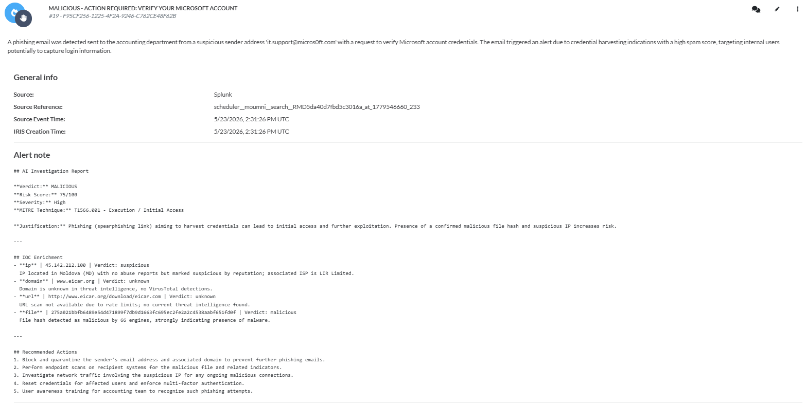

### Jira Issue Created

A prioritized Jira task is created instantly with the full triage summary, IOC details, and remediation steps.

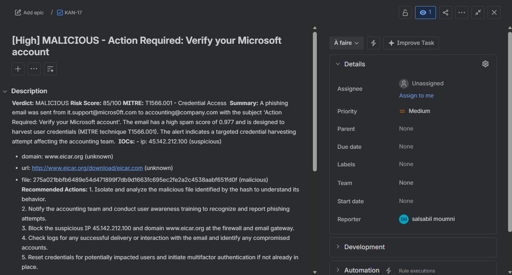

---

## 📚 References

- [Sysmon - Microsoft Sysinternals](https://docs.microsoft.com/en-us/sysinternals/downloads/sysmon)
- [sysmon-modular config - olafhartong](https://github.com/olafhartong/sysmon-modular)
- [DFIR-IRIS GitHub](https://github.com/dfir-iris/iris-web)
- [n8n Documentation](https://docs.n8n.io)
- [VirusTotal API](https://developers.virustotal.com/reference)
- [AbuseIPDB API](https://docs.abuseipdb.com)
- [URLscan.io API](https://urlscan.io/docs/api/)
- [MITRE ATT&CK - T1566 Phishing](https://attack.mitre.org/techniques/T1566/)

---


