# 🛡️ Automated SOC Pipeline — pfSense + Splunk + n8n + TheHive

> A fully automated Security Operations Center (SOC) pipeline built entirely on open-source tools.  
> Threats are detected by Splunk, enriched via VirusTotal, triaged in TheHive, and analysts are notified — and can take remediation action — directly from Slack.

**Author:** [salsabilmoumni](https://github.com/salsabilmoumni)

---

## 📑 Table of Contents

- [Overview](#-overview)
- [Architecture](#-architecture)
- [Stack](#-stack)
- [Network Layout](#-network-layout)
- [Phase 1 — Installation & Configuration](#phase-1--installation--configuration)
  - [1. pfSense Setup](#1-pfsense-setup)
  - [2. Sysmon](#2-sysmon)
  - [3. Splunk](#3-splunk)
  - [4. Active Directory](#4-active-directory)
  - [5. TheHive](#5-thehive)
  - [6. n8n](#6-n8n)
- [Phase 2 — Attack Simulations](#phase-2--attack-simulations)
- [Phase 3 — Detection & Alerting](#phase-3--detection--alerting)
  - [Attack 1 — Port Scan / Firewall Blocked Scanner](#attack-1--port-scan--firewall-blocked-scanner)
  - [Attack 2 — RDP Brute Force](#attack-2--rdp-brute-force)
  - [Attack 3 — Kerberoasting](#attack-3--kerberoasting)
- [Phase 4 — Incident Response & Remediation](#phase-4--incident-response--remediation)
- [References](#-references)

---

## 🔍 Overview

This project simulates a real-world SOC environment deployed on cloud infrastructure (Vultr). It covers the full detection-to-response lifecycle:

1. Attackers perform real attacks (port scan, RDP brute force, Kerberoasting)
2. Splunk detects anomalies and fires webhook alerts
3. n8n orchestrates the response: enriches IOCs via VirusTotal, opens cases in TheHive, and notifies analysts on Slack
4. Analysts trigger one-click remediation (disable user / reset password) directly from Slack

---

## 🏗️ Architecture

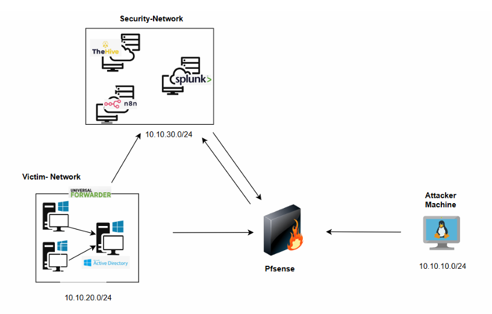

---

## 🔄 Full Workflow

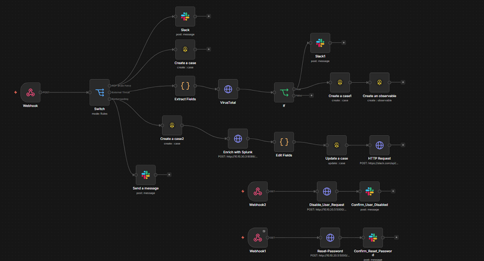

---

## 🧰 Stack

| Tool | Role | Port |
|------|------|------|
| **pfSense** | Firewall / network segmentation | — |
| **Splunk Enterprise** | SIEM — log ingestion, detection, alerts | 8000 |
| **n8n** | SOAR — workflow automation & orchestration | 5678 |
| **TheHive 5** | Case management platform | 9000 |
| **Slack** | Analyst notification & action channel | — |
| **VirusTotal API v3** | IOC enrichment (IP reputation) | — |
| **Impacket** | Kerberoasting simulation | — |
| **Hydra** | RDP brute force simulation | — |
| **Flask** | Remediation API on the AD server | 5000 |
| **Sysmon v15.2** | Windows endpoint telemetry | — |

---

## 🌐 Network Layout

| Interface | NIC | IP | Hosts |
|-----------|-----|----|-------|
| WAN | vtnet0 | 95.179.244.27 | Internet |
| ATTACKER | vtnet2 | 10.10.10.3/24 | Kali Linux |
| SECURITY | vtnet3 | 10.10.30.4/24 | Splunk, TheHive, n8n |
| VICTIM | vtnet4 | 10.10.20.3/24 | Windows DC, C1, C2 |

Firewall rules allow traffic between all segments through pfSense (which acts as default gateway), so logs from every VM flow through the firewall.

---

## Phase 1 — Installation & Configuration

### 1. pfSense Setup

Deploy pfSense on Vultr and configure a private VPC.  
Reference guide: *"PFsense setup on Vultr with private LAN — Jarrod's Tech"*

**Interfaces:**

| Interface | IP |
|-----------|-----|
| WAN | 95.179.244.27 (public) |
| ATTACKER | 10.10.10.3/24 |
| SECURITY | 10.10.30.4/24 |
| VICTIM | 10.10.20.3/24 |

**Firewall rules:** Add a pass-all rule on each interface (source = subnet, destination = any) so machines can communicate and pfSense can collect logs.

**Set pfSense as the default gateway** on all VMs so every connection is routed through the firewall.

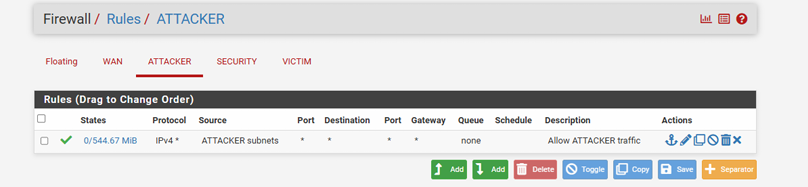
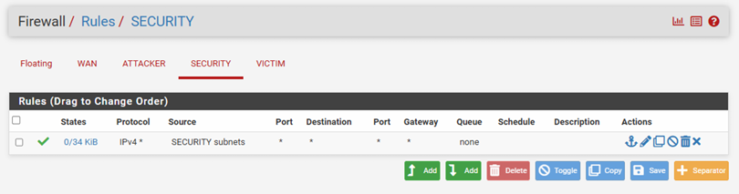
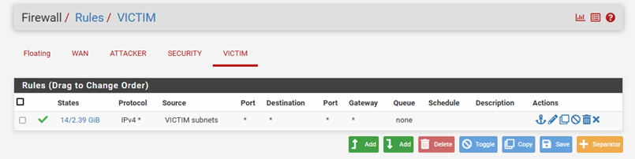

Interface status — all up:

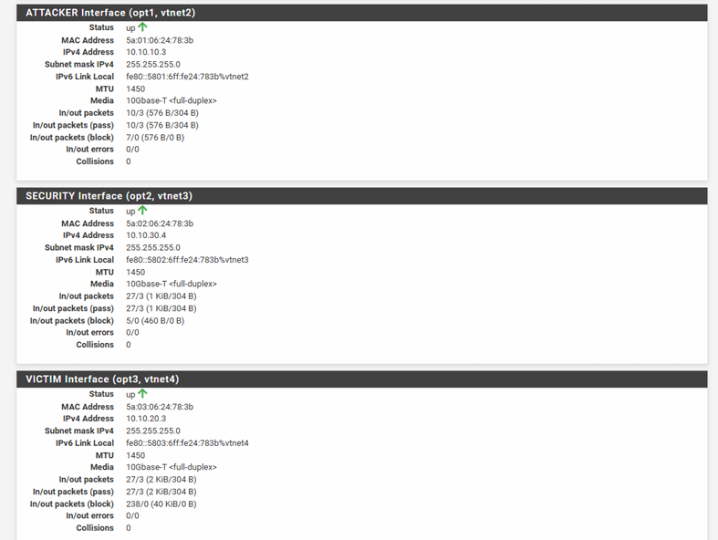

---

### 2. Sysmon

Install **Sysmon v15.2** on all three Windows machines (DC + 2 clients).

**Download:** [Sysmon — Sysinternals](https://learn.microsoft.com/en-us/sysinternals/downloads/sysmon)  
**Config:** [olafhartong/sysmon-modular — sysmonconfig.xml](https://github.com/olafhartong/sysmon-modular/blob/master/sysmonconfig.xml) (schema 4.90)

```powershell
# Install Sysmon with config
.\Sysmon64.exe -i .\sysmonconfig.xml

# Verify installation
Get-Service Sysmon64
Get-WinEvent -ListLog "Microsoft-Windows-Sysmon/Operational"
```

Sysmon captures: process creation, network connections, file operations, registry changes, and more.


---

### 3. Splunk

**Install Splunk Enterprise** on the Security VM and start it:

```bash
/opt/splunk/bin/splunk start
# Web UI available at http://<SECURITY_IP>:8000
```


**Splunk Universal Forwarder** — install on all 3 Windows machines and configure `inputs.conf`:

```
C:\Program Files\SplunkUniversalForwarder\etc\system\local\inputs.conf
```

```ini
[WinEventLog://Microsoft-Windows-Sysmon/Operational]
index = soc
disabled = 0

[WinEventLog://Security]
index = soc
disabled = 0
```

> ⚠️ **Common issue:** the default `inputs.conf` gets copied to local. Replace it with the minimal clean version above, then restart:

```powershell
Restart-Service SplunkForwarder
```

**Windows Audit Policy** — enable on all machines to generate connection events:

```cmd
auditpol /set /subcategory:"Filtering Platform Connection" /success:enable /failure:enable
```

This generates **EventCode 5156** (connection allowed) and **EventCode 5157** (connection blocked).

After configuring the forwarder, Splunk receives telemetry from all 3 victim machines:

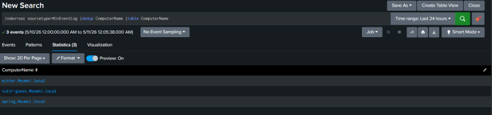

---

### 4. Active Directory

Install **Active Directory Domain Services** on the Windows Server VM (hostname: `Moumni-ADDC01`).

**Steps:**
1. Server Manager → Add Roles → Active Directory Domain Services
2. Promote to Domain Controller, create domain `Moumni.local`
3. On Windows-C1 and Windows-C2: set Preferred DNS to the DC IP (`10.10.20.5`)
4. Join the domain: `System Properties → Computer Name → Change → Domain: Moumni`


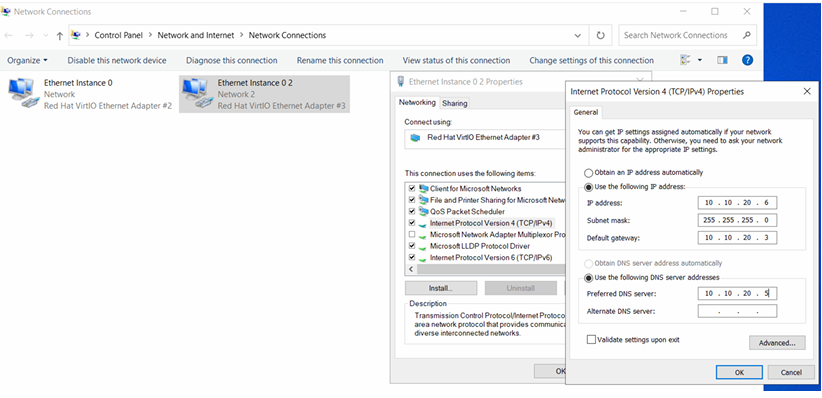
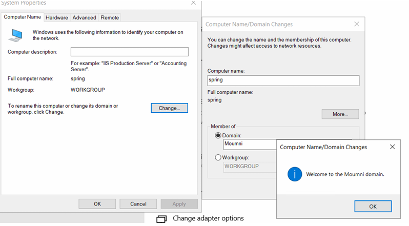

---

### 5. TheHive

Install **TheHive 5** using Docker:

```bash
docker pull strangebee/thehive:5
docker-compose up -d
# Available at http://<SECURITY_IP>:9000
```

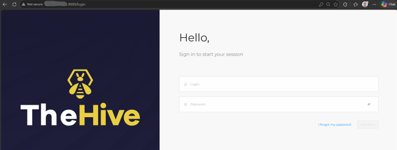

---

### 6. n8n

Install **n8n** using Docker Compose:

```yaml
services:
  n8n:
    image: n8nio/n8n:latest
    restart: always
    ports:
      - "5678:5678"
    environment:
      - N8N_HOST=10.10.30.5
      - N8N_PORT=5678
      - N8N_PROTOCOL=http
      - N8N_SECURE_COOKIE=false
      - GENERIC_TIMEZONE=Africa/Tunis
    volumes:
      - ./n8n_data:/home/node/.n8n
```

```bash
docker-compose up -d
# Available at http://<SECURITY_IP>:5678
```

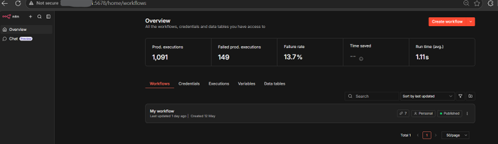

---

## Phase 2 — Attack Simulations

Three attack types are simulated from the Kali attacker machine:

| # | Attack | Tool | Source |
|---|--------|------|--------|
| 1 | Port Scan / Host Sweep | nmap / pfSense blocked traffic | 10.10.10.x |
| 2 | RDP Brute Force | Hydra | 10.10.10.x |
| 3 | Kerberoasting | Impacket GetUserSPNs | 10.10.10.x |

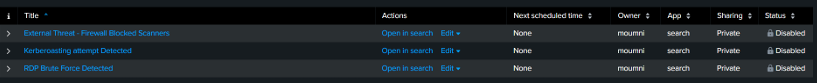

Configure the n8n webhook to receive the Splunk alerts:

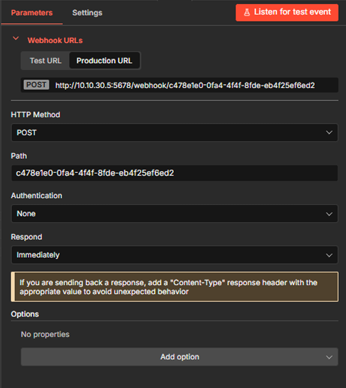

---

## Phase 3 — Detection & Alerting

All three Splunk saved searches fire webhook POSTs to n8n.  
A **Switch node** routes each alert to the correct workflow branch based on `search_name`.

**Switch Rules:**

| Rule | Condition | Branch |
|------|-----------|--------|
| RDP Brute Force | `search_name` contains `RDP` | Slack + TheHive Case |
| External Threat | `search_name` contains `External Threat` | Full pipeline (VT + TheHive + Slack) |
| Kerberoasting | `search_name` contains `Kerberoasting` | Slack + TheHive + Enrichment + Remediation |

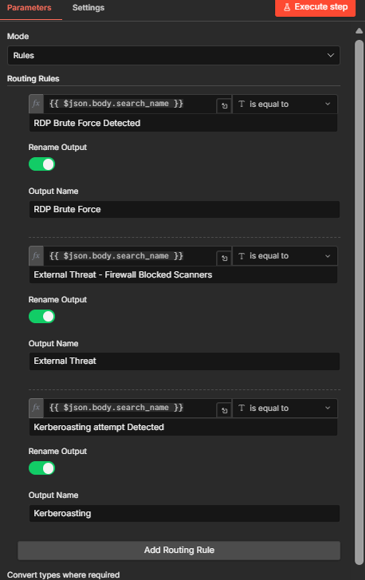

---

### Attack 1 — Port Scan / Firewall Blocked Scanner

Detects any IP performing a port scan or host sweep that pfSense blocks — covers both external internet scanners and internal Kali attacks.

**Splunk Detection Query:**

```spl
index=soc sourcetype=pfsense
| rex field=_raw "filterlog\[\d+\]: (?P<csv>.+)"
| eval fields=split(csv, ",")
| eval action=mvindex(fields, 6)
| eval direction=mvindex(fields, 7)
| eval proto=mvindex(fields, 16)
| eval src_ip=mvindex(fields, 18)
| eval dst_port=mvindex(fields, 21)
| where action="block" AND direction="in" AND proto="tcp"
| where NOT match(src_ip, "^10\.")
| where NOT match(src_ip, "^172\.")
| where NOT match(src_ip, "^192\.168\.")
| where dst_port IN ("22", "3389", "445", "1433", "3306")
| stats dc(dst_port) as ports_scanned, count as total_packets by src_ip
| where total_packets > 3
| sort -total_packets
| head 3
| eval list(src_ip) as top_attackers, sum(total_packets) as total_blocked_packets, count as unique_ips
```

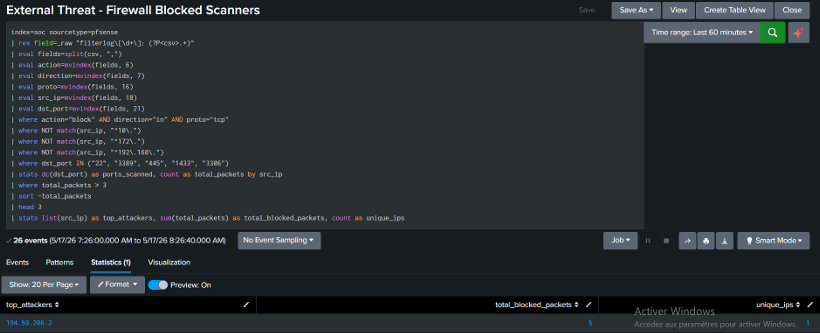

Alert fires when blocked traffic exceeds threshold → POST to n8n webhook.

**n8n Workflow Logic:**

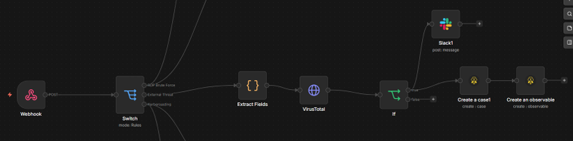

```
Webhook (POST)
  └── Switch (mode: Rules)
        ├── RDP Brute Force → Send Slack message + Create TheHive Case
        └── External Threat
              └── Extract Fields (JavaScript — parse IPs from top_attackers)
                    └── VirusTotal API (GET /api/v3/ip_addresses/{ip})
                          └── IF malicious > 0
                                ├── TRUE → Create TheHive Case
                                │         → Create Observable (IP as IOC)
                                │         → Slack Alert 🚨
                                └── FALSE → Stop (IP is clean)
```

**JavaScript Extraction Node** — extracts IPs from Splunk webhook payload before enrichment:

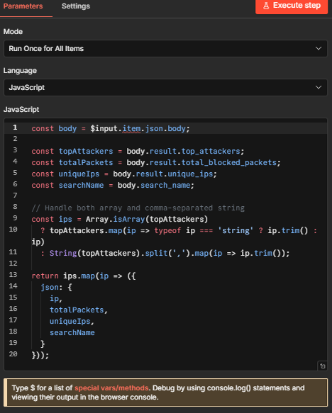

**VirusTotal Enrichment Node:**
- Endpoint: `GET https://www.virustotal.com/api/v3/ip_addresses/{ip}`
- Auth: `x-apikey` header
- Fields used: `last_analysis_stats.malicious`, `country`, `as_owner`

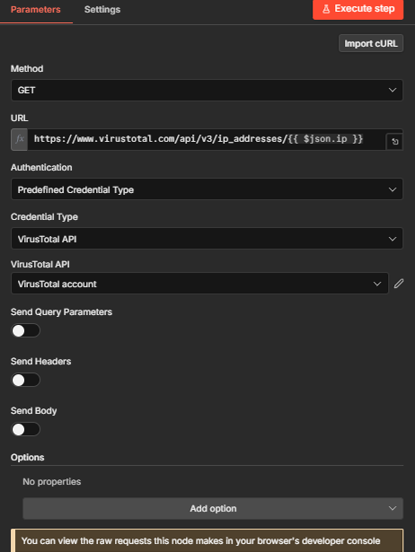

**IF Node** — classifies whether the IP is malicious:

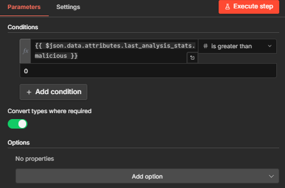

**TheHive Case Creation:**
- Title: `External Threat - {ip}`
- Severity: Medium
- Tags: `ExternalThreat`, `{country}`, `VT-Malicious`

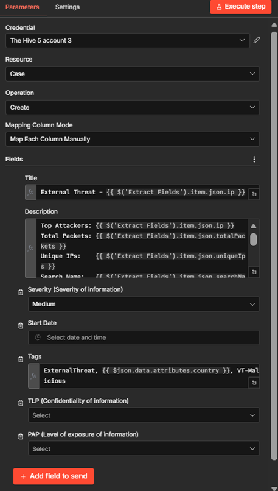
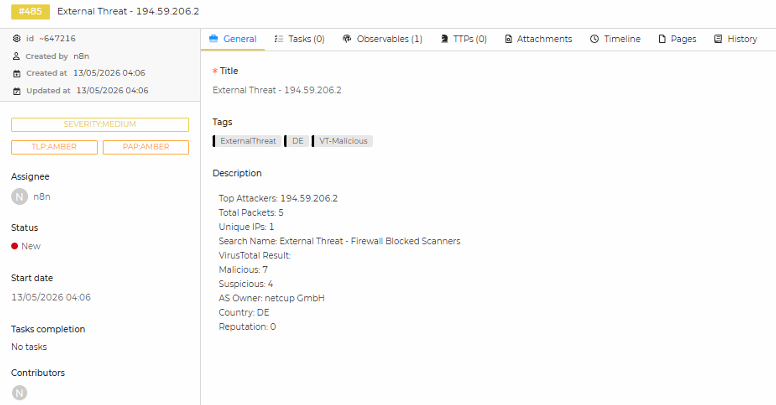

**Slack Alert:**

```
🚨 *External Threat Detected*
*IP:* 194.59.206.2
*Search:* External Threat - Firewall Blocked Scanners
*Total Packets:* 5  |  *Unique IPs:* 1
*VirusTotal Verdict:*
  - Malicious: 7  |  Suspicious: 4
  - AS Owner: netcup GmbH  |  Country: DE
🔗 VT Link: https://www.virustotal.com/gui/ip-address/194.59.206.2
Automated with this n8n workflow
```

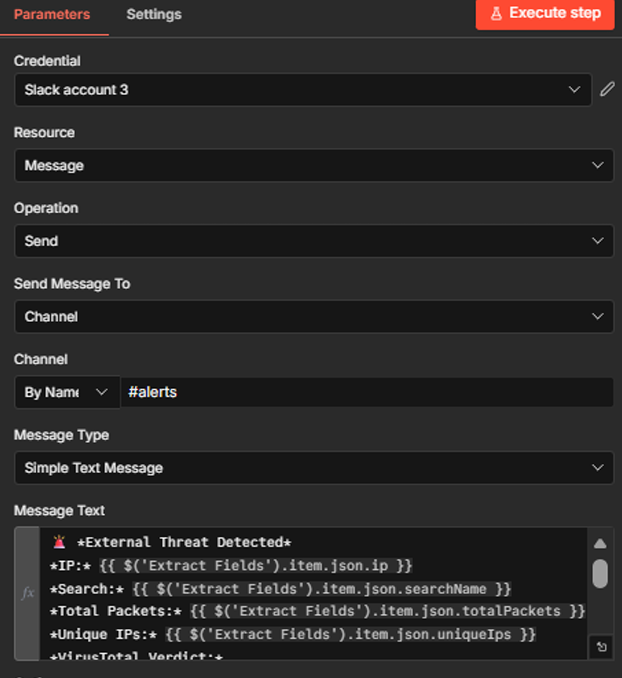
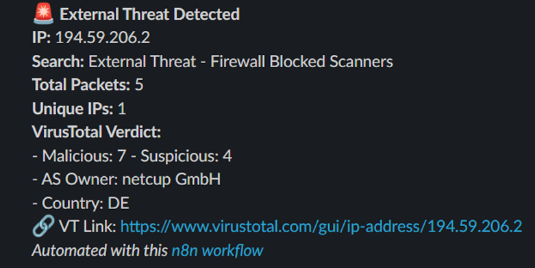

**Add Observable (IOC) to TheHive** — IP added with type `ip`, TLP: Amber, IOC: true:

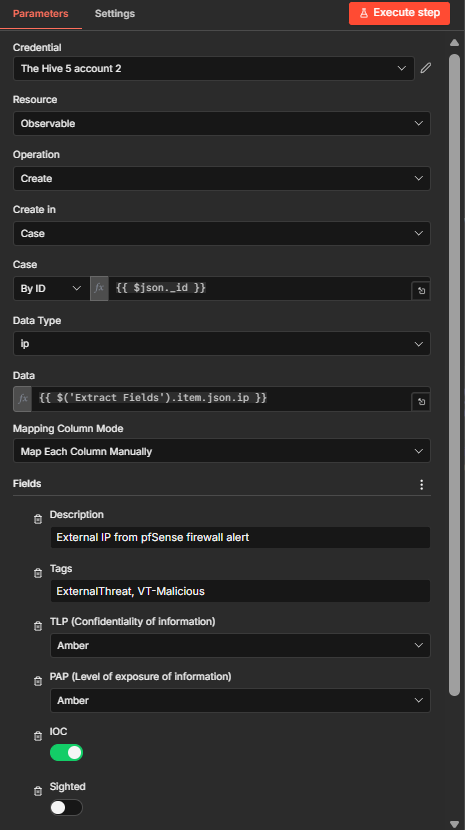
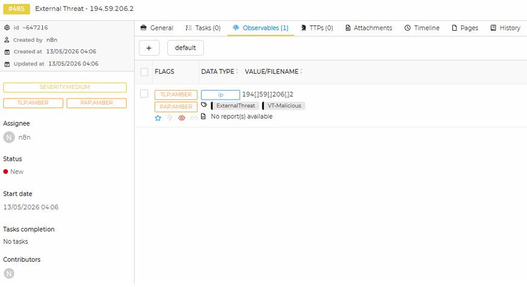

---

### Attack 2 — RDP Brute Force

**Simulation (from Kali):**

```bash
hydra -l administrator \
  -P /usr/share/seclists/Passwords/CommonCredentials/10k-most-common.txt \
  -t 4 rdp://10.10.20.4
```

**Splunk Detection Query:**

```spl
index=soc sourcetype=WinEventLog EventCode=3389 DestinationPort=3389
| bin _time span=1m
| stats count by _time, SourceIp, DestinationIp
| where count > 50
```

Fires alert when >50 RDP connection attempts from a single source within 1 minute.

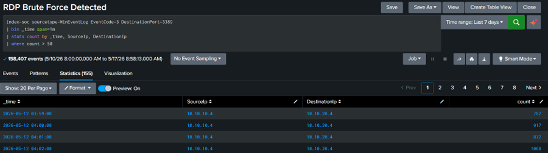

**n8n Workflow:**

```
Webhook (POST)
  └── Switch → RDP Brute Force branch
        ├── Send Slack message (immediate alert)
        └── Create TheHive Case
              Title:    "RDP Brute Force - {SourceIp}"
              Severity: High
              Tags:     RDP, BruteForce, T1110.001
```

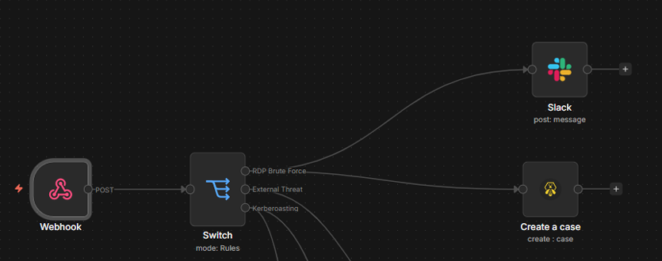

**TheHive Case:**

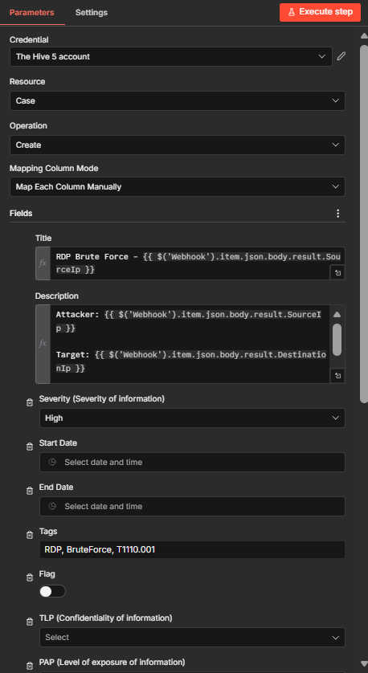
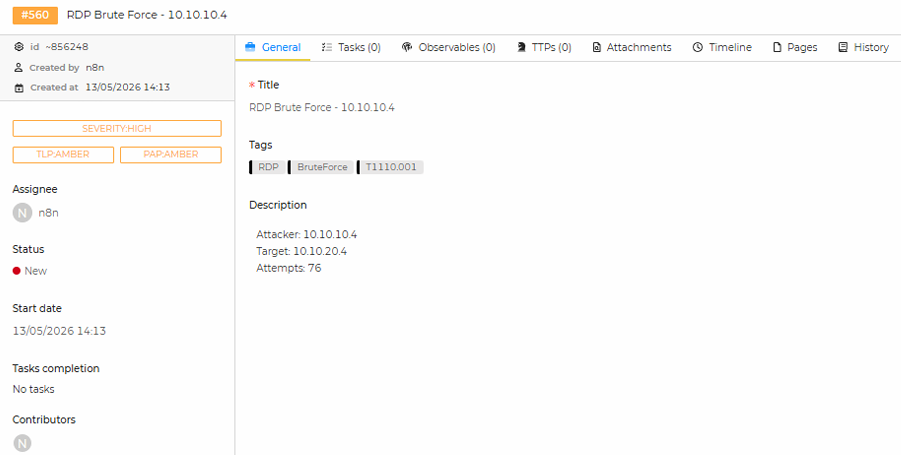

**Slack Notification:**

```
🚨 [HIGH] RDP Brute Force Detected
Attacker IP: 10.10.10.4
Target IP:   10.10.20.4
Attempts:    76
Search:      RDP Brute Force Detected
🔗 Splunk Link: http://...
Automated with this n8n workflow
```

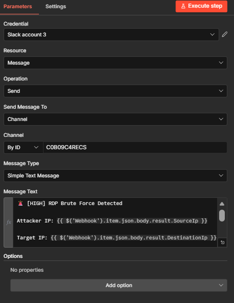
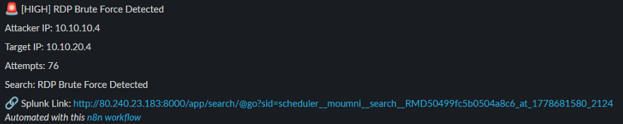

---

### Attack 3 — Kerberoasting

#### Setup on DC (PowerShell)

```powershell
# Create a low-privilege domain user
New-ADUser -Name "joe doe" -SamAccountName "joedoe" `
  -AccountPassword (ConvertTo-SecureString "Password123" -AsPlainText -Force) `
  -Enabled $true

# Create vulnerable service account
New-ADUser -Name "svc_http" -SamAccountName "svc_http" `
  -AccountPassword (ConvertTo-SecureString "Service123!" -AsPlainText -Force) `
  -Enabled $true -PasswordNeverExpires $true

# Register SPN
setspn -A HTTP/webserver.Moumni.local svc_http

# Enable RC4 encryption (makes it vulnerable to Kerberoasting)
Set-ADUser svc_http -KerberosEncryptionType RC4

# Verify
setspn -L svc_http
```

#### Simulation (from Kali/Attacker)

```bash
# Install Impacket
git clone https://github.com/fortra/impacket.git
cd impacket && pip install . --break-system-packages

# Enumerate SPNs
python3 /usr/local/bin/GetUserSPNs.py Moumni.local/joedoe:Password123 -dc-ip 10.10.20.5

# Request TGS hashes
python3 /usr/local/bin/GetUserSPNs.py Moumni.local/joedoe:Password123 -dc-ip 10.10.20.5 -request

# Crack hash offline (e.g. with hashcat)
```

#### Splunk Detection Query

```spl
index=soc EventCode=4769
| where Ticket_Encryption_Type="0x17"
| where NOT like(Service_Name, "%$")
| where Service_Name!="krbtgt"
| table _time, Account_Name, Service_Name, Client_Address, Ticket_Encryption_Type
| sort -_time
```

- Monitors **Event ID 4769** (Kerberos Service Ticket Request)
- Triggers on **RC4 encryption (`0x17`)** — the primary Kerberoasting indicator
- Payload sent to n8n: `Account_Name`, `Service_Name`, `IpAddress`, `Ticket_Encryption_Type`, MITRE tag

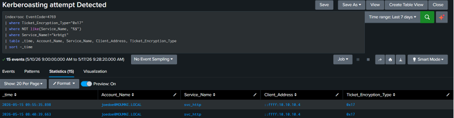

#### n8n Workflow — Kerberoasting Branch

```
Webhook (POST)
  └── Switch → Kerberoasting branch
        ├── Send Slack message (immediate alert)
        │     Fields: User, Service Account, Source IP,
        │             Encryption Type, Severity: HIGH
        │             MITRE ATT&CK: T1558.003
        │             Splunk link + Recommended actions
        │
        └── Create TheHive Case
              Title:    "Kerberoasting attempt Detected - {Account_Name}"
              Severity: High  |  Tags: T1558.003  |  TLP/PAP: Amber
              │
              └── Enrich with Splunk (last 24h activity for the account)
                    EventCodes: 4768/4769/4624/4625/4720/4722/4724/4738
                    │
                    └── Edit Fields (JavaScript)
                          - tgsCount, tgtCount
                          - logonSuccess, logonFailed
                          - accountCreated, passwordReset, accountModified
                          - riskLevel (CRITICAL / HIGH / MEDIUM)
                          - criticalFlags[], enrichmentSummary
                          │
                          └── Update TheHive Case (append enrichment)
                                │
                                └── HTTP Request → Slack API
                                      - TGS count, risk level
                                      - 🚫 Click to Disable AD User
                                      - 🔑 Click to Reset Service Password
```

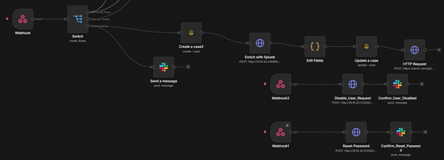

**Immediate Slack Notification:**

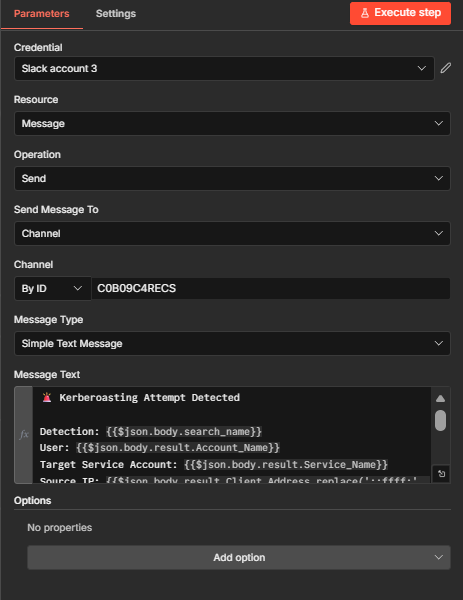
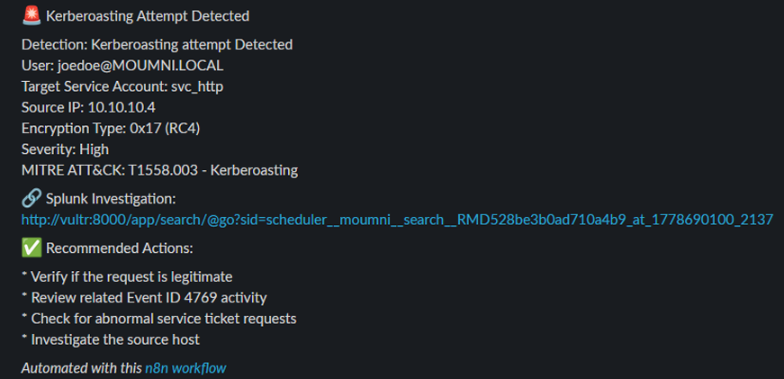

**Immediate TheHive Case Creation:**

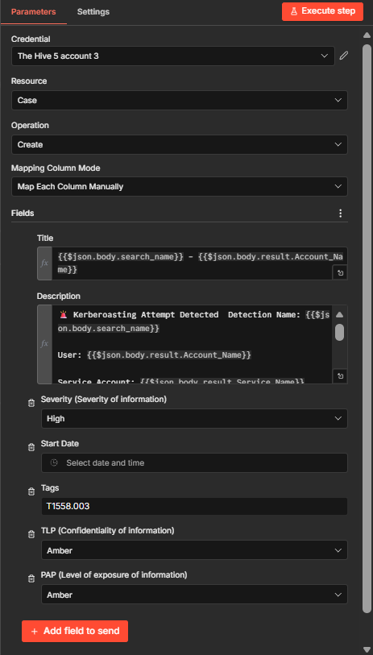
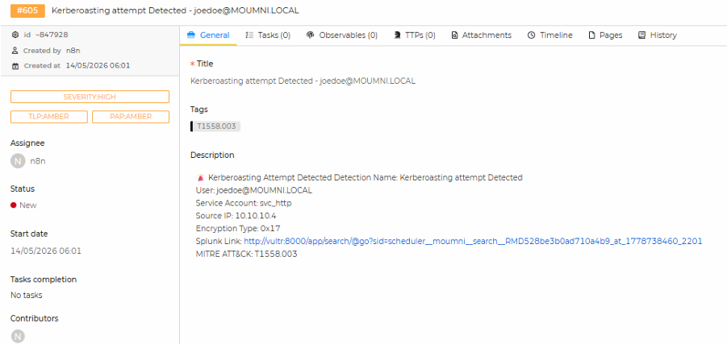

**Splunk Enrichment** — query pulls last 24h of activity for the compromised account:

- TGS/TGT request counts
- Successful/failed logon counts
- Account modifications
- Risk level assessment (CRITICAL / HIGH / MEDIUM)
- Critical flags (account creation, password reset, etc.)

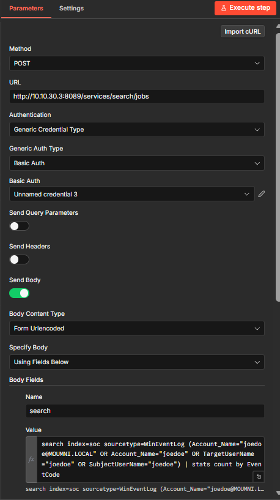

**Edit Fields (JavaScript)** — extracts and computes enrichment fields:

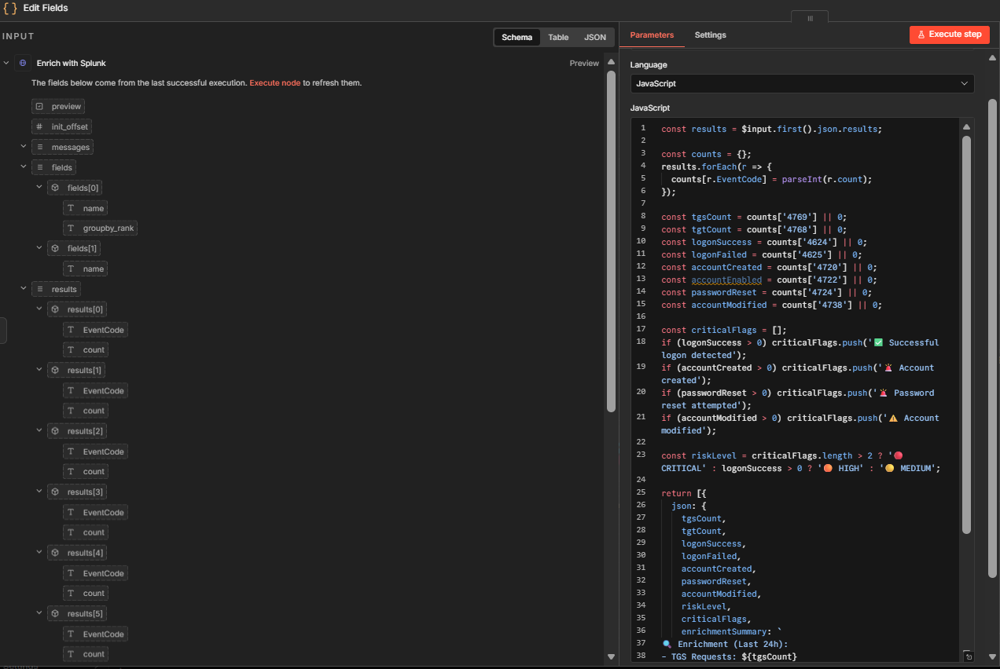

All enrichment data is added to the TheHive case description. The case is updated:

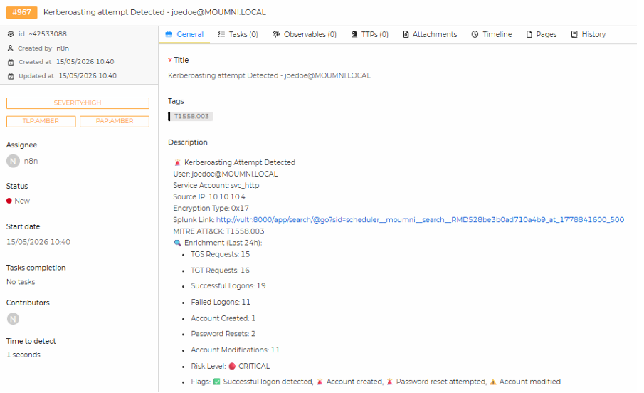

**Action Required message sent to Slack:**

```
🚨 Kerberoasting Detected — Action Required
User:            joedoe@MOUMNI.LOCAL
Service Account: svc_http
TGS Requests:    15
Risk Level:      CRITICAL

Remediation Actions:
🚫 Click to Disable AD User
🔑 Click to Reset Service Password
```

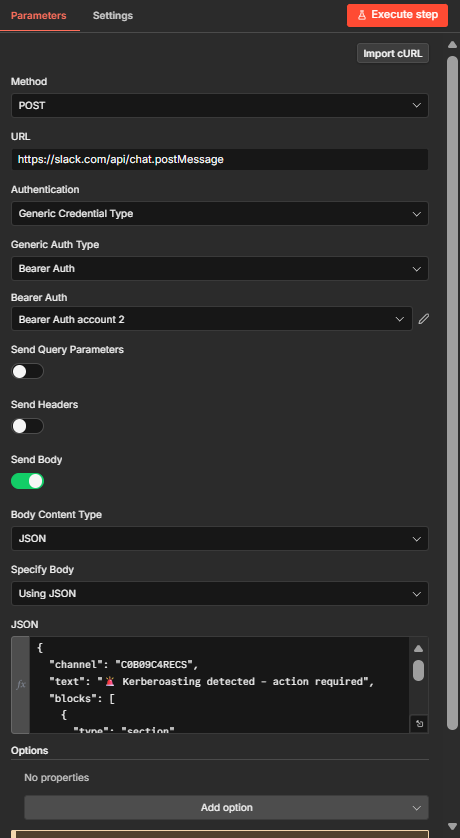
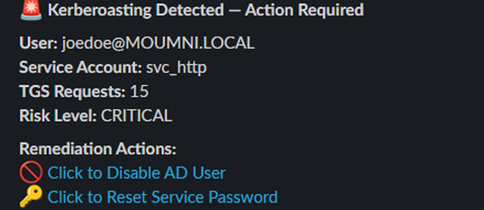

---

## Phase 4 — Incident Response & Remediation

### Flask Remediation API (on AD Server)

A lightweight Flask API running on the Windows DC enables n8n to execute PowerShell commands remotely via HTTP.

**Setup:**

```bash
pip install flask requests
python C:\ad_api.py
# Listens on 0.0.0.0:5000
```

**Endpoints:**

| Endpoint | Method | Action |
|----------|--------|--------|
| `/health` | GET | Health check |
| `/disable-user` | POST | Disable AD account via `Disable-ADAccount` |
| `/reset-password` | POST | Reset password via `Set-ADAccountPassword` |

**Security:**
- API key authentication via `X-API-Key` header
- Passwords generated randomly (25 chars, mixed charset)
- New password sent to Slack `#alerts` channel after reset

**AD Actions:**
- **Disable:** sets `userAccountControl = 514` via `Disable-ADAccount`
- **Reset:** generates random password via `Set-ADAccountPassword`

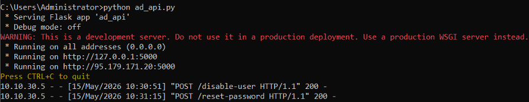

### Remediation Pipeline in n8n

```
Webhook2 (GET /disable-user?username=X)
  └── Disable_User_Request (POST → Flask API /disable-user)
        └── Confirm_User_Disabled (Slack confirmation)

Webhook1 (GET /reset-password?username=X)
  └── Reset_Password (POST → Flask API /reset-password)
        └── Confirm_Reset_Password (Slack confirmation + new password)
```

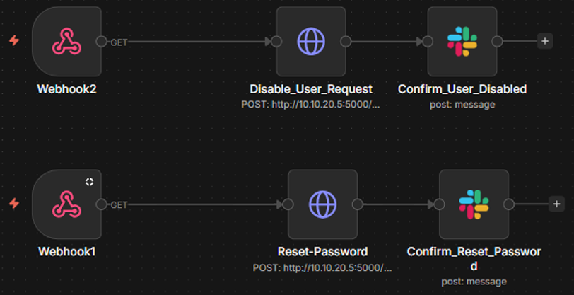

Both webhooks are permanently published. The analyst simply **clicks a link in Slack** → browser opens → webhook fires → PowerShell executes on the AD server → Slack confirms.

**User Disabled Confirmation:**

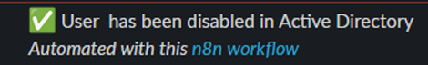

**Password Reset Confirmation:**

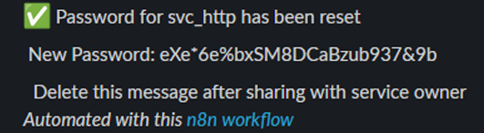

---

## 🔗 References

- [pfSense on Vultr with private LAN — Jarrod's Tech](https://jarrod.tech)
- [Sysmon v15.2 — Sysinternals](https://learn.microsoft.com/en-us/sysinternals/downloads/sysmon)
- [sysmon-modular config — olafhartong](https://github.com/olafhartong/sysmon-modular)
- [Impacket — fortra](https://github.com/fortra/impacket)
- [VirusTotal API v3](https://developers.virustotal.com/reference/overview)
- [TheHive Project](https://thehive-project.org/)
- [n8n Documentation](https://docs.n8n.io/)
- [MITRE ATT&CK T1558.003 — Kerberoasting](https://attack.mitre.org/techniques/T1558/003/)
- [MITRE ATT&CK T1110.001 — Password Guessing](https://attack.mitre.org/techniques/T1110/001/)

---

<p align="center">Built by <a href="https://github.com/salsabilmoumni">salsabilmoumni</a></p>
