# 🛡️ Automation SOC — Splunk + Shuffle + VirusTotal + TheHive


## 📋 Overview

This project simulates a real-world **Security Operations Center (SOC)** environment deployed on cloud infrastructure. The goal is to build an automated detection and response pipeline that mirrors what analysts encounter in production environments — from raw endpoint telemetry all the way to enriched, triaged cases in a case management platform.

The lab uses **Mimikatz** (a well-known credential-dumping tool) as the simulated threat. When Mimikatz accesses LSASS on the Windows endpoint, Sysmon captures the event, Splunk detects it, and the entire response chain fires automatically: hash enrichment via VirusTotal, analyst email notification, and case creation in TheHive — all without manual intervention.

---

## 🎯 Objectives

- Deploy a cloud-based SOC lab with isolated VPC networking
- Collect endpoint telemetry using **Sysmon** and forward it to **Splunk** via Universal Forwarder
- Write a **Splunk detection rule** targeting LSASS access (credential dumping — MITRE T1003)
- Build a **Shuffle SOAR workflow** that automates the full alert-to-case pipeline
- Enrich file hashes automatically using the **VirusTotal API**
- Auto-generate **TheHive cases** with observables and notify analysts by email
- Understand how SOAR reduces mean time to respond (MTTR) in a SOC

---

## 🏗️ Architecture

The pipeline flows from left to right: a Splunk alert fires a webhook into Shuffle, which extracts the SHA256 hash, queries VirusTotal, creates a TheHive case, attaches observables, and emails the analyst.

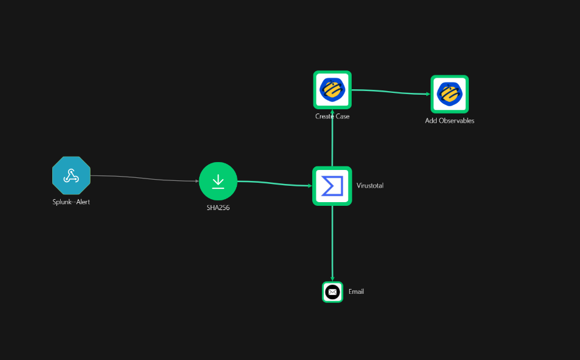

---

## 🧰 Tools Used

| Tool | Role |
|---|---|
| **Splunk Enterprise** | SIEM — log ingestion, search, alerting |
| **Sysmon** | Windows endpoint telemetry (process, network, file events) |
| **Shuffle** | SOAR platform — workflow automation |
| **VirusTotal** | Threat intelligence — hash enrichment |
| **TheHive** | Case management — incident tracking |
| **Mimikatz** | Simulated threat — credential dumping via LSASS access |
| **Vultr** | Cloud infrastructure — VMs + VPC |

---

## ☁️ Infrastructure Setup

### Virtual Machines

Three VMs were provisioned on Vultr:

| VM | Role |
|---|---|
| Windows Server | Endpoint (Sysmon + Splunk Forwarder) |
| Linux (Ubuntu) | Security VM — Splunk Enterprise + TheHive (Docker) |
| *(Shuffle)* | SOAR — cloud-hosted at shuffler.io |

### Network & Firewall

- Firewall group configured to allow **SSH (22)** and **RDP (3389)** from the analyst's public IP only
- **VPC enabled** across all VMs (same region) to allow private inter-VM communication
- Windows VPC adapter manually configured with the private VPC IP

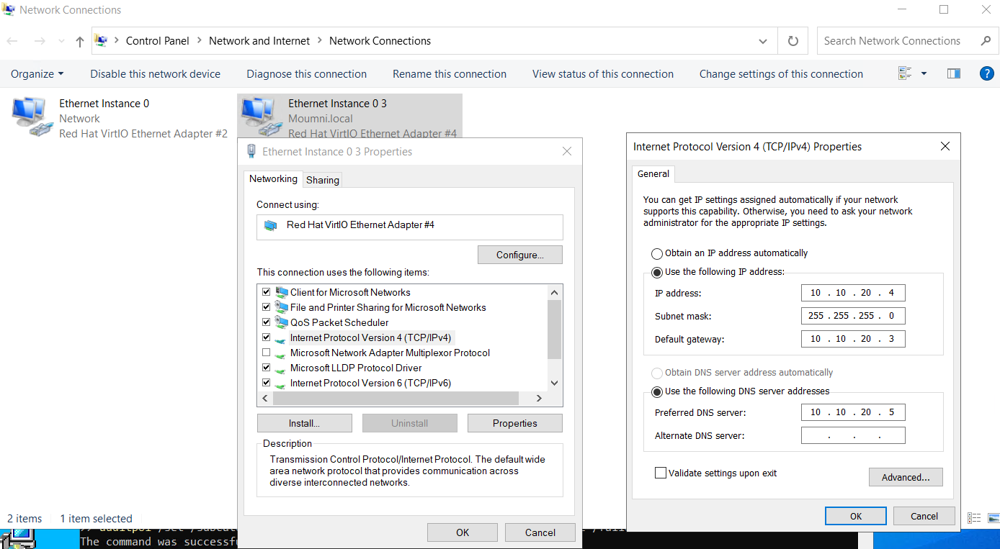

---

## 📡 Sysmon — Endpoint Telemetry

Sysmon was installed on the Windows machine using the community-maintained `sysmonconfig.xml` (olafhartong/sysmon-modular, schema 4.90) to capture rich process, network, and file activity.

```powershell
# Install Sysmon with config
.\Sysmon64.exe -i .\sysmonconfig.xml

# Verify installation
Get-Service Sysmon64
Get-WinEvent -ListLog "Microsoft-Windows-Sysmon/Operational"
```

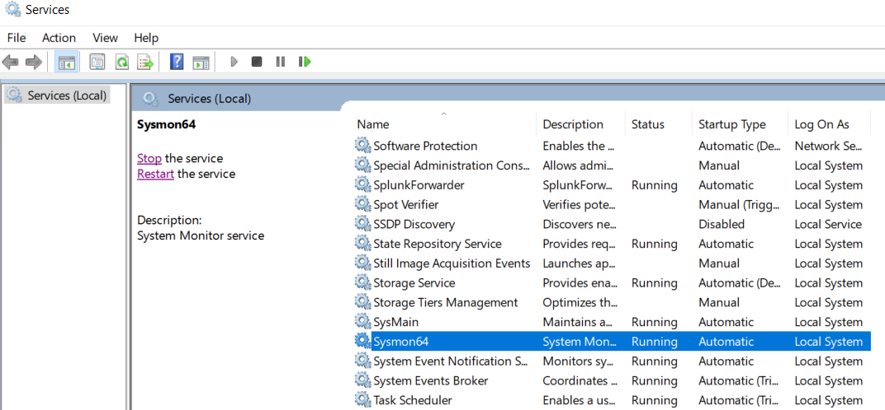

---

## 📊 Splunk — SIEM Setup

### Install & Start

Splunk Enterprise was installed on the Security VM (Linux):

```bash
/opt/splunk/bin/splunk start
# Web UI: http://<SECURITY_IP>:8000
```


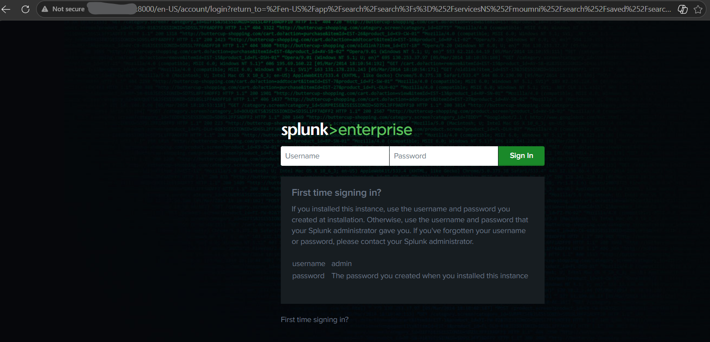

### Universal Forwarder

The Splunk Universal Forwarder was installed on the Windows endpoint and configured to ship Sysmon and Security event logs to the Splunk indexer.

**`C:\Program Files\SplunkUniversalForwarder\etc\system\local\inputs.conf`**

```ini
[WinEventLog://Microsoft-Windows-Sysmon/Operational]
index = lab
disabled = 0

[WinEventLog://Security]
index = lab
disabled = 0
```

```powershell
Restart-Service SplunkForwarder
```

---

## 🐝 TheHive — Case Management

TheHive was deployed via Docker on the Security VM:

```bash
docker-compose up -d
# Available at http://<SECURITY_IP>:9000
```

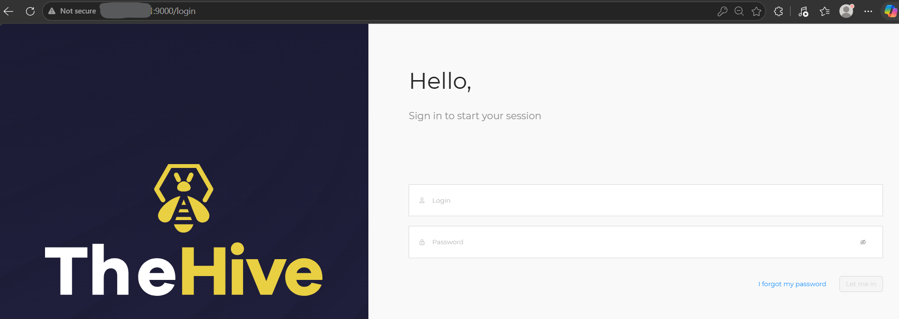

---

## ☠️ Mimikatz — Simulated Attack

To allow Mimikatz to be downloaded without Windows Defender blocking it, the Downloads folder was added as a Defender exclusion.

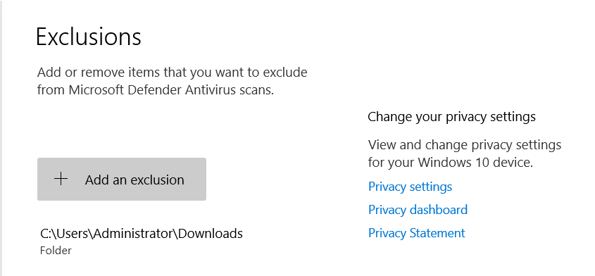

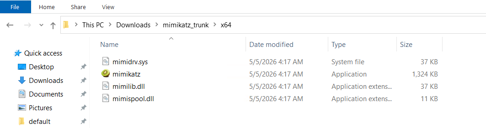

Running Mimikatz causes it to access the **LSASS process**, generating a Sysmon **Event ID 10** — the trigger for the entire detection chain.

---

## 🚨 Splunk Alert — Detection Rule

A saved search was created in Splunk to detect LSASS access events from Mimikatz. The SPL query extracts key fields (SourceImage, TargetImage, GrantedAccess, SourceUser, RuleName) and filters for `EventID=10` where `TargetImage` matches `lsass.exe`.

**Alert: `LSASS Access - Credential Dumping`**
- Alert type: Scheduled (cron)
- Time range: Last 24 hours
- Trigger: Number of results > 0
- Actions: Add to Triggered Alerts + **Webhook → Shuffle**

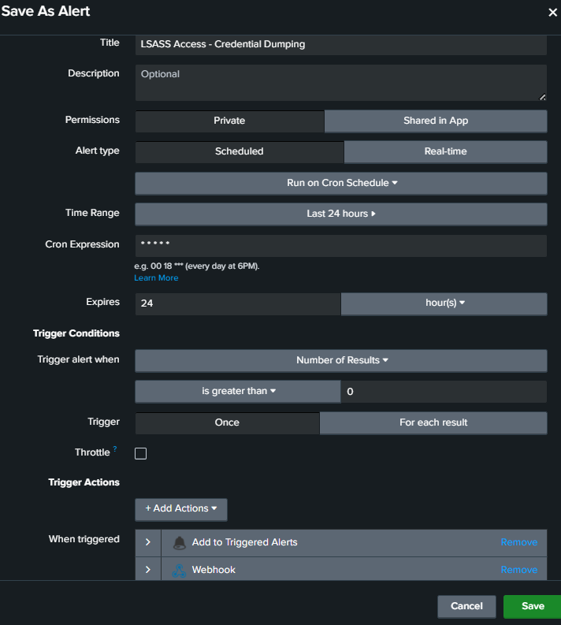

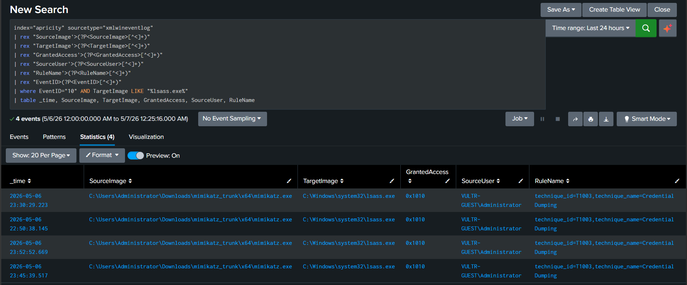

The detection correctly identified 4 Mimikatz execution events, capturing the source binary path, target `lsass.exe`, GrantedAccess `0x1010`, and the MITRE technique tag `T1003 - Credential Dumping`.

---

## ⚙️ Shuffle — SOAR Workflow

### Workflow Overview

```
Splunk Alert (Webhook)
    └──▶ SHA256 Extract (Regex)
              └──▶ VirusTotal (Hash Lookup)
                        ├──▶ Create Case (TheHive)
                        │         └──▶ Add Observables (TheHive)
                        └──▶ Email Notification (Analyst)
```

### 1. Webhook — Receive Splunk Alert

A Shuffle webhook was configured to receive the Splunk alert payload.

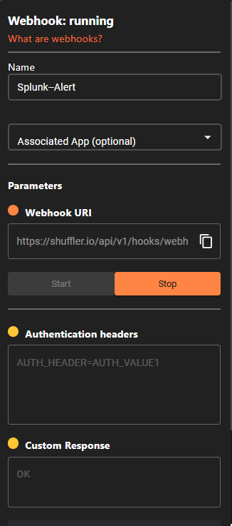

### 2. SHA256 Node — Extract Hash

A regex capture group node extracts the SHA256 hash from the Sysmon event's `Hashes` field.

- **Input:** `$exec.result.Hashes`
- **Regex:** `SHA256=([A-Fa-f0-9]{64})`

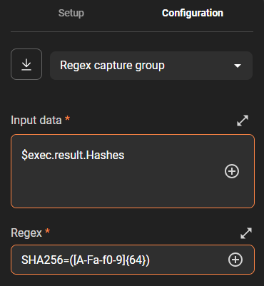

### 3. VirusTotal Node — Hash Enrichment

The extracted SHA256 is submitted to VirusTotal's `GET /files/{id}` endpoint using an authenticated API key.

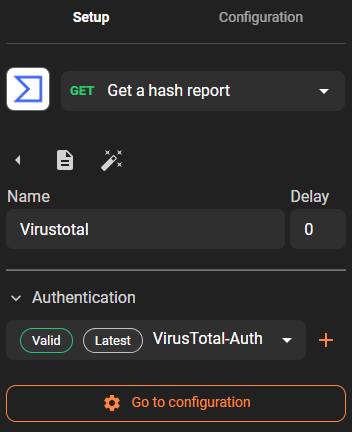

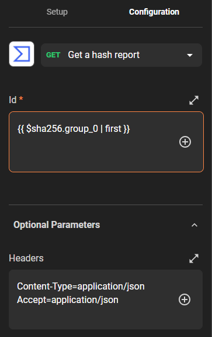

### 4. Email Node — Analyst Notification

An email is sent automatically with a structured incident summary including host, SHA256, technique, VT reputation score, and recommended actions.

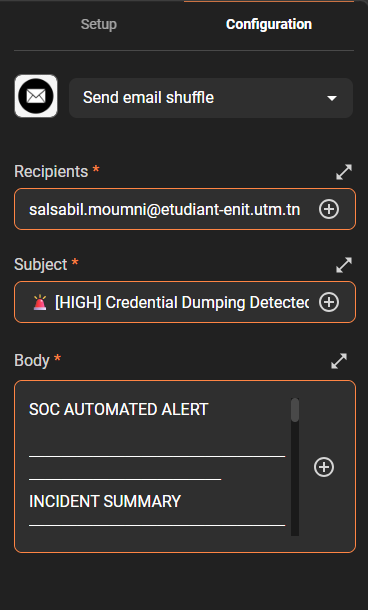

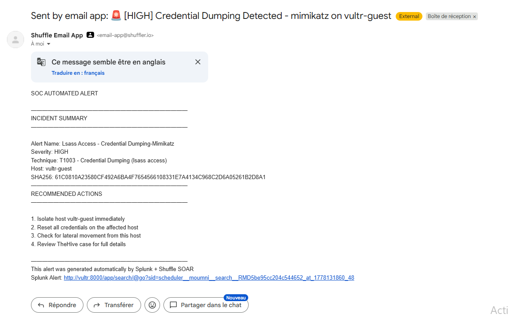

The email subject reads **[HIGH] Credential Dumping Detected** and includes the full incident context — host name, SHA256 hash, MITRE technique, VT malicious verdict count, and recommended remediation steps.

### 5. TheHive — Create Case

A TheHive case is created automatically via the API with severity, tags (`mimikatz`, `T1003`, `lsass`, `credential-dumping`), and a rich description populated from the VirusTotal enrichment results.

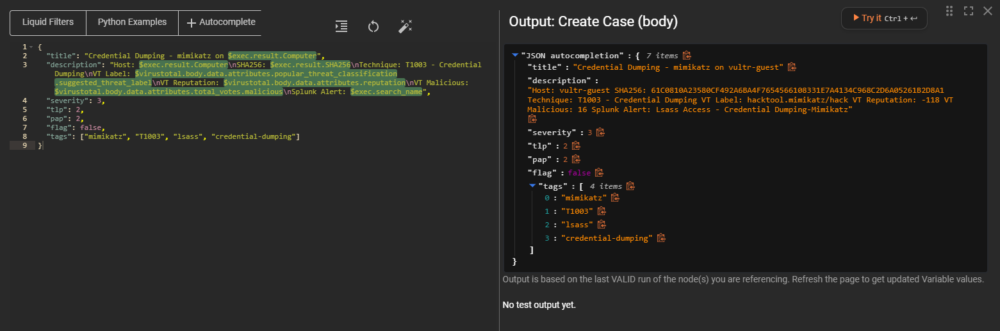

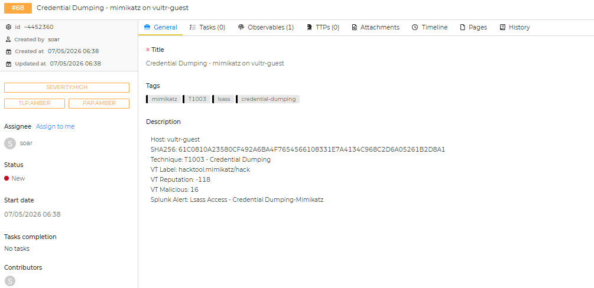

### 6. TheHive — Add Observables

The SHA256 hash is attached to the newly created case as an observable of type `hash`.

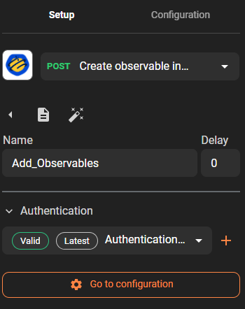

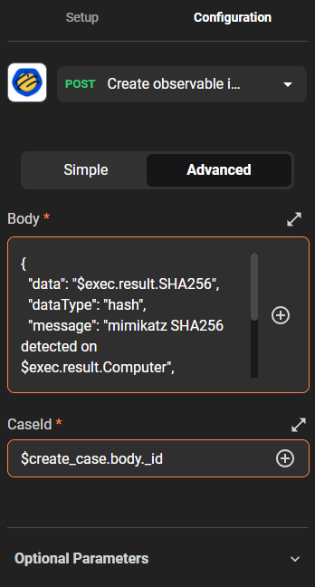

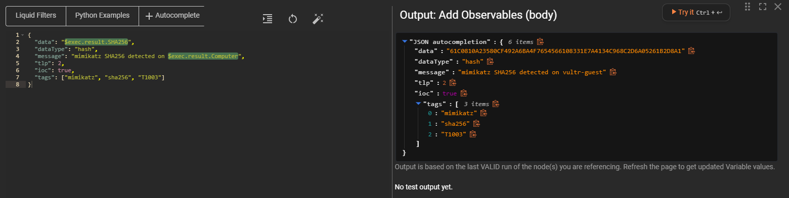

### Final Result — TheHive Case with Observable

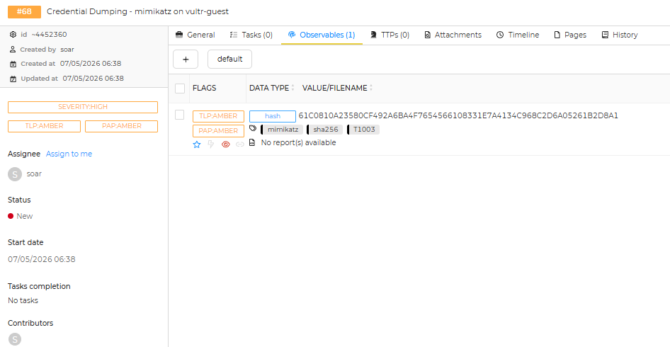

The completed case in TheHive shows:
- **Severity:** HIGH / TLP:AMBER / PAP:AMBER  
- **Observable:** SHA256 hash tagged with `mimikatz`, `sha256`, `T1003`
- **Created by:** soar (automated)

---

## 🔁 End-to-End Flow Summary

```
Mimikatz runs on Windows endpoint
    └──▶ Sysmon logs LSASS access (Event ID 10)
              └──▶ Splunk Forwarder ships log to Splunk
                        └──▶ Splunk alert fires (LSASS Access - Credential Dumping)
                                  └──▶ Webhook triggers Shuffle workflow
                                            ├──▶ SHA256 extracted via regex
                                            ├──▶ VirusTotal enrichment (malicious verdict)
                                            ├──▶ Email alert sent to analyst
                                            └──▶ TheHive case created with SHA256 observable
```

---

## 💡 Lessons Learned

**1. SOAR dramatically reduces analyst toil.**  
Tasks that would take a SOC analyst several minutes (looking up a hash, opening a ticket, notifying the team) happen in seconds automatically. This is the core value proposition of a SOAR platform.

**2. Sysmon configuration quality determines detection quality.**  
Using a well-tuned community config (olafhartong/sysmon-modular) is far better than the defaults. The schema version matters — always match your config to your Sysmon binary version.

**3. VPC networking requires manual adapter configuration on Windows.**  
Vultr assigns the VPC IP but Windows won't use it automatically — the network adapter properties must be updated manually with the correct static IP, subnet, and gateway.

**4. Defender exclusions are a real attacker technique.**  
Excluding the Downloads folder to run Mimikatz is exactly what attackers do in the real world. Detection engineers should monitor for Defender exclusion creation events.

**5. VirusTotal reputation is not binary.**  
A hash can have a low malicious count but still be suspicious. Enrichment context (vendor labels, community votes, file metadata) should be part of the triage, not just the score.

**6. TheHive observables enable faster triage.**  
Attaching the SHA256 hash as a typed observable (not just text in a description) allows analysts to pivot to other cases involving the same indicator.

**7. Webhook security matters.**  
In production, Shuffle webhook endpoints should be protected with authentication headers to prevent spoofed alert injection.

---

## 🔗 References

- [Sysmon — Sysinternals](https://learn.microsoft.com/en-us/sysinternals/downloads/sysmon)
- [olafhartong/sysmon-modular](https://github.com/olafhartong/sysmon-modular)
- [Shuffle SOAR](https://shuffler.io)
- [TheHive Project](https://thehive-project.org)
- [VirusTotal API](https://developers.virustotal.com)
- [MITRE ATT&CK T1003 — OS Credential Dumping](https://attack.mitre.org/techniques/T1003/)

---

*Part of the [Cyber-Security-Labs](../) series.*
