# 🛡️ Sigma YARA SOC Automation Pipeline

> **Fully automated SOC triage pipeline** — From Splunk alert to Jira ticket + IRIS DFIR incident in seconds, powered by YARA, SigmaHQ, and AI.


---

## 📋 Table of Contents

- [Overview](#-overview)
- [Architecture](#-architecture)
- [Tech Stack](#-tech-stack)
- [Pipeline Flow](#-pipeline-flow)
- [Installation & Configuration](#-installation--configuration)
  - [1. Install Sysmon](#1-install-sysmon)
  - [2. Install Splunk](#2-install-splunk)
  - [3. Install IRIS DFIR](#3-install-iris-dfir)
- [Attack Simulation](#-attack-simulation)
- [Detection](#-detection)
- [Workflow — Step by Step](#-workflow--step-by-step)
- [Results](#-results)

---

## 🔍 Overview

When Splunk detects a suspicious `.exe` file download via Sysmon telemetry, this n8n workflow automatically:

1. **Fetches** the flagged file via SSH/SCP to the n8n host
2. **Scans** it with YARA rules
3. **Fetches** the matching Sigma rule from SigmaHQ on GitHub
4. **Uses AI (GPT-4)** to generate and execute targeted Splunk SPL hunt queries
5. **Performs SOC-level triage** using a second AI agent
6. **Creates incidents** in both **Jira** and **IRIS DFIR** automatically — no human in the loop required for initial triage

This pipeline dramatically reduces mean time to respond (MTTR) and eliminates repetitive analyst work for common threat patterns like credential dumping tools (e.g., Mimikatz).

---

## 🏗️ Architecture

```
Splunk Alert (Webhook)
        │
        ▼
  GetFile + YARA scan
        │
        ├──────────────────────────┐
        ▼                          ▼
 GitHub Sigma rule fetch     YARA result
        │                          │
        ▼                          │
  Parse Sigma rule            Merge Node
        │                          │
        └──────────────────────────┘
                   │
                   ▼
        AI Agent → Generate SPL queries
                   │
                   ▼
        Clean & Split queries
                   │
                   ▼
        Splunk REST API → Execute queries
                   │
                   ▼
        Format Splunk results
                   │
                   ▼
     AI Agent → SOC Triage Decision
                   │
                   ▼
            Parse verdict
           /              \
      MALICIOUS           BENIGN
      /       \               \
Jira ticket  IRIS DFIR     Jira ticket
  (High)      alert         (Medium)
```

---

## 🧰 Tech Stack

| Tool | Role |
|------|------|
| **n8n** | Automation orchestrator — connects all components |
| **Splunk + Sysmon** | Log ingestion, SIEM, and alert source |
| **YARA** | File scanning against malware signatures |
| **SigmaHQ GitHub** | Detection rule source (community rules) |
| **OpenAI GPT-4** | SPL query generation + SOC triage verdict |
| **VirusTotal** | IOC enrichment |
| **IRIS DFIR** | Incident management and case creation |
| **Jira** | Ticket creation and tracking |

---

## 🔄 Pipeline Flow

Below is the full n8n workflow overview:

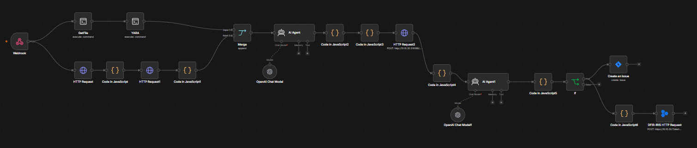

The pipeline consists of **17 nodes** chained end-to-end:

```
Webhook → GetFile → YARA → GitHub Fetch → Parse Sigma → Merge
→ AI Agent (SPL Gen) → Code JS2 (Extract) → Code JS3 (Clean/Split)
→ HTTP Request2 (Splunk REST) → Code JS4 (Format) → AI Agent (Triage)
→ Code JS5 (Parse Verdict) → IF Node → [Jira + IRIS | Jira]
```

---

## ⚙️ Installation & Configuration

### 1. Install Sysmon

Sysmon (System Monitor) captures detailed Windows telemetry that feeds into Splunk.

**Step 1:** Download Sysmon from Sysinternals:

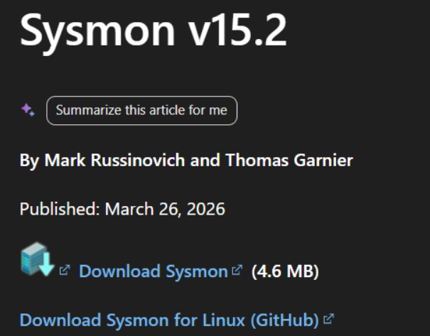

**Step 2:** Get the community Sysmon config from GitHub:

```
https://github.com/olafhartong/sysmon-modular/blob/master/sysmonconfig.xml
```

**Step 3:** Install Sysmon with the config file:

```powershell
.\Sysmon64.exe -i .\sysmonconfig.xml
```

**Successful installation output:**


Verify the Sysmon64 service is running in Windows Services:


---

### 2. Install Splunk

Deploy Splunk Enterprise on an Ubuntu VM.

**Step 1:** Download Splunk from the [official site](https://www.splunk.com/en_us/download/splunk-enterprise.html) and install on your Ubuntu VM.

**Step 2:** Start Splunk:

```bash
/opt/splunk/bin/splunk start
```

**Step 3:** Splunk web interface will be available at `http://<your-host>:8000`

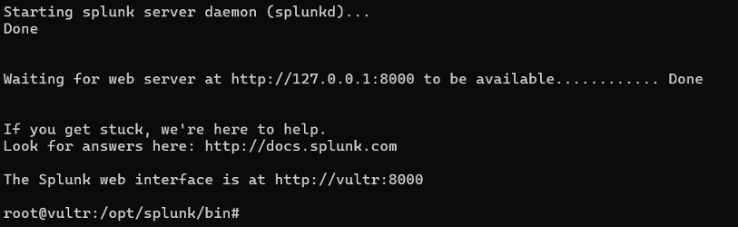

Sign in with the credentials you set at installation (`admin` / your password).


> **Note:** Make sure the Splunk Universal Forwarder on your Windows VM is sending Sysmon logs to your Splunk instance. Set the index to `soc`.

---

### 3. Install IRIS DFIR

IRIS is deployed via Docker on an Ubuntu VM.

**Step 1:** Install Docker:

```bash
# Install Docker
apt update && apt upgrade -y
apt install -y ca-certificates curl gnupg git
install -m 0755 -d /etc/apt/keyrings
curl -fsSL https://download.docker.com/linux/ubuntu/gpg | gpg --dearmor -o \
  /etc/apt/keyrings/docker.gpg
chmod a+r /etc/apt/keyrings/docker.gpg
echo \
  "deb [arch=$(dpkg --print-architecture) signed-by=/etc/apt/keyrings/docker.gpg] \
  https://download.docker.com/linux/ubuntu \
  $(. /etc/os-release && echo "$VERSION_CODENAME") stable" | \
  tee /etc/apt/sources.list.d/docker.list
apt update
apt install -y docker-ce docker-ce-cli containerd.io docker-compose-plugin
```

**Step 2:** Clone and configure IRIS:

```bash
# Clone IRIS
git clone https://github.com/dfir-iris/iris-web.git
cd iris-web
git checkout v2.4.20

# Configure environment
cp .env.model .env

# Generate secrets (run each separately, paste output into .env)
openssl rand -hex 32   # → POSTGRES_PASSWORD and POSTGRES_ADMIN_PASSWORD
openssl rand -hex 32   # → IRIS_SECRET_KEY
openssl rand -hex 32   # → IRIS_SECURITY_PASSWORD_SALT

# Edit .env with your generated secrets
nano .env
```

**Step 3:** Start IRIS:

```bash
docker compose pull
docker compose up -d
```

**Step 4:** Get the admin password from logs:

```bash
docker compose logs app | grep -i admin
```


All containers should show `Up`:


**Step 5:** Log into IRIS at `https://<your-iris-host>` with the retrieved credentials:


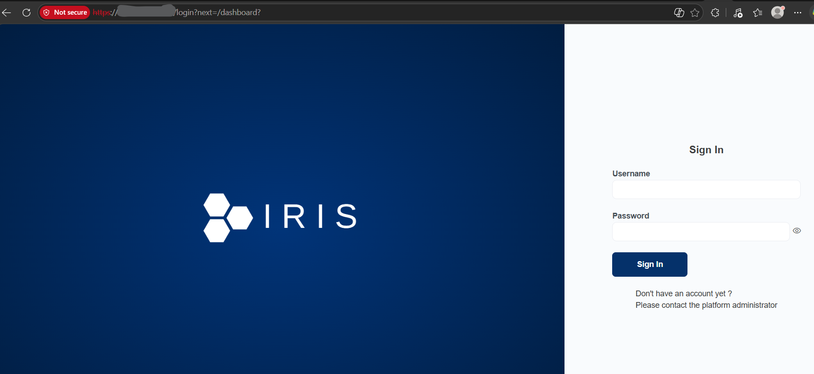

---

## 💥 Attack Simulation

To test the pipeline end-to-end, we simulate a real-world attacker downloading **Mimikatz** (a well-known credential dumping tool).

**Step 1:** Add a Microsoft Defender exclusion for the Downloads folder so the file isn't immediately quarantined (this simulates an attacker disabling AV first):

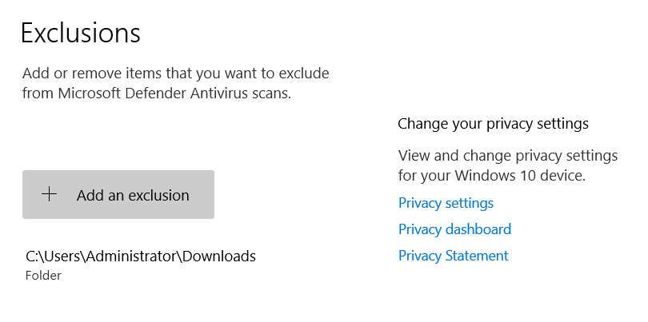

**Step 2:** Download Mimikatz to the excluded directory. Sysmon captures this as a file creation event (EventCode 11):

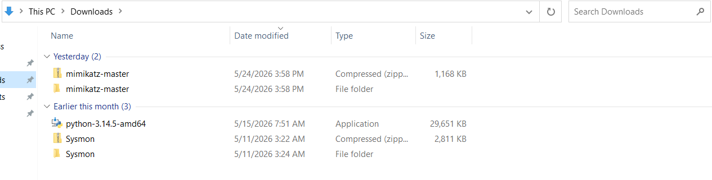

Also execute mimikatz to test the generated queries for detecting its execution or not 

> ⚠️ **This is for lab/testing purposes only.** Always perform attack simulations in an isolated, controlled environment.

---

## 🔎 Detection

### Splunk SPL Query

Run the following query in Splunk to detect suspicious `.exe` downloads while filtering out known-good system paths:

```spl
index=soc EventCode=11 TargetFilename="*.exe"
NOT TargetFilename="C:\\Windows\\System32\\lsasvc.exe"
NOT TargetFilename="C:\\Windows\\System32\\svchost.exe"
NOT TargetFilename="C:\\Windows\\System32\\cleanmgr.exe"
NOT TargetFilename="*Windows\\SysWow64*"
NOT TargetFilename="*AppData\\Local\\Temp*"
NOT TargetFilename="*ProgramData*"
NOT TargetFilename="*Zone.Identifier*"
| table _time, TargetFilename, Image, User, Computer
```

This surfaces only meaningful file creation events — in this case, the Mimikatz download is clearly visible:

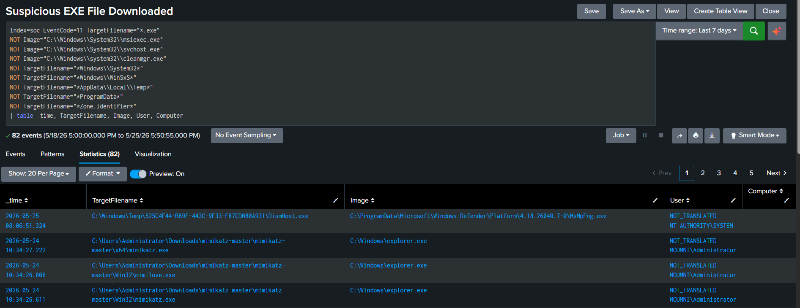

---

## 🔧 Workflow — Step by Step

### 1. Webhook (Trigger)

The workflow starts when Splunk fires an alert via a configured webhook action.

- **Method:** POST
- **Receives:** Splunk alert payload
- **Key fields extracted:**
  - `body.result.TargetFilename` — path of the suspicious file
  - `body.result.User` — user who downloaded it
  - `body.result._time` — timestamp
  - `body.result.Image` — process that created the file

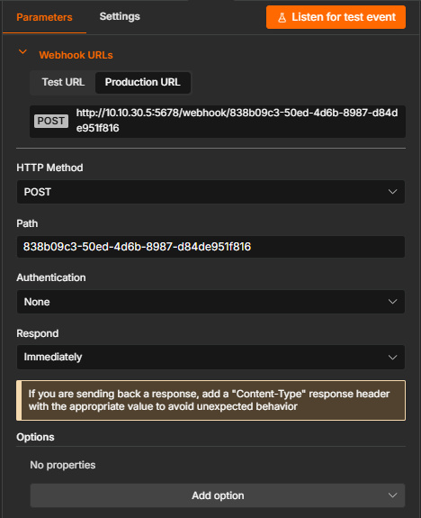

---

### 2. GetFile

Fetches the flagged `.exe` file from the Windows endpoint to the n8n host for YARA scanning.

- **Method:** `execute: command` (SSH node)
- SSH must be enabled on the n8n host to accept the incoming SCP transfer

```bash
scp -o StrictHostKeyChecking=no Administrator@10.10.20.5:\
"$(echo '{{ $('Webhook').item.json.body.result.TargetFilename }}' \
| sed 's/\\/\//g' | sed 's/C://' | sed 's/:Zone.Identifier//')" \
/opt/soc/yara/samples/latest.exe
```

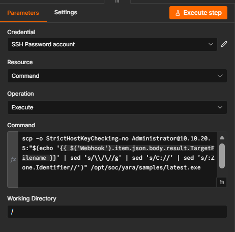

---

### 3. YARA Scan

Scans the fetched file against custom YARA rules.

- **Method:** `execute: command`
- **Rule location:** `/opt/soc/yara/rules/suspicious_exe.yar`

```bash
yara /opt/soc/yara/rules/suspicious_exe.yar /opt/soc/yara/samples/latest.exe
```

**Example output:**

```
Suspicious_Executable /opt/soc/yara/samples/latest.exe
```

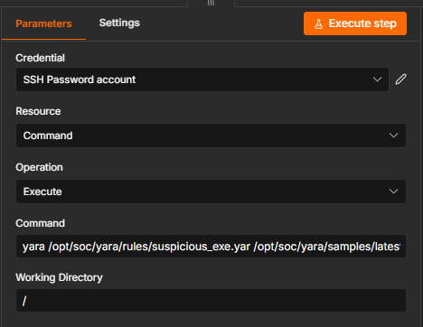

---

### 4. HTTP Request — Fetch Sigma Rule from GitHub

Fetches the relevant Sigma rule from the SigmaHQ repository on GitHub using the GitHub API.

- **Method:** GET
- **URL:** `{{ $json.download_url }}` (dynamically built from the file name)
- **Headers:**
  - `Authorization: Bearer <GITHUB_TOKEN>`
  - `Accept: application/vnd.github.v3.raw+json`

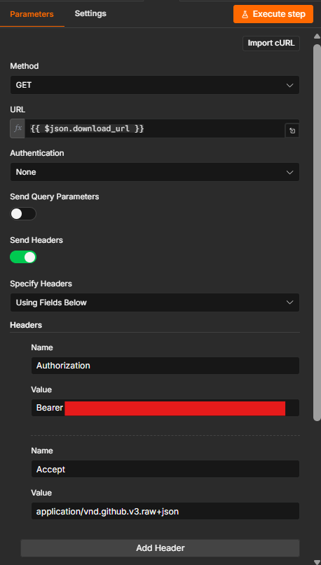

---

### 5. Code in JavaScript1 — Parse Sigma Rule

Parses the first matching Sigma rule from the GitHub search results and extracts the raw rule content.

```javascript
const items = $input.first().json.items;
if (!items || items.length === 0) {
  return [{ json: { error: 'No rules found' } }];
}

const firstRule = items[0];
return [{
  json: {
    rule_name: firstRule.name,
    rule_path: firstRule.path,
    download_url: firstRule.url,
    html_url: firstRule.html_url
  }
}];
```

Then a second Code node extracts the raw rule body:

```javascript
const data = $input.first().json;
return [{
  json: {
    sigma_rule: data.sigma_rule
  }
}];
```

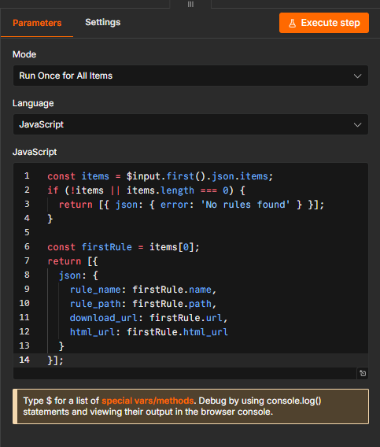

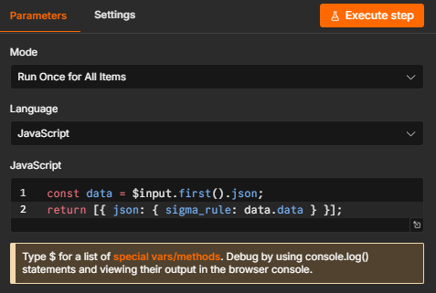

---

### 6. Merge Node

Combines the YARA scan result and the Sigma rule into a single data item for the AI agent.

- **Mode:** Append
- **Input 1:** YARA result (`stdout`)
- **Input 2:** Parsed Sigma rule

---

### 7. AI Agent — SPL Query Generation

An OpenAI GPT-4.1-mini agent takes the combined YARA + Sigma context and generates targeted Splunk hunt queries.

**Model:** `gpt-4.1-mini`  
**Node type:** AI Agent with Responses API enabled

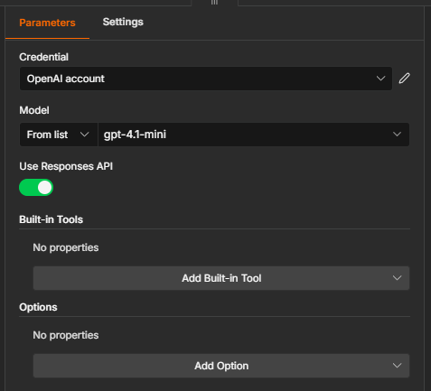

**System Prompt:**

```
You are an expert SOC analyst. You received the following detection alerts:

YARA Result:
{{ $('YARA').item.json.stdout }}

Sigma Rule (from SigmaHQ):
{{ $('Code in JavaScript1').item.json.sigma_rule }}

Alert Details:
- File: {{ $('Webhook').item.json.body.result.TargetFilename }}
- User: {{ $('Webhook').item.json.body.result.User }}
- Time: {{ $('Webhook').item.json.body.result._time }}
- Image: {{ $('Webhook').item.json.body.result.Image }}

SPLUNK CONTEXT:
- Index: soc
- Log source: Sysmon
- Key Event Codes: 1=process creation, 3=network, 7=image load, 10=process access, 11=file create
- Example working query: index=soc EventCode=1 CommandLine="*mimikatz*" | table _time, CommandLine, User, Computer

Your tasks:
1. Convert the Sigma rule to a valid Splunk SPL query using the above context
2. Generate 3-5 additional hunt queries based on the threat
3. All queries must use index=soc and Sysmon EventCodes
4. Provide threat summary

Return EXACTLY in this format:
PRIMARY_SPL: <single line spl query>
HUNT_QUERIES:
- <query 1>
- <query 2>
- <query 3>
SUMMARY: <threat summary>
```


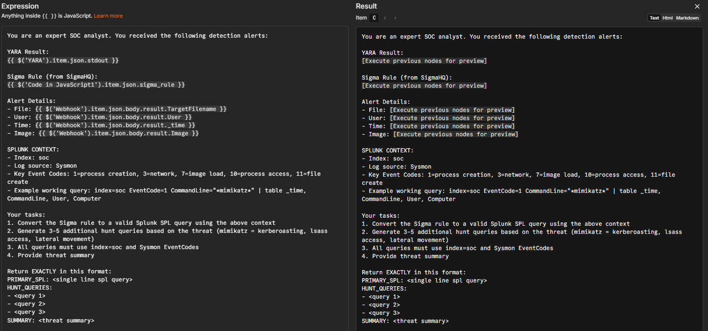

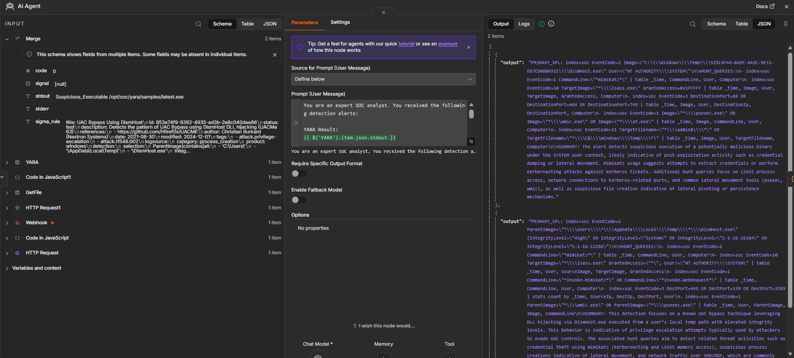

---

### 8. Code in JavaScript2 — Extract AI Output

Extracts the structured AI response for downstream processing.

```javascript
const data = $input.first().json;
return [{ json: { sigma_rule: data.data } }];
```

---

### 9. Code in JavaScript3 — Clean & Split Queries

Parses the AI output into structured fields and cleans SPL syntax:

```javascript
const output = $input.first().json.output;

// Extract PRIMARY_SPL
const splMatch = output.match(/PRIMARY_SPL:\s*(.+?)(?=\nHUNT_QUERIES:|$)/s);
let primarySpl = splMatch ? splMatch[1].trim() : '';
primarySpl = primarySpl.replace(/\\\\/g, '\\').replace(/^search\s+/i, '');

// Extract HUNT_QUERIES
const huntMatch = output.match(/HUNT_QUERIES:\s*([\s\S]*?)(?=\nSUMMARY:|$)/);
let huntQueries = [];
if (huntMatch) {
  huntQueries = huntMatch[1].split('\n')
    .filter(l => l.trim().startsWith('-'))
    .map(l => l.replace(/^-\s*/, '').trim());
}

// Extract SUMMARY
const summaryMatch = output.match(/SUMMARY:\s*([\s\S]*?)$/);
const summary = summaryMatch ? summaryMatch[1].trim() : '';

// Clean and fix common SPL field name issues
function cleanSpl(query) {
  query = query.replace(/\\"/g, '"').replace(/\\\\/g, '\\').replace(/```/g, '').trim();
  query = query.replace(/(\w+=(?:"[^"]*"|\S+))\s+OR\s+(\w+=(?:"[^"]*"|\S+))/g, '($1 OR $2)');
  query = query.replace(/\bFileName\b/g, 'TargetFilename');   // Fix wrong field names
  query = query.replace(/\bProcessName\b/g, 'Image');
  query = query.replace(/^["']|["']$/g, '');
  return query;
}

const data = $input.first().json;
const allQueries = [data.primary_spl, ...data.hunt_queries];
return allQueries
  .filter(q => q && q.trim())
  .map(query => ({
    json: {
      spl_query: cleanSpl(query),
      summary: data.summary
    }
  }));
```

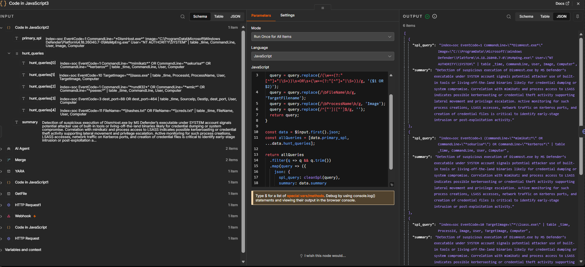

---

### 10. HTTP Request2 — Execute SPL in Splunk REST API

Each cleaned query is executed directly against the Splunk REST API.

- **Method:** POST
- **URL:** `http://<splunk-host>:8089/services/search/jobs`
- **Authentication:** Basic Auth (Splunk user with `search` role)
- **Body Content Type:** Form-Urlencoded

| Field | Value |
|-------|-------|
| `search` | `search {{ $json.spl_query }}` |
| `output_mode` | `json` |
| `exec_mode` | `oneshot` |

> **`exec_mode=oneshot`** runs the search synchronously and returns results immediately — no job polling required.

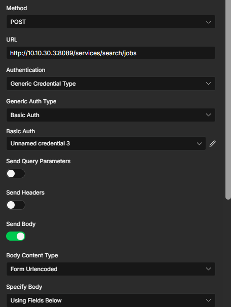

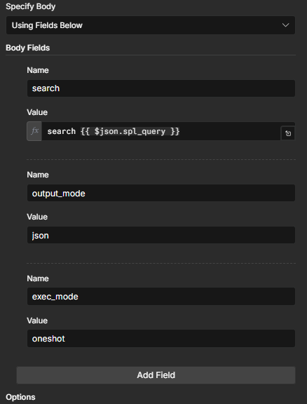

---

### 11. Code in JavaScript4 — Format Splunk Results

Formats the raw Splunk REST response for the triage agent:

```javascript
const splunkResponse = $input.first().json;
const results = splunkResponse.results || [];

const spl_query = $('Code in JavaScript3').item.json.spl_query;
const threat_summary = $('Code in JavaScript3').item.json.summary;

return [{
  json: {
    spl_query: spl_query,
    threat_summary: threat_summary,
    splunk_hits: JSON.stringify(results, null, 2),
    hit_count: results.length
  }
}];
```

---

### 12. IOC Enrichment — VirusTotal

Before final triage, the file IOC (indicator of compromise) is enriched via a VirusTotal API lookup using the GitHub search node to cross-reference detection data.

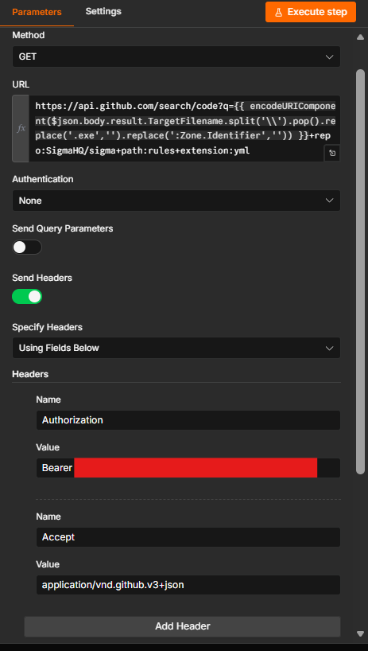

---

### 13. AI Agent — SOC Triage

A second GPT-4 agent acts as a **senior SOC analyst**, reviewing all collected evidence and making the final verdict.

**Triage Prompt:**

```
You are a senior SOC analyst. Analyze the Splunk findings below and make a triage decision.

THREAT CONTEXT:
{{ $json.threat_summary }}

SPL QUERY:
{{ $json.spl_query }}

SPLUNK HITS ({{ $json.hit_count }} total):
{{ $json.splunk_hits }}

IMPORTANT OBSERVATIONS TO CONSIDER:
- Look at the CommandLine carefully: is the file being EXECUTED or just referenced in a path?
- scp.exe -f means file is being TRANSFERRED via SCP, not executed
- Repeated hits every 1 minute = likely automated/scripted behavior
- Check if this could be a legitimate admin action or a test

Respond EXACTLY in this format:
VERDICT: MALICIOUS or BENIGN
CONFIDENCE: HIGH or MEDIUM or LOW
REASON: <one paragraph>
AFFECTED_USER: <username>
AFFECTED_HOST: <hostname or UNKNOWN>
ACTIONS:
- <action 1>
- <action 2>
- <action 3>
```

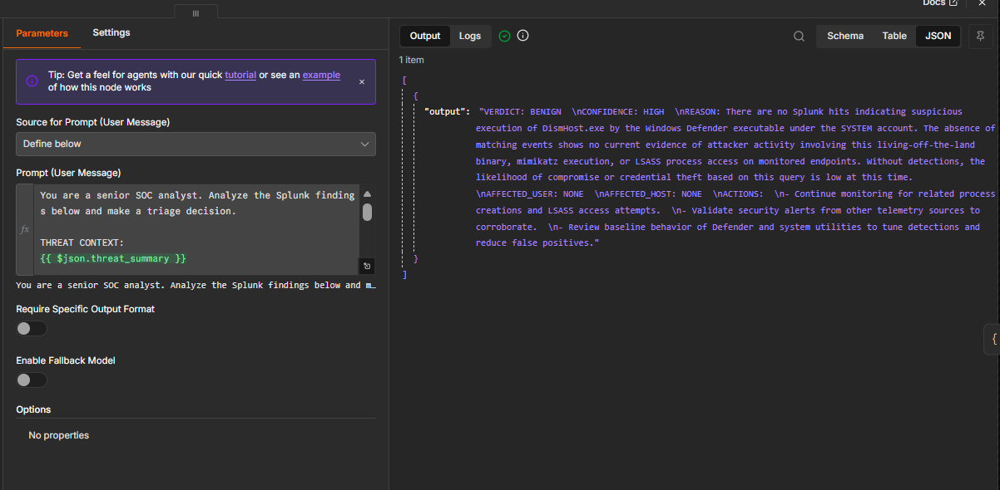

---

### 14. Code in JavaScript5 — Parse SOC Verdict

Extracts structured fields from the AI triage output:

```javascript
const output = $input.first().json.output;

const verdict        = output.match(/VERDICT:\s*(MALICIOUS|BENIGN)/)?.[1]          || 'BENIGN';
const confidence     = output.match(/CONFIDENCE:\s*(HIGH|MEDIUM|LOW)/)?.[1]         || 'LOW';
const reason         = output.match(/REASON:\s*([\s\S]*?)(?=\nAFFECTED_USER:)/)?.[1]?.trim() || '';
const affected_user  = output.match(/AFFECTED_USER:\s*(.+)/)?.[1]?.trim()           || 'UNKNOWN';
const affected_host  = output.match(/AFFECTED_HOST:\s*(.+)/)?.[1]?.trim()           || 'UNKNOWN';

const actionsMatch = output.match(/ACTIONS:\s*([\s\S]*?)$/);
const actions = actionsMatch
  ? actionsMatch[1].split('\n')
      .filter(l => l.trim().startsWith('-'))
      .map(l => l.replace(/^-\s*/, '').trim())
  : [];

return [{ json: { verdict, confidence, reason, affected_user, affected_host, actions } }];
```

---

### 15. IF Node — Route on Verdict

Routes the workflow based on the AI triage decision:

- **Condition:** `{{ $json.verdict }} equals MALICIOUS`
- **True branch** → Jira (High priority) + IRIS DFIR alert
- **False branch** → Jira (Medium priority) only

---

### 16. IRIS DFIR — Create Alert

If the verdict is **MALICIOUS**, an alert is created in IRIS DFIR for case management.

- **Method:** POST
- **URL:** `https://<iris-host>/alerts/add`
- **Authentication:** DFIR-IRIS API token
- **Body Content Type:** JSON
- **Body:** `{{ $json }}` (full triage object)

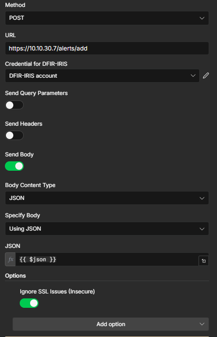

---

### 17. Jira — Create Ticket

A Jira ticket is created regardless of verdict (malicious or benign), ensuring full audit trail.

- **Operation:** Create Issue
- **Project:** SOC
- **Issue Type:** Task
- **Priority:** High (MALICIOUS) / Medium (BENIGN)

**Summary:**
```
[SOC ALERT] Suspicious .exe download detected - {{ $('Webhook').item.json.body.result.TargetFilename }}
```

**Description template:**
```
*Trigger:* Suspicious .exe file downloaded and flagged by YARA
*File:* {{ $('Webhook').item.json.body.result.TargetFilename }}
*User:* {{ $('Webhook').item.json.body.result.User }}
*Time:* {{ $('Webhook').item.json.body.result._time }}
*YARA Result:* {{ $('YARA').item.json.stdout }}
*SOC Verdict:* {{ $json.verdict }} ({{ $json.confidence }} confidence)
*Affected User:* {{ $json.affected_user }}
*Affected Hosts:* {{ $json.affected_host }}

*Analysis:*
{{ $json.reason }}

*Required Actions:*
• {{ $json.actions[0] }}
• {{ $json.actions[1] }}
• {{ $json.actions[2] }}
```

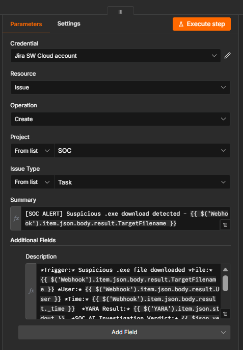

---

## ✅ Results

### IRIS DFIR Alert Created

The alert appears in IRIS with full context — file path, user, YARA result, verdict, confidence, affected host, and recommended actions:

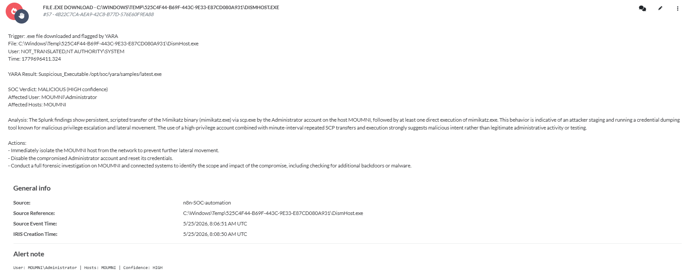

### Jira Ticket Created

A detailed Jira ticket is automatically created in the SOC project with the full investigation summary:

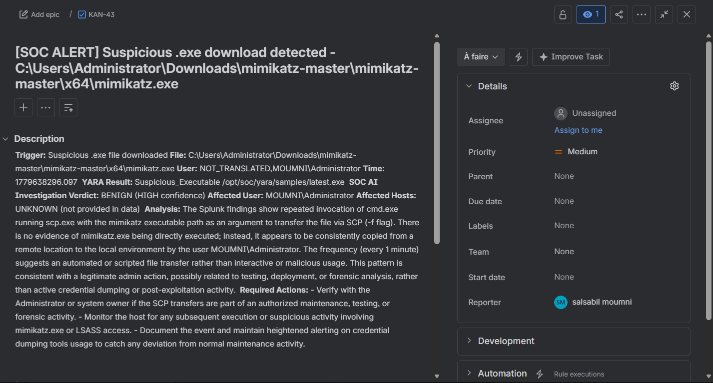

The ticket includes:
- **Trigger** description
- **File path** of the suspicious executable
- **User** and **host** context
- **YARA match** result
- **AI Verdict** with confidence level
- **Analysis paragraph** from the SOC triage agent
- **Required actions** for the responding analyst

---

## 🧪 Key Design Decisions

| Decision | Rationale |
|----------|-----------|
| `exec_mode=oneshot` for Splunk | Avoids polling — results returned synchronously, keeping the pipeline fast |
| Two separate AI agents | Separating SPL generation from triage gives each agent a focused, higher-quality task |
| VirusTotal enrichment before triage | Gives the triage agent richer IOC context for a more accurate verdict |
| Jira ticket for both verdicts | Ensures full audit trail regardless of outcome — benign findings are still documented |
| Field name cleanup in JS3 | Sigma rules use generic field names; the cleanup maps them to Sysmon-specific Splunk fields (`FileName` → `TargetFilename`, `ProcessName` → `Image`) |

---


## 🔐 Prerequisites & Credentials Needed

| Service | Credential Required |
|---------|-------------------|
| Splunk | Admin user with `search` role + REST API on port 8089 |
| GitHub | Personal Access Token (for SigmaHQ API requests) |
| OpenAI | API Key (GPT-4 or GPT-4.1-mini) |
| VirusTotal | API Key |
| IRIS DFIR | API Token (from user settings) |
| Jira | Jira Software Cloud account + API token |
| n8n SSH | SSH Password account pointing to your Windows endpoint |

---

