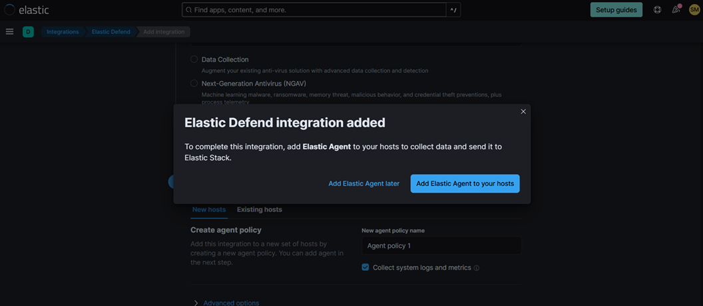
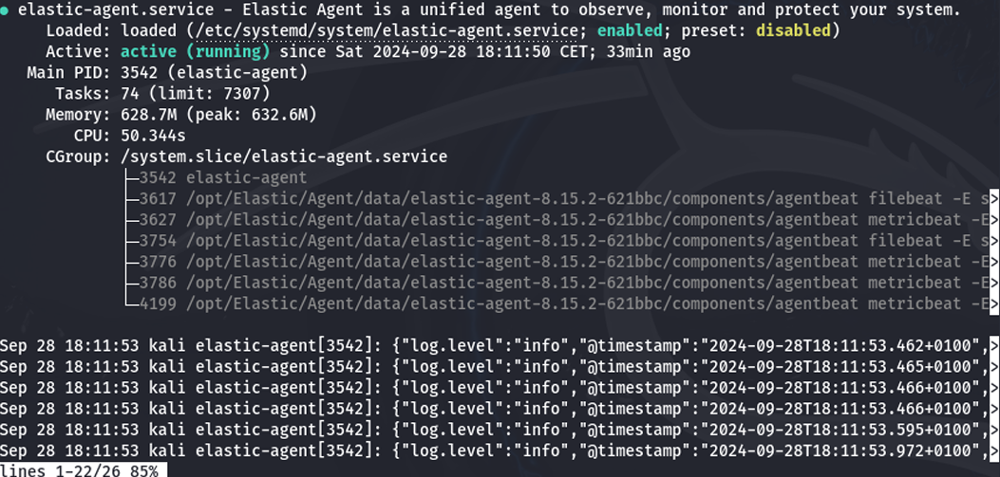
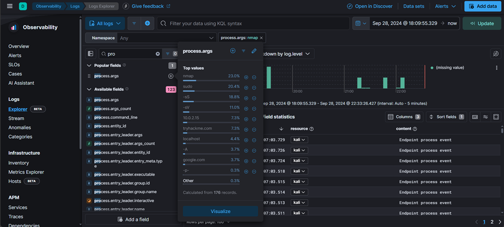
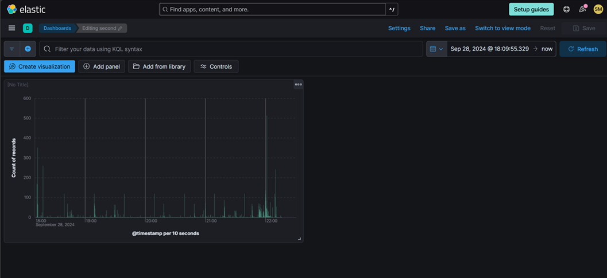
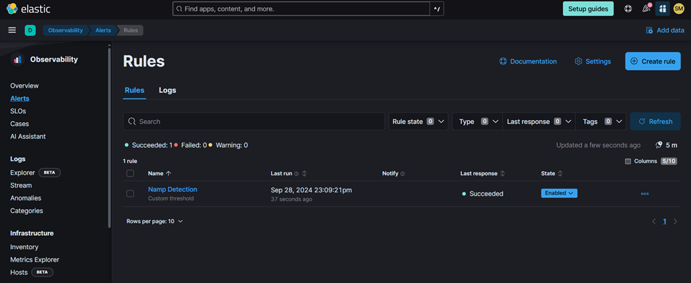
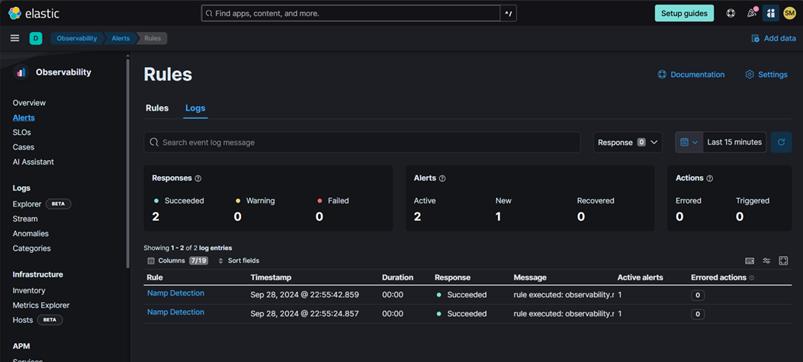

# Home Lab — Elastic SIEM

A hands-on home lab for building a Security Information and Event Management (SIEM) system using the Elastic Stack and a Kali Linux virtual machine. The lab covers log collection, threat simulation, dashboard creation, and custom alerting.

**Tags:** `elastic` `siem` `blue-team` `log-analysis` `kali-linux` `detection-engineering`

---

## Lab overview

| Item | Detail |
|---|---|
| Platform | Elastic Cloud (free trial) |
| Agent | Elastic Agent 8.15.2 |
| VM | Kali Linux |
| Goal | Collect logs, simulate attacks, detect them with custom alerts |

---

## Environment setup

### Step 1 — Create Elastic account and add integration

Sign up for a free Elastic Cloud trial, then navigate to **Integrations → Elastic Defend** and create an agent policy to collect system logs and metrics.



### Step 2 — Install Elastic Agent on Kali Linux

```bash
curl -L -O https://artifacts.elastic.co/downloads/beats/elastic-agent/elastic-agent-8.15.2-linux-x86_64.tar.gz
tar xzvf elastic-agent-8.15.2-linux-x86_64.tar.gz
cd elastic-agent-8.15.2-linux-x86_64
sudo ./elastic-agent install \
  --url=https://cc02a53713e3409d88e22c15aaa7f245.fleet.us-central1.gcp.cloud.es.io:443 \
  --enrollment-token=<YOUR_TOKEN>
```

Verify the agent is running:

```bash
sudo systemctl status elastic-agent.service
```



Agent enrolled successfully — logs begin flowing to Elastic Cloud immediately.

---

## Generating security events

### Step 3 — Simulate a port scan with Nmap

With the agent running, we simulate a real-world reconnaissance attack using Nmap to generate detectable security events.

```bash
nmap -sS 192.168.1.0/24
nmap -p- localhost
```

### Step 4 — Verify logs in Elastic

Navigate to **Observability → Logs → Log Explorer** and filter with KQL:

```
process.args: nmap
```



The query returns endpoint process events showing Nmap execution — confirming log ingestion and search are working correctly.

---

## Dashboard

### Step 5 — Create a security events dashboard

In **Dashboards → Create visualization**, build a time-series chart of security event count:

- X-axis: `@timestamp` per 10 seconds
- Y-axis: count of records



This gives a visual baseline — spikes indicate bursts of activity worth investigating.

---

## Alert creation

### Step 6 — Write a custom Nmap detection rule

Navigate to **Alerts → Rules → Create rule** and configure a custom threshold rule:

| Field | Value |
|---|---|
| Rule name | Nmap Detection |
| Type | Custom threshold |
| KQL query | `process.args: nmap` |
| Trigger | Count > 1 in 5 minutes |



After running Nmap twice, the alert fired twice as expected:



---

## Key findings

- Elastic Agent was successfully deployed on Kali Linux and began forwarding endpoint and network events within minutes.
- Nmap scans were captured as `endpoint process events` and `endpoint network events`.
- A custom KQL-based alert reliably triggered on Nmap execution — demonstrating that signature-free behavioral detection is achievable with simple query logic.

---

## MITRE ATT&CK mapping

| Technique | ID | Description |
|---|---|---|
| Active Scanning | T1595 | Nmap port scanning simulated |
| Network Service Discovery | T1046 | Port enumeration detected |

---

## What I learned

- How to deploy Elastic Agent and enroll it into a Fleet-managed policy
- Writing KQL queries to hunt for specific process execution events
- Building time-series dashboards to establish activity baselines
- Creating threshold-based detection rules without writing complex SPL/DSL

---

## Tools used

| Tool | Purpose |
|---|---|
| Elastic Stack (Cloud) | SIEM platform, log storage and search |
| Elastic Agent 8.15.2 | Log collection and forwarding |
| Kali Linux VM | Attack simulation endpoint |
| Nmap | Port scanning (threat simulation) |
| KQL | Query language for detection rules |
