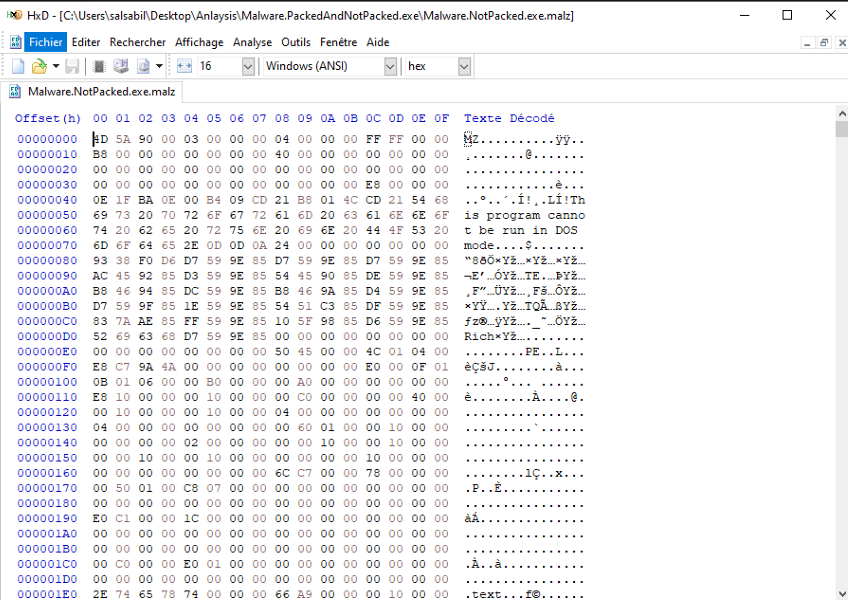
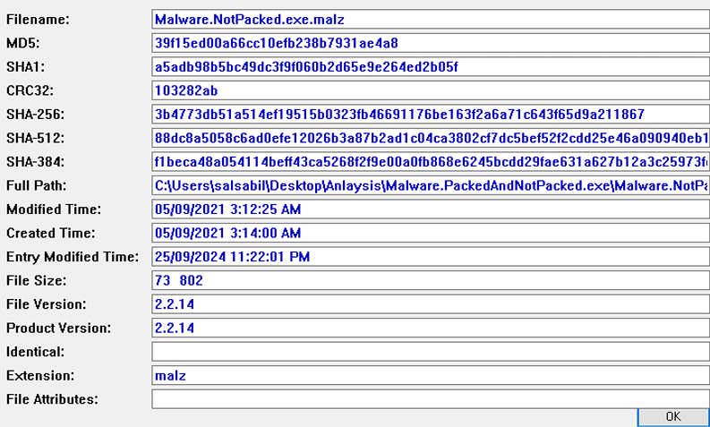
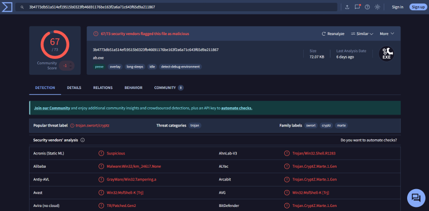
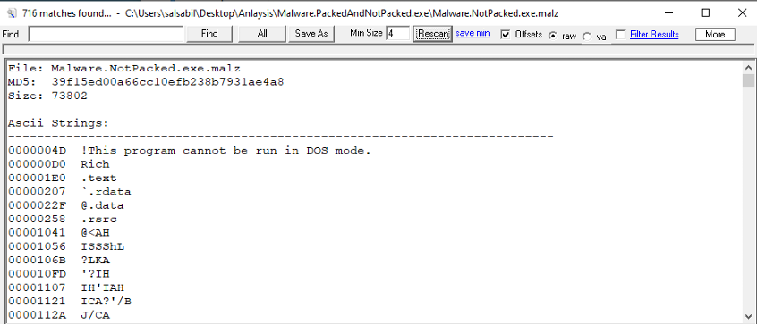
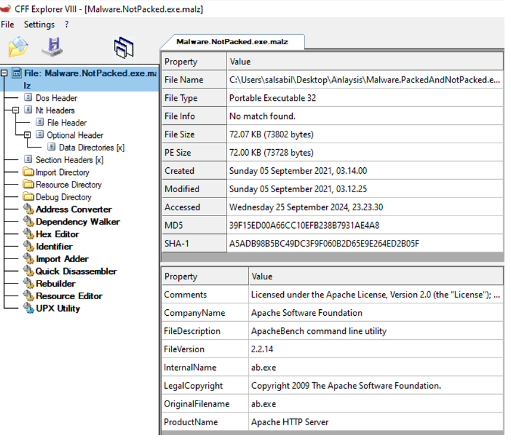
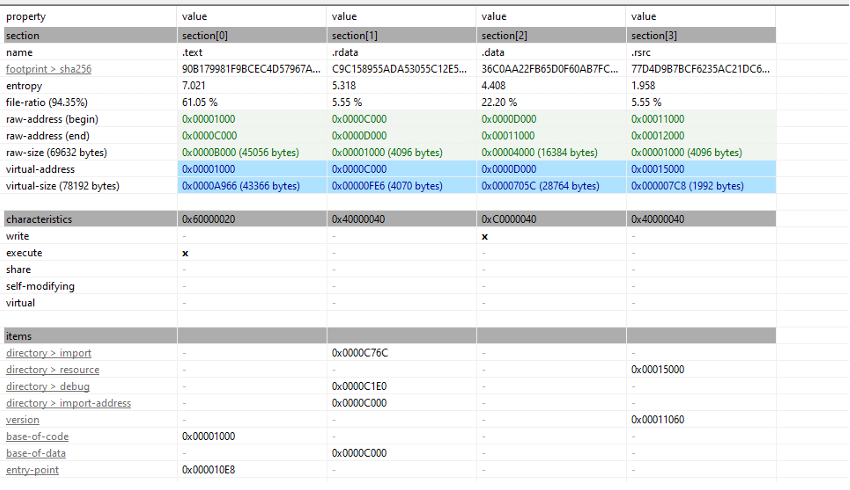
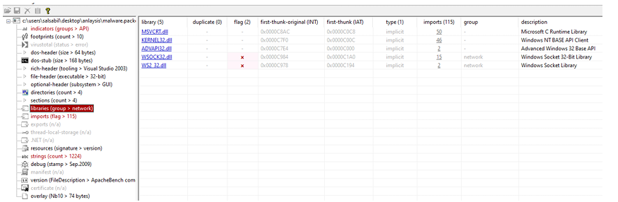
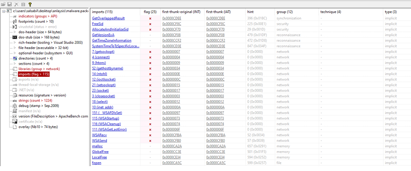

# Malware Analysis Lab — Static Analysis with FLARE VM

A hands-on malware analysis lab using FLARE VM on Windows. The sample analyzed is `Malware.NotPacked.exe.malz` — a real malicious executable examined through static analysis techniques including hex inspection, hashing, string extraction, PE header analysis, and DLL import review.

**Tags:** `malware-analysis` `dfir` `static-analysis` `flare-vm` `pestudio` `yara` `blue-team` `reverse-engineering`

---

## Lab overview

| Item | Detail |
|---|---|
| Environment | FLARE VM (Windows VM) |
| Sample | `Malware.NotPacked.exe.malz` |
| Analysis type | Basic static analysis |
| MD5 | `39f15ed00a66cc10efb238b7931ae4a8` |
| SHA-256 | `3b4773db51a514ef19515b0323fb46691176be163f2a6a71c643f65d9a211867` |
| VirusTotal detections | 67 / 73 vendors flagged as malicious |
| Malware family | Trojan.CryptZ.Marte (Trojan / RAT) |

---

## Sample files

| Filename | Type | Size |
|---|---|---|
| `Malware.NotPacked.exe.malz` | PE32 Executable | 73,802 bytes (72.07 KB) |
| `Malware.PackedAndNotPacked.exe.zip` | Archive | 88 KB |

---

## Analysis methodology

```
Step 1: Hex inspection (HxD)        → confirm file type
Step 2: Hash generation (HashMyFile) → get MD5/SHA256 for VirusTotal
Step 3: VirusTotal lookup            → community threat intelligence
Step 4: String extraction (Strings)  → find readable IOCs
Step 5: PE header analysis (CFF Explorer) → metadata, compile info
Step 6: Full static analysis (PeStudio) → sections, imports, DLLs
```

---

## Step 1 — Hex inspection with HxD

Opening the file in HxD, the first two bytes are `4D 5A` — the **MZ magic bytes**, confirming this is a Windows Portable Executable (PE) file.



> **Why this matters:** Knowing the file type before running anything is the foundation of safe malware triage. Magic bytes reveal true file type regardless of extension.

---

## Step 2 — Hash generation with HashMyFile

```
Filename: Malware.NotPacked.exe.malz
MD5:      39f15ed00a66cc10efb238b7931ae4a8
SHA-1:    a5adb98b5bc49dc3f9f060b2d65e9e264ed2b05f
SHA-256:  3b4773db51a514ef19515b0323fb46691176be163f2a6a71c643f65d9a211867
File size: 73,802 bytes
Compiled: Sunday 05 September 2021, 03:14:00
```



---

## Step 3 — VirusTotal lookup

Submitted the SHA-256 hash to VirusTotal.

**Result: 67/73 vendors flagged as malicious**



| Field | Value |
|---|---|
| Popular threat label | `trojan.aswort/cryptz` |
| Family labels | `swrort`, `cryptz`, `marte` |
| Notable detections | Trojan/Win32.Shell.R1283, Trojan.CryptZ.Marte.1.Gen |

> **Why this matters:** A 67/73 detection rate is near-certain malware. In a SOC, this hash would immediately trigger containment of the host.

---

## Step 4 — String extraction

Using the Strings tool, 716 ASCII strings were found. Key findings:

```
!This program cannot be run in DOS mode.   ← standard PE string
.text                                       ← code section
.rdata                                      ← read-only data
@.data                                      ← initialized data
```



The presence of the DOS mode string and section names is normal for PE files. The meaningful IOCs come from the import and library analysis below.

---

## Step 5 — PE header analysis with CFF Explorer



| Property | Value |
|---|---|
| File type | Portable Executable 32-bit |
| Compile date | Sunday 05 September 2021, 03:14:00 |
| File version | 2.2.14 |
| Internal name | `ab.exe` |
| Original filename | `ab.exe` |
| Company name | Apache Software Foundation ← **suspicious: malware masquerading as Apache** |
| Product name | Apache HTTP Server |

> **Key finding:** The malware is disguised as an Apache HTTP Server utility (`ab.exe`). This is a common technique — **living off legitimate software identities** to evade detection and confuse analysts.

---

## Step 6 — Deep analysis with PeStudio

### Section analysis



| Section | Entropy | Write | Execute | Flag |
|---|---|---|---|---|
| `.text` | 7.021 | ✗ | ✓ | High entropy — possible packing |
| `.rdata` | 5.318 | ✗ | ✗ | Normal |
| `.data` | 4.408 | ✓ | ✗ | Normal |
| `.rsrc` | 1.958 | ✗ | ✗ | Normal |

> **Why entropy matters:** The `.text` section has entropy of 7.021 (out of 8.0 max). High entropy often indicates packed or encrypted code — the malware may unpack itself at runtime.

### DLL imports (Libraries tab)



| DLL | Category | Significance |
|---|---|---|
| `WSOCK32.dll` | Network | Legacy Winsock — basic socket connections |
| `WS2_32.dll` | Network | Modern Winsock — TCP/IP, IPv4/IPv6 support |
| `KERNEL32.dll` | System | Core Windows API — process/file/memory operations |
| `ADVAPI32.dll` | System | Security, registry, service manipulation |
| `MSVCRT.dll` | Runtime | Standard C library |

> **Key finding:** The combination of `WSOCK32.dll` + `WS2_32.dll` + `KERNEL32.dll` + `ADVAPI32.dll` strongly suggests the malware can perform **network-based operations** (C2 communication, data exfiltration) combined with **system manipulation** (file operations, process control).

### Notable imports (Functions tab)



| Import | Group | MITRE Technique |
|---|---|---|
| `WSASend`, `WSARecv` | Network | C2 communication |
| `4.connect`, `7.getsockopt` | Network | Socket operations |
| `WriteFile`, `ReadFile`, `CreateFile` | File | File system access |
| `GetCurrentProcess`, `TerminateProcess` | Execution | Process manipulation |
| `GetCommandLine` | Execution | Command execution |
| `Sleep` | Evasion | T1497 — Sandbox Evasion (delayed execution) |
| `FreeLibrary`, `LoadLibraryA` | Dynamic Library | T1106 — Execution through API |
| `AllocateAndInitializeSid` | Security | Privilege/identity manipulation |

---

## Threat assessment

Based on static analysis, this malware is assessed as a **network-capable trojan** with the following likely capabilities:

- **C2 communication** — multiple socket imports (`connect`, `WSASend`, `WSARecv`) enable outbound connections to a command-and-control server
- **Data exfiltration** — file read/write imports combined with network functions suggest data collection and transmission
- **Process manipulation** — `GetCurrentProcess`, `TerminateProcess` suggest it can control its own execution or kill other processes
- **Sandbox evasion** — `Sleep` is flagged under T1497, commonly used to delay malicious activity until sandbox timeout
- **Identity masking** — disguised as Apache `ab.exe` to evade signature detection

---

## IOCs

| Type | Value |
|---|---|
| MD5 | `39f15ed00a66cc10efb238b7931ae4a8` |
| SHA-256 | `3b4773db51a514ef19515b0323fb46691176be163f2a6a71c643f65d9a211867` |
| Filename | `Malware.NotPacked.exe.malz` |
| Masquerades as | Apache `ab.exe` v2.2.14 |

---

## MITRE ATT&CK mapping

| Technique | ID | Evidence |
|---|---|---|
| Masquerading | T1036 | Disguised as Apache HTTP Server utility |
| System Information Discovery | T1082 | `GetVersionEx`, system API calls |
| Process Discovery | T1057 | `GetCurrentProcess` import |
| Command and Control | T1095 | Winsock network imports |
| Sandbox Evasion: Time Based | T1497.003 | `Sleep` import |
| Execution through API | T1106 | `LoadLibraryA` dynamic loading |

---

## Tools used

| Tool | Purpose |
|---|---|
| HxD | Hex editor — confirm file type from magic bytes |
| HashMyFile | Generate MD5, SHA-1, SHA-256 hashes |
| VirusTotal | Community threat intelligence lookup by hash |
| Strings | Extract ASCII/Unicode strings from binary |
| CFF Explorer | PE header analysis — metadata, compile info, sections |
| PeStudio | Full static analysis — indicators, imports, DLLs, strings |
| FLARE VM | Safe Windows malware analysis environment |

---

## What I learned

- The MZ magic bytes (`4D 5A`) are the first check when identifying a Windows executable
- High `.text` section entropy (>7.0) is a strong indicator of packing or encryption
- Malware frequently masquerades as legitimate software — always cross-check `OriginalFilename` and `CompanyName` against known software
- The combination of network DLLs + file I/O imports + process APIs is a classic RAT/trojan signature
- `Sleep` appearing in imports is a sandbox evasion red flag, not just an innocent timing function
