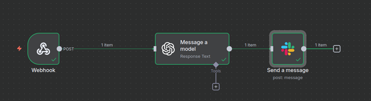
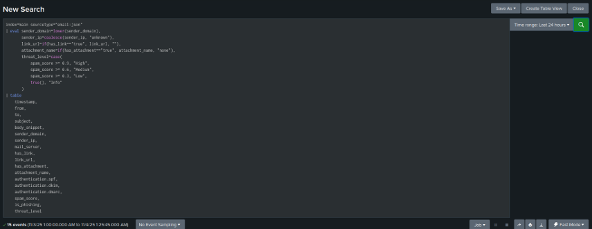
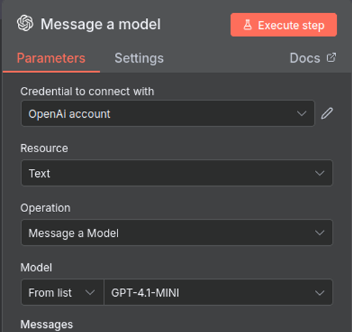
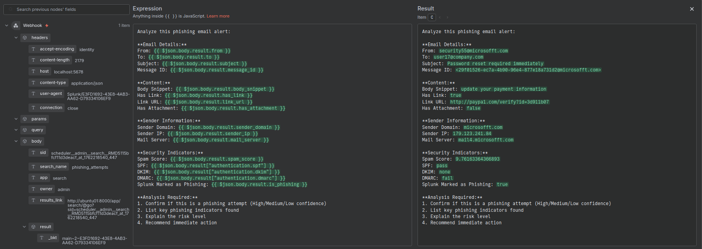
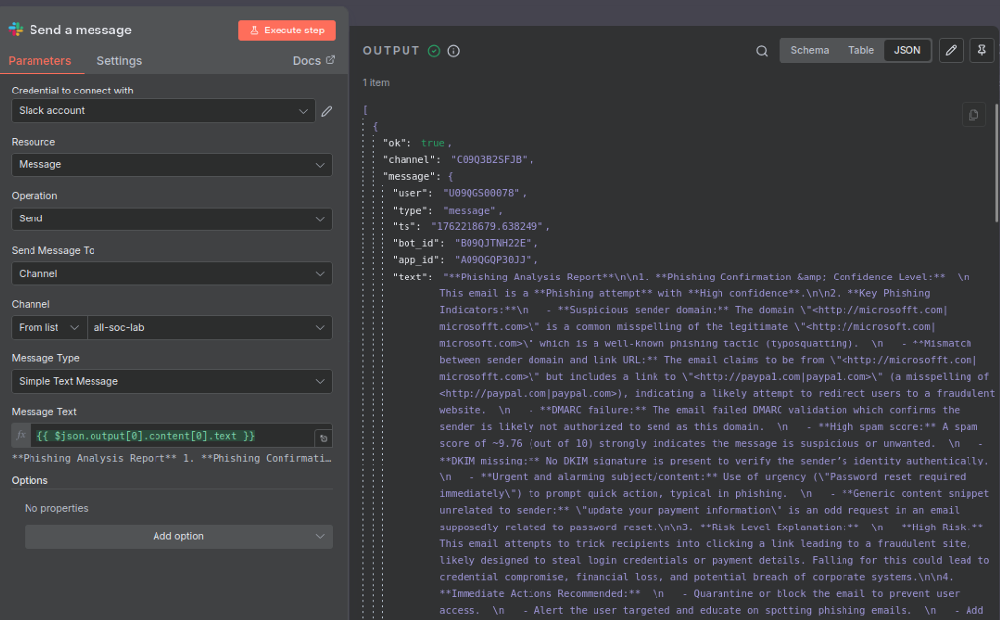
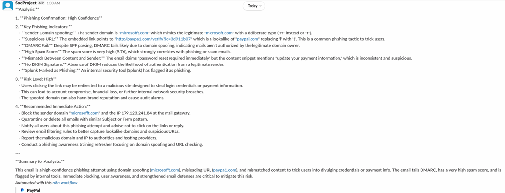

# Automated Phishing Detection & Analysis System

An intelligent automation pipeline that integrates **Splunk**, **n8n**, and **ChatGPT API** to detect, analyze, and alert on phishing emails in real-time — without manual analyst intervention.

**Tags:** `splunk` `automation` `phishing` `n8n` `chatgpt` `soc-automation` `email-security` `blue-team`

---

## Overview

This project automates the full phishing triage workflow across three stages:

```
Splunk (detect) → n8n (orchestrate) → ChatGPT (analyze) → Slack (alert)
```

| Stage | Tool | Role |
|---|---|---|
| Detection | Splunk | Monitors email traffic, scores spam, checks SPF/DKIM/DMARC |
| Orchestration | n8n | Receives Splunk webhook, routes data to AI for analysis |
| Analysis | ChatGPT GPT-4.1-MINI | Classifies email as Phishing/Legitimate with confidence score |
| Notification | Slack | Posts full analysis and recommended actions to security channel |

---

## Architecture

```
[Splunk Alert] ──webhook──▶ [n8n Webhook Trigger]
                                      │
                              [ChatGPT Analysis]
                              (GPT-4.1-MINI)
                                      │
                              [Slack Notification]
                              (#all-soc-lab channel)
```



---

## Splunk detection query

Splunk monitors the `main` sourcetype for email JSON and triggers when suspicious indicators are found:

```splunk
index=main sourcetype="email-json"
| eval sender_domain=lower(sender_domain),
       link_url=if(has_link=="true", link_url, ""),
       attachment_name=if(has_attachment=="true", attachment_name, "none"),
       threat_level=case(
           spam_score >= 0.9, "High",
           spam_score >= 0.4, "Medium",
           spam_score >= 0.3, "Low",
           true(), "Info"
       )
| table timestamp, from, to, subject, body_snippet, sender_domain,
         sender_ip, mail_server, has_link, link_url, has_attachment,
         attachment_name, authentication_dkim, authentication_spf,
         spam_score, is_phishing, threat_level
```



The alert webhook fires when `is_phishing=true`, posting the full email metadata as JSON to n8n.

---

## n8n workflow configuration

### Node 1 — Webhook trigger

| Parameter | Value |
|---|---|
| URL path | `/webhook/phishing-alert` |
| Method | POST |
| Format | JSON |
| Authentication | None |



### Node 2 — ChatGPT analysis (GPT-4.1-MINI)

| Parameter | Value |
|---|---|
| Credential | OpenAI account |
| Model | GPT-4.1-MINI |
| Role | System |

**System prompt used:**

> You are a cybersecurity analyst specializing in phishing detection. You will be given email metadata, content snippets, and authentication results from a mail security system (Splunk). Analyze each email and classify it as 'Phishing' or 'Legitimate'. Explain your reasoning clearly and provide a short summary for analysts, also give recommendations.

**Message body template (n8n expression):**

```
++Email Details:++
From: {{ $json.body.result.from }}
To: {{ $json.body.result.to }}
Subject: {{ $json.body.result.subject }}
Message ID: {{ $json.body.result.message_id }}

++Content:++
Body Snippet: {{ $json.body.result.body_snippet }}
Has Link: {{ $json.body.result.has_link }}
Link URL: {{ $json.body.result.link_url }}
Has Attachment: {{ $json.body.result.has_attachment }}

++Sender Information:++
Sender Domain: {{ $json.body.result.sender_domain }}
Sender IP: {{ $json.body.result.sender_ip }}
Mail Server: {{ $json.body.result.mail_server }}

++Security Indicators:++
Spam Score: {{ $json.body.result.spam_score }}
DKIM: {{ $json.body.result.authentication_dkim }}
DMARC: {{ $json.body.result.authentication_dmarc }}
Splunk Marked as Phishing: {{ $json.body.result.is_phishing }}

++Analysis Required:++
1. Confirm if this is a phishing attempt (High/Medium/Low confidence)
2. List key phishing indicators found
3. Explain the risk level
4. Recommend immediate action
```



### Node 3 — Slack notification

| Parameter | Value |
|---|---|
| Credential | Slack account |
| Channel | `#all-soc-lab` |
| Message format | Simple Text Message |
| Message | `{{ $json.output[0].content[0].text }}` |



---

## Sample output

### Slack alert received



The Slack message included:

- **Phishing confirmation: High Confidence**
- Key indicators: domain spoofing (`microsoftt.com` → `microsoft.com`), DMARC fail, suspicious URL (`paypal.com`), spam score 9.76/10
- Risk level: High — potential credential theft / financial fraud
- Recommended actions: block sender domain, quarantine email, notify affected user, add domain to blocklist

---

## Detection logic — what Splunk checked

| Check | Finding |
|---|---|
| SPF | Pass |
| DKIM | Fail (not authorized) |
| DMARC | Fail |
| Spam score | 9.76 / 10 |
| Domain | `microsoftt.com` (typosquat) |
| Link URL | Points to `paypal.com` lookalike |

---

## MITRE ATT&CK mapping

| Technique | ID |
|---|---|
| Phishing | T1566 |
| Spearphishing via email | T1566.001 |
| User Execution: Malicious Link | T1204.001 |

---

## Future improvements

- [ ] Automated quarantine action via Splunk webhook response
- [ ] Local ML model to reduce ChatGPT API dependency
- [ ] Phishing trends dashboard in Splunk
- [ ] MISP integration for IOC sharing

---

## Tools used

| Tool | Purpose |
|---|---|
| Splunk | Email log ingestion and phishing detection |
| n8n | Workflow automation and orchestration |
| ChatGPT API (GPT-4.1-MINI) | AI-powered email classification |
| Slack | Real-time SOC team alerting |
